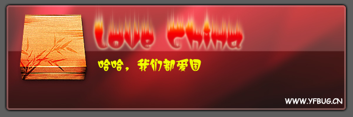
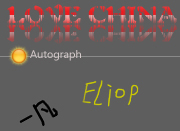

# Love China，一起让世界知道，中国的力量！ 

> 2008-04-18

 

  
 

 

  今日，MSN上流传着个病毒LOVE CHINA ，它是一种爱国型病毒.
 

 

  受到了广大网友的支持~~~~~~~~~~~~
 

 

  OK，我也支持，为什么？我们都爱国，正如他所宣传，让世界知道中国的力量。
 

 

  现在，不管是论坛，还是哪里，到处都多了个红色心型的表情。
 

 

  那就是LOVE CHINA，我们一起Love吧~
 

 

  自动感染方法：
 

 

  QQ,MSN感染方法不介绍了。（abc介绍过）
 

 

  HI的方法：由于HI不支持昵称型表情，所以只能先：♡CHINA咯~~~·（复制♡CHINA，加到你的昵称前面）
 

 

  现在还有更搞笑的，连心形的表情都出防伪标志了.
 

 

  大家可以到
  <a href="http://eliop.3uu.cn/article.asp?id=17" target="_blank">
   Eliop
  </a>
  那里看看，很搞笑.................
 

 

  另外，请这样发给你的HI好友：
 

 

  HI名字前面请 加♡China，让全世界看看中国人的团结，请转发给你的HI朋友。
 

 

  MSN已经有1/3人变成了这样，希望HI也一样！！！！
 

 

  o(∩_∩)o...哈哈，最后来个宣传：
 

 

  
 

 

 

 

  （那个心，是我自己PS的，由于PS得不好看，就不发了）
 

 

  这个事情都是CNN闹的。开始我还不知道。
 

 

  哪么大家跟我一起这样做：
 

 

  开始-运行（直接按WIN+R）
 

 

  ping
  <a href="http://www.cnn.com/">
   www.cnn.com
  </a>
  -t -l 65500
 

 

  求会PHP者，做个P2P的网页，一起ping死CNN
 

 

  ===================================================================
 

 

  “关于我”栏目中的 爱国签名 活动（我发起的）要想显示者，请写明：
 

 

  申请者：XXX
 

 

  我的签名：HI.BAIDU.COM/XXX/album/XXX.PNG（自己用PS或者其他的，必须是透明的。大小必须在300*300以内）
 

 

  
 

