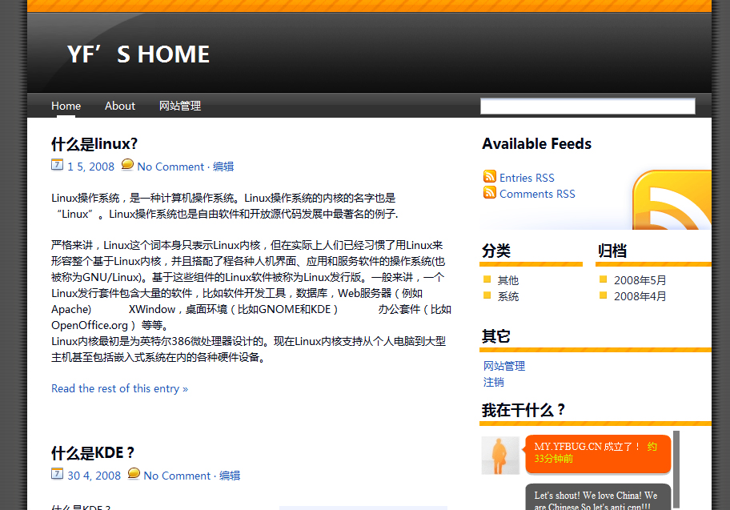

# YF'S HOME|五一前重现发布|MY.YFBUG.CN|已经全新改版 

> 2008-04-25

 

  
 

 

  这个是YF'S BLOG
 

 

  那个是YF'S HOME。不要搞混了~
 

 

  地址：
  <a href="http://my.yfbug.cn/">
   http://MY.YFBUG.CN
  </a>
 

 

  
 

 

  这个不是转向而是有服务器的哈哈~
 

 

  主要是为了丰富网友的知识面，转载一些精品文章或者一些名词的意思等等，总之是转载....
 

 

  所以，以后关于下载类，转载类就不会出现在我的BOKE里了，都尽在
  <a href="http://my.yfbug.cn/">
   http://MY.YFBUG.CN
  </a>
  （YF'S HOME）
 

 

  另外，透露下：
 

 

  我用的文章发布系统是WordPress
 

 

  感觉很好用，模板是WP移植过来的，感觉还行。
 

 

  YF'S HOME 截图：
 

 

  说下：配合雅黑字体更好看！
 

 
 

  第一篇是写：这个不是我真正的blog，真正的blog还是这个百度，那个仅仅是转载精品文章供网友和我学习。
 

 

  哈哈，从Z-BLOG到WP，就是速度慢了点，其他还行吧~
 

