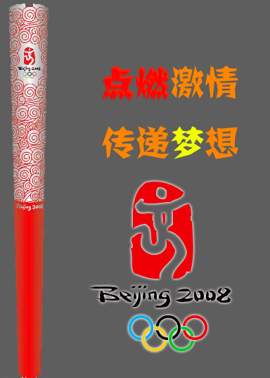

# 百度北京2008奥运圣火传递活动 

> 2008-05-02

 

  
 

 

  虽然过于形式主义，但是，我还是要把百度奥运圣火传递下去，不能砸在我手里啊~！
 

 

  本人荣幸地被朋友visonedison 点名，接2008百度空间奥运火炬传递活动第十棒，让我们将奥运精神继续传递下去吧！
 

 

  以下人士已经被我点名：
 

 

  1.Eliop 2.Lzlhoho 3.namosay
 

 

  4.snailsoft 5.1997liuxinyu 6.路戈
 

 

  7.世纪童话 8.FY 9.Xnot
 

 

  10.Du掌柜
 

 

  您被点到了吗？恭喜您！
 

 

  如果您被点到，请您认真阅读传递规则
 

 

  被传到的博主要珍惜自己百度空间的火炬手机会！复制奥运火炬图。要在自己的博客里写下对奥运的祝福，然后传给另外一个人，写出自己是第几棒。保留上一 棒火炬手的名字。还要到被传百度空间火炬手的博客里留言通知对方——火炬传到你这里了，请往下传！请被点名者一定将火炬传递下去，完成传递的人将会永远得到大家的祝福。被点名者如果被多个朋友点名，可以自由选择一个朋友的火炬，再传给别人。
 

 

  图：
 

 
 

 

