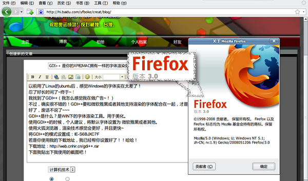
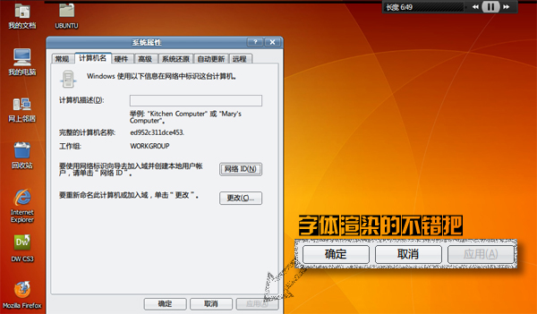
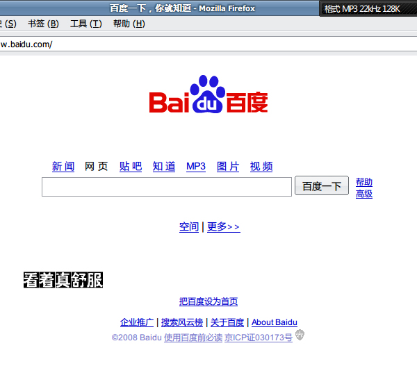

# GDI++下载 |让你的XP和MAC拥有一样的字体渲染效果！| 

> 2008-05-28

 

  
 

 

  以前用了Linux的ubuntu后，感觉Windows的字体实在太差了！
 

 

  忍了好长时间了~终于~！我找到了GDI++（我怎么感觉我在做广告~！）
 

 

  不过，确实很不错的！
 

 

  GDI++要微软雅黑或者其他支持渲染的字体配合在一起，才是最爽的！
 

 

  GDI++是什么？是WIN下的字体渲染工具。用于美化。
 

 

  好了，废话不说了~~~
 

 

  使用GDI++的时候，个人建议，将默认字体设置为 微软雅黑或者其他。
 

 

  使用火狐浏览器，渲染技术感觉会更好，并且更快~
 

 

  将GDI++的模式设置成：IE-S6BJXC7F
 

 

  若是你使用我的下载地址，我已经帮你设置好了！！哈哈！
 

 

  
  下载地址：
  <a href="http://www.gougou.com/search?search=gdi%2B%2B&amp;restype=-1&amp;id=10000001&amp;ty=0&amp;pattern=0">
   http://www.gougou.com/search?search=gdi%2B%2B&amp;restype=-1&amp;id=10000001&amp;ty=0&amp;pattern=0
  </a>
 

 

  下面我贴出下我使用的截图吧！
 

 
  
 1.jpg
  
 
 2.jpg
 
 3.jpg
  
 由于网页大小限制，所以我用PS放小了，但质量不减！！哈哈！有些地方我又重点放大了~~~
  
  
 用不起MAC的朋友和我一起来享受GDI++的字体渲染的乐趣吧！

