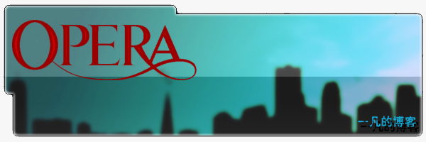
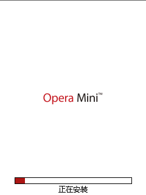
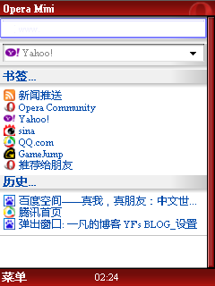
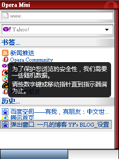
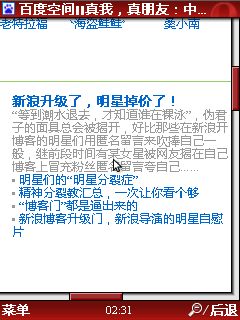
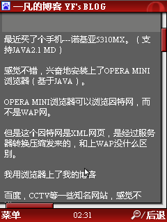
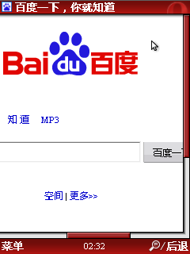

# 流水账+OPERA MINI截图 

> 2008-06-11

 

  
 

 

  最近买了个手机---诺基亚5310MX。（支持JAVA2.1 MD）
   
   
  感觉不错，兴奋地安装上了OPERA MINI浏览器（基于JAVA）。
   
   
  OPERA MINI浏览器可以浏览因特网，而不是WAP网。
   
   
  但是这个因特网是XML网页，是经过服务器转换压缩发来的，和上WAP没什么区别。
   
   
  我用浏览器上了我的博客
   
   
  百度，CCTV等一些知名网站，感觉不错！！
   
   
  可是....
   
  我刚刚上了半个小时，我10011打过去，听了话费，吓我一跳！
   
  扣了我40多块！
   
   
  于是我开始算了....
   
   
  资费标准：0.03元/kb
   
   
  根据手机的统计，共收到1168145b
   
   
  那么就是1168145/1024=1140.7666015625kb 其实才1M多
   
   
  那么所付的钱为：1140.7666015625*0.03=34.222998046875元
   
   
  再加上手机之前没有统计的一些流量，是差不多40块。
   
   
  本来以为联通的资费标准挺便宜的，结果这么一算，我还是推荐大家上网办包月
   
   
  然后我咨询了下，包月有2元10M的，5元30M的等等的。
   
   
  我想用30M就够用了~~~就办了个30M的。
   
   
  哎~~~要等到7.1才有效包月啊~忍了把，现在我又算了下。
   
   
  只要我上BAIDU.COM。就要花掉我
   
   
  流量：22289b=21.7666015625kb
   
   
  话费：21.7666015625*0.03=0.652998046875
   
   
  6角不要忽视它，打开2，3个就5块多了。。。
   
   
  所以，这两天我忍了~不用手机上网了~~呵呵。
   
   
  最近忙于玩我的手机，所以没时间写文章，也没动电脑。动了也就是下载几个JAVA程序到手机上。
   
   
  我很推荐诺基亚和索爱两款手机。
   
   
  |他们的字体渲染技术非常不错！看起来很顺！并且我买的5310支持FLASH,JAVA并且还有主题！
   
   
  我下载了20多个主题，有VISTA风格的，IPHONE风格的，MAC风格的，很不错！！！
   
   
  呵呵，真是流水账啊~~~~！
   
   
  付：
   
  OPERA MNI浏览器
   
  （JAVA手机模拟机中运行）
 

 
  
 
  
 
  
 
  
  
 
 
  
 
  
 哈哈！真爽啊！

