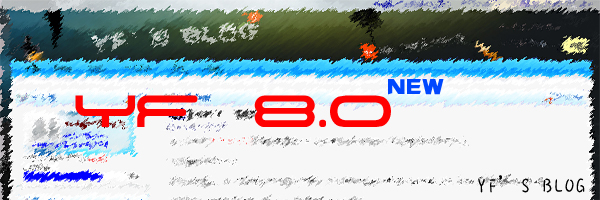

# 重新做了一款模板 

> 2008-06-19

 

  
 

 

  由于以前的YF1.0-YF7.0的模板都是由YF1.0为基础修改而成的，所以每次改动变动不大。
 

 

  这次模板代号YF8.0.这次变动很大，花了我8天时间做的这个模板...不过有些来源与WP(WORDPRESS)，但是大多数都是自己PS的。基础代码为百度提供的代码，修改都是独立完成的。
 

 

  <strong>
   代码拿不拿走随便，但请勿分享！
  </strong>
 

 

  这次的改动可能会让大家对我的博客有重新的认识。
 

 

  计划在下面的时间继续修改增加细节，如
 

 <code>
  +增加引用模块--100%
   
  +增加评论框留言板底色--100%
   
  +修改所有发送的按钮为图片--0%
   
  +对原来的文章开头图进行底色修改（大约3天时间，由于以前的STAGE为#5e5e5e，所以修改起来可能要麻烦写...哎！）-30%
   
  +对细节进行优化--40%
   
  +申请ECSS+ECHI-- （-1）%
   
  +更换新头像--100%
   
 </code>
 

  新头像...还行吧？？？
   
  
   
 

 

  另外：
  <strong>
   本人正在申请ECSS，请各位好友支持
  </strong>
 

 

  <strong>
   ECSS是啥？
   <a href="http://baidu.ec/bbs/44.html" target="_blank">
    点击此处进入了解情况
   </a>
  </strong>
 

