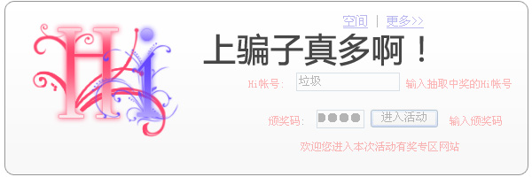
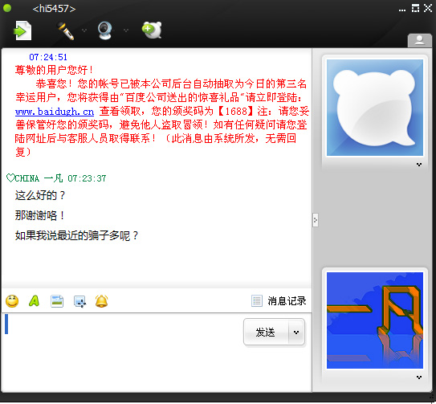
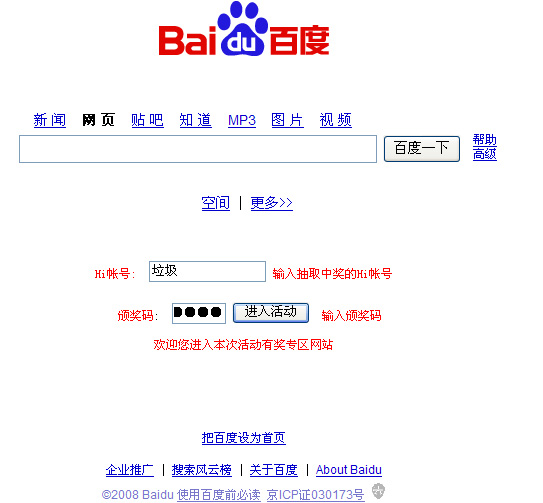
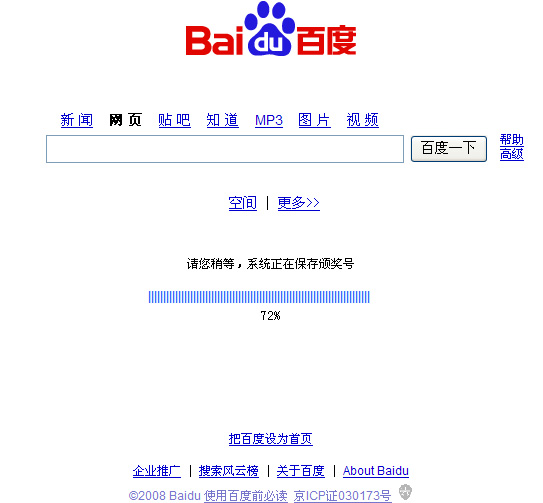
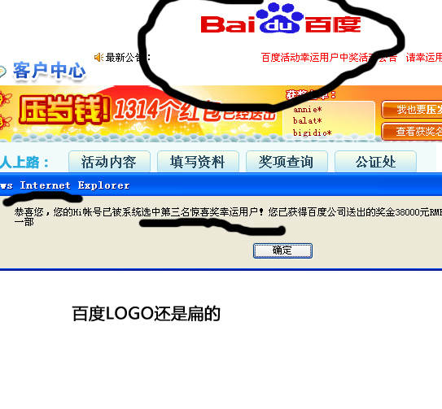
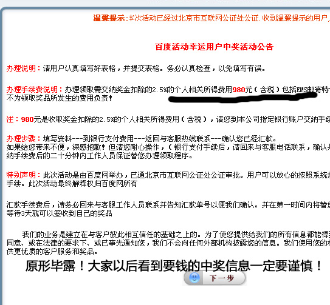

# 最近的HI上的骗子多，大家注意！ 

> 2008-06-28

 

  
 

 

  最近的骗子可真多啊！大家注意啊！！！
 

 

  不过，弄得太假了。
 

 <code>
  尊敬的用户您好！　　恭喜您！您的帐号已被本公司后台自动抽取为今日的第三名幸运用户，您将获得由"百度公司送出的惊喜礼品"请立即登陆：www.baidugh.cn 查看领取，您的颁奖码为【1688】注：请您妥善保管好您的颁奖码，避免他人盗取冒领！如有任何疑问请您登陆网址后与客服人员取得联系！（此消息由系统所发，无需回复）
 </code>
 

  
 

 

  打开网站...原来是个钓鱼网站
  <a href="http://www.baidugh.cn/">
   http://www.baidugh.cn/
  </a>
 

 

 

 

  
 

 

  大家要小心啊！
 

 

 

 

  
 

 

 

 

  
 

 

 

 

  
 

 

  好玩把！大家自己看看，有空根他们客服聊聊.....想办法知道它的银行账号，黑死他！
 

