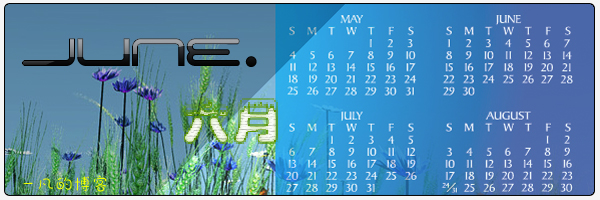

# June.六月 小结 

> 2008-07-01

 

  
 

 

  做个总结吧！
 

 

  总的来说，六月我比较懒，发博文的效率大大降低。
 

 

  不过也有很多探究。
 

 

  <strong>
   我所干的事情一：
  </strong>
  新买了个手机，一直在玩它，导致最后100元多花费用于cmwap掉了。
 

 

  我下载了上百个java程序，让手机运行，当手机打开java目录时，我敢说，打开速度是普通诺基亚手机的0.1倍，因为java程序太多了。
 

 

  我这几天主要在几个论坛上逛，如bbs.ucweb.com，我的id为yfblog，发表了很多帖子，哈哈！后来从该论坛上学到了很多知识，除了刷机不会，其他的几乎都会了...（刷机不是不会，是不敢）
 

 

  学会了java合成软件，合成了1个10合一的软件，被众多人士所批论！原因是大小太大了，不过我的N可以受得了...很多人都难以置信我的N。
 

 

  还有是ANYVIEWS的umb格式看小说看漫画，真爽！
 

 

  这导致了我没时间写博客，最近博客的访问量降低了，不过没关系，我心理素质好。哈哈！
 

 

  <strong>
   我所干的事情二：
  </strong>
  那就是...申请ECSS.X2，自从我发现了BAIDU.EC，我几乎每天都泡在论坛上，等待着EDIKID的批准，等啊等....终于于前天实现了，令我太激动了。
 

 

  我都不知道ED是怎么办到的，本来都说SAY GOODBYE TO ECSS，现在又可以了？哈哈！反正不管怎么说我是申请到了。
 

 

  我申请ECSS.X2有什么用？
  <code>
   1.ECSS.X2的模板保护功能，这个问题自从我退出ECSS后我就后悔了，今天终于解决了大部分的盗取版权问题。
    
   2.ECSS.X2强大的EJS，这个很吸引人的，其实EJS就是JS，区别不大，可以实现很多百度空间不能实现的特效，如FLASH，或者插入html代码（包括百度禁用的），改变模块，只要你会一些简单的JS，你就能编出你喜欢的脚本。
    
   3.ECSS.X2的模块模板功能和模板随机切换，这个我不介绍了，不是太直观。
    
   4.ECSS.X2的后续功能，据说，ECSS.X2要推出ECHI，和文章发布系统，这样的话我就可以绑定顶级域名了，拥有更
  </code>
 

 

  不要小看了ECSS,等我绑米后，我照样可以用FF或者S或者N来浏览我的博客啦！
   
   
  <strong>
   我所干的事情三：
  </strong>
  修改我的模板，由YF6.0-YF7.0-YF8.0
   
  其中YF8.0是基于ECSS.X2的，对代码做了全新的编写，对此本人学习了大量CSS知识（其实CSS很简单）。
   
  不久后我将发表一篇博文--名字叫--如何修改自己的CSS，高手不要见怪
   
  我现在感觉现在的模板还好，但还没有达到最好效果，本人正在努力中...
   
  这里我公开一下YF8.0中的EJS代码
  <code>
   function window.onbeforeunload() { if( event.clientX&gt;document.body.clientWidth &amp;&amp; event.clientY&lt;0 || event.altKey ) { window.event.returnValue="一凡忠诚的欢迎您下次再来！"; } }
    
  </code>
  这段代码很经典，会一点JS的都会，可惜我不会.... 还有一段斜体显示FLASH的代码，来自BAIDU.EC
   
  <code>
   window.onload=function flash(){ var j=document.getElementsByTagName('em'); while (j.length) if(j[0]9) j[0].outerHTML='&lt;br /&gt;
    
   &lt;embed height="350" width="450" autoplay="0" src="+j[0].firstChild.data+"&gt;&lt;/embed&gt;&lt;br /&gt;
    
   '; }
    
  </code>
  总之，我是很懒的，模板一次一次的换，做了个flash，后来不知道如何停止循环而让我删掉了，后来才知道是STOP{}
   
  ....
   
  呵呵。六月份干的事情真多啊！
 

 

  <strong>
   至于接下来的打算
  </strong>
 

 

  那应该是....
 

 

  1.完善我的模板
 

 

  2.设计与制作WIN7的界面，重新做出更漂亮的，虽然我PS很烂
 

 

  3.学习些新的东西，如flash，或者JS
 

 

  4.学习JAVA（长远打算）
 

