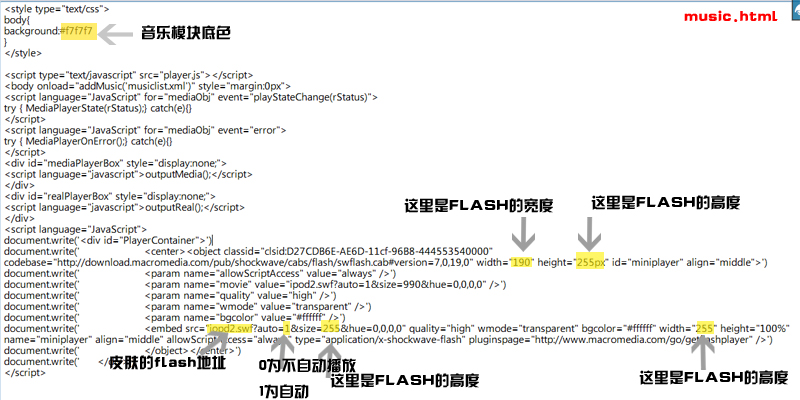

# 本站音乐播放器已启动 

> 2008-07-11

 

  
 

 

  感谢ED,给我插入插件的机会,以前,我用的是优酷的,是否感觉没有个性？
 

 

  现在，我自己弄了一个....用的是iframe框架。
 

 

  我用的是 自定义3这个模块。
 

 

  使用的播放器的皮肤是IPOD...至少我比较喜欢。
 

 

  现在就有一首歌曲，
  <strong>
   大家帮我推荐一下
  </strong>
  。
 

 

  <strong>
   还有没有其他的好听点的歌曲。谢谢
  </strong>
  。
 

 

  是ECSSX.2的用户可以跟我一起分享这个代码：
 

 <code>
  

   var Xmusic;
    
   Xmusic='&lt;div id="m_pro" class="modbox"&gt;&lt;style type="text/css"&gt;body{background:#f7f7f7}&lt;/style&gt;&lt;iframe width=200 height=260 frameborder=0 scrolling=auto src=http://yfsir.cn/music.html&gt;&lt;/iframe&gt;&lt;/div&gt;';
    
   if(document.getElementById("m_mylink3")) document.getElementById("m_mylink3").outerHTML=Xmusic;
  

 </code>
 

  目前本博客仅支持IE浏览器，最佳效果为IE7，火狐与OPERA黑屏状况等待解决，本站黑屏属于正常状况，大家不要担心，可能是ECSS服务器不稳定的缘故，过一会模板就会恢复。或者刷新一下。
 

 

  模块样子：
 

 

 

 

  
 

 

  FLASH浏览：
 

 

  <em>
   http://yfsir.cn/ipod2.swf height=300 width=200
  </em>
 

 

  (不能播放音乐，属于样品，真正的请看主页的)
 

 

  为了张扬你的个性，如果你有网站存放空间，你也可以在这里下载flash播放器源文件：
   
   
  里面有说明，大家下载传到自己的网站看看吧！
 

 

  <a href="http://yfsir.cn/FlashMusic.jpg" target="_blank">
   
   FlashMusic.jpg
  </a>
 

 

  (右键另存为，然后改文件名为FLASHMUSIC.RAR，我的空间不支持RAR呵呵)
 

 

  关于播放器的使用的注释文件：
 

 

  
 

 

  （一凡注释）
 

