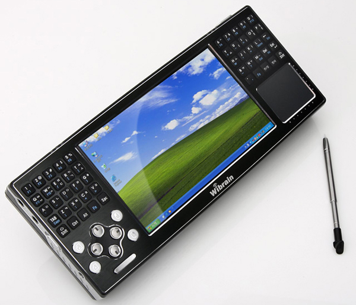
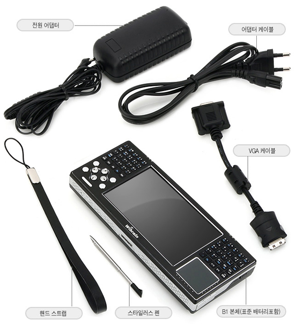
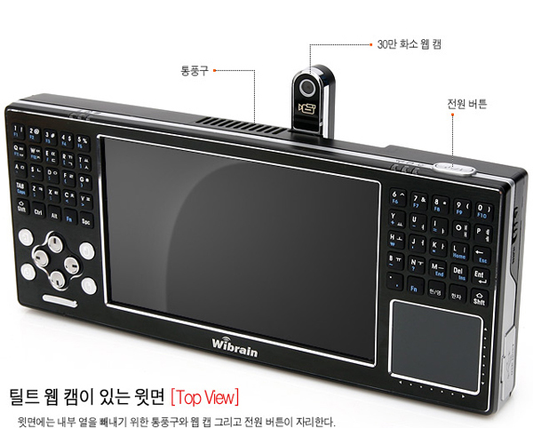
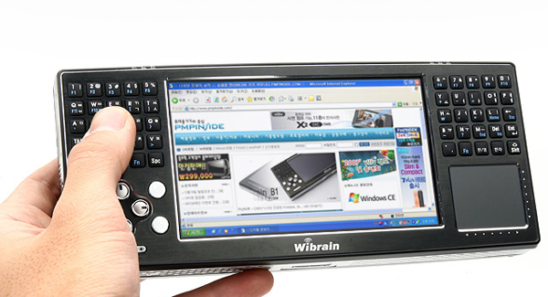

# UMPC-太精致了 

> 2008-07-26

 

  
 

 

  话说我最喜欢的东西，
   
   
  有人说：PSP？
   
   
  我：NO
   
   
  还有人说：IPOD，IPHONE，IMAC？
   
   
  我说：NO NO
   
   
  .........
   
   
  我喜欢的东西并不是PSP，IPOD之类的，但是大小也就那么大～
   
   
  那就是UMPC。。。
   
   
  UMPC是超级微型笔记本电脑，很小，一般的分辨率可不低，有1024＊600那么大～
   
   
  一般的配置也不低，1G内存吧～1.2GHZ 的CPU，64M显卡（显卡只能这样了～因为机身限制太小了）
   
   
  价格也不是太高～一般一部好点的手机（如WINDOWS MOBLIE）的价格就够了
   
   
  大概在3000－10000不等，基本上4000的就很好了～
   
   
  我就是喜欢小的东西，爱不释手～所以，我一般不用台式机，都是本本～
   
   
  这回看到了UMPC，更是爱不释手～
   
   
  <strong>
   但是一直买不起！
  </strong>
 

 

  最后，贴几张图！
   
   
  让大家报饱眼福
   
   
  
 

 

 

 
 

 

 

 

 

 

 
 

  
 

 

 

 

 

 
 

