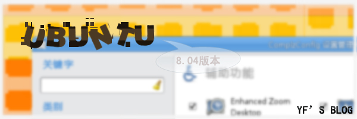
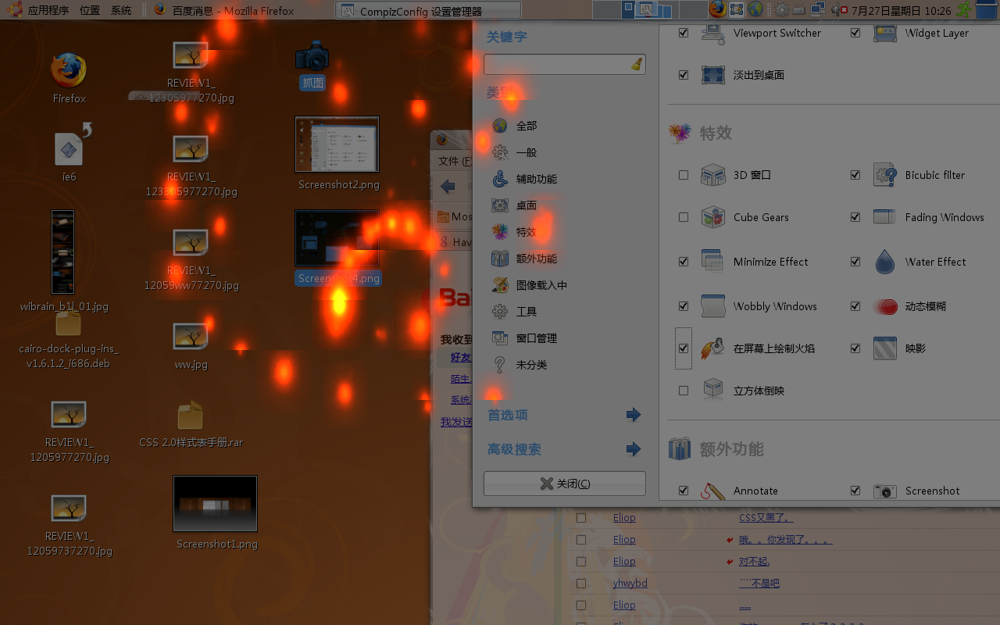
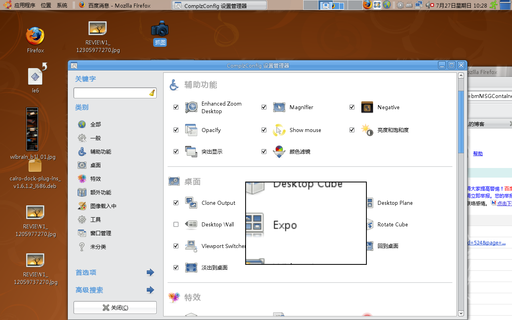
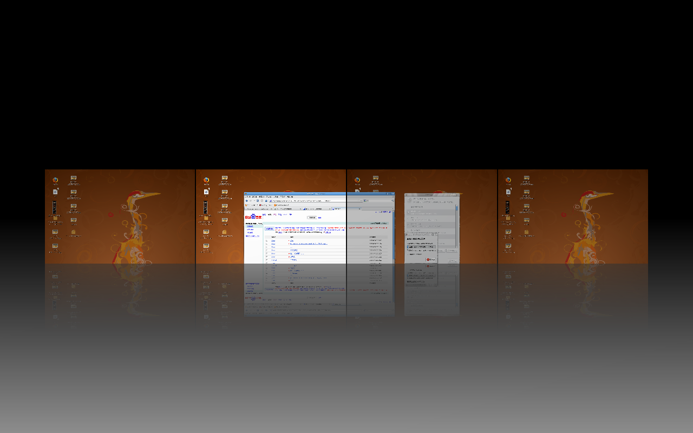

# 体验UBUNTU 8.04 

> 2008-07-28

 

  
 

 

  最近呆着没事，安装了个系统~UBUNTU
 

 

  以前安装了好久，都没安装成功~
 

 

  现在，我刻录了一张盘。是ubuntu8.04版本的。
 

 

  具体截图，请看我的相册里面的
  <a href="http://hi.baidu.com/yfboke/album/Ubuntu" target="_blank">
   UBUNTU
  </a>
  图片吧！
 

 

  这次安装我用光盘安装的。光盘真是快~
 

 

  最近空间不更新，访问量急剧下降...
  
 

 

  5分钟刻录OK~（我不怕刻录坏掉，因为我的是可擦写的CD）
 

 

  安装后...的确成功了~
 

 

  可是，我的显卡是ATI的，系统不认~开不启特效~
 

 

  于是我开始从网上找了各种代码~
 

 

  结果试了半天~没有一句可以用的~
 

 

  导致很多次无法开机~在ubuntu自检的时候黑屏~
 

 

  幸好我有方法~使用安全模式，初始化那个硬件配置
 

 

  具体代码我忘了~但是很麻烦的~
 

 

  后来慢慢的~特效师可以开启了~，但是特效运行得很缓慢（不是一般的缓慢）。
 

 

  于是我又开始找ATI的驱动教程。
 

 

  结果终于找到了一篇关于我的型号的教程（6515b的朋友用ubuntu的可真多~）
 

 

  后来安上了，太爽了！
 

 

  特效比VISTA多了10多个~很多特效快捷键都是我自己摸索出来的。。。
 

 

  WIN+E。。很多很多。。。前提是你安装了那个特效软件~
 

 

  最后，我还贴几张。
 

 

  
 

 

  
 

 

  
 

 

  
 

