# OpenSUSE,linux中的最华丽的系统,YF亲手安装 

> 2008-08-03

 

  
 

 

  OpenSUSE是以linux为内核的东西.
 

 

  听说是最华丽的，我就下载下来玩玩。。。
 

 

  我用VM虚拟机安装。
 

 

  先下载镜像文件，共4.29G，11分钟搞定了（不信？不信找我看截图）
 

 

  然后就加载镜像文件，启动系统。
 

 

  启动系统以后才发现，不是中文版的。
 

 

  这个的确很漂亮，就连安装过程都很漂亮。
 

 

  我看ubuntu才是。
 

 

 

 

 

 好了，不说那么多了，我们开始吧！
 

 

 

  真是麻烦，口头说很麻烦，所以我就录了视频。
 

 

  <strong>
   网速低用户请看下面的优酷
  </strong>
 

 

  <strong>
   <embed allowscriptaccess="never" height="390" loop="false" menu="false" play="true" pluginspage="http://www.macromedia.com/go/getflashplayer" src="http://player.youku.com/player.php/sid/XMzc2ODA4MzI=/v.swf" style="width: 450px; height: 390px;" type="application/x-shockwave-flash" width="450" wmode="transparent">
   </embed>
  </strong>
 

 

  <strong>
   网速高的用户请看下面的视频（视频分辨率800*600）
  </strong>
 

 

  <em>
   http://www.eliop.com.cn/yf/SUSE.wmv width=800 height=600
  </em>
 

 

  视频地址：http://www.eliop.com.cn/yf/SUSE.wmv ，可下载，
  <strong>
   感谢
   <a href="http://www.eliop.com.cn" target="_blank">
    ELIOP
   </a>
   提供空间！
  </strong>
 

 

  下面发一些截图。
 

 

  
 

 

 

 

  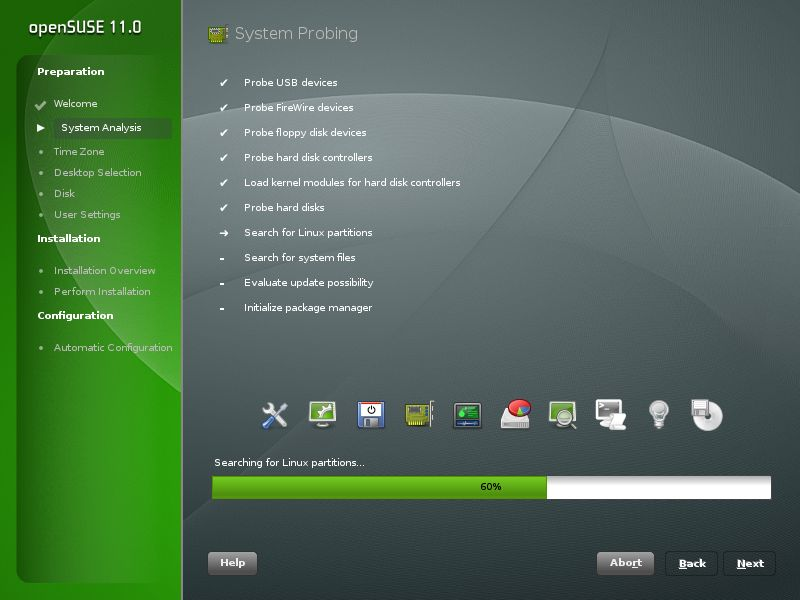
 

 

 

 

  
 

 

 

 

  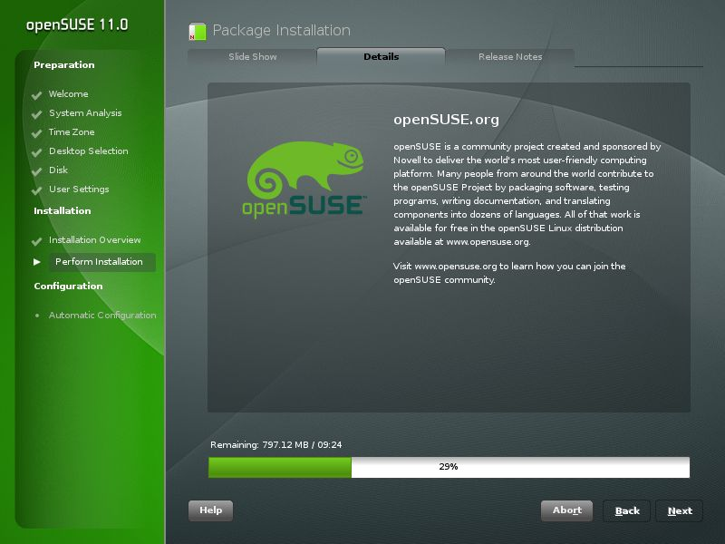
 

 

 

 

  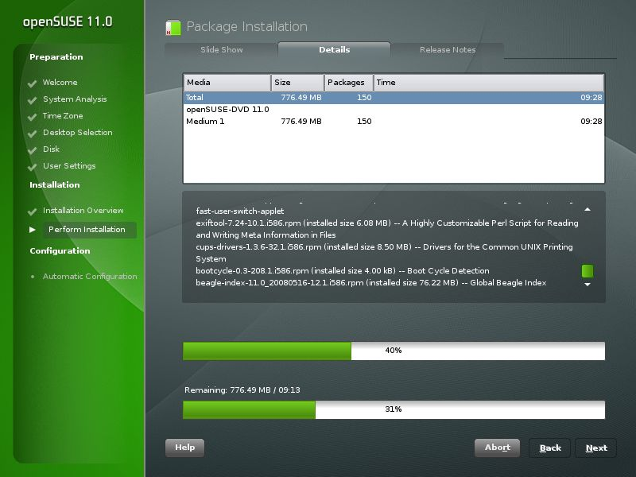
 

 

 

 

  
 

 

  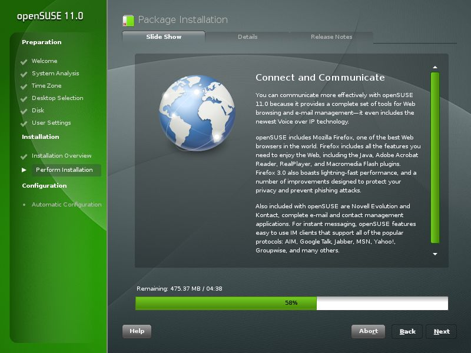
 

 

  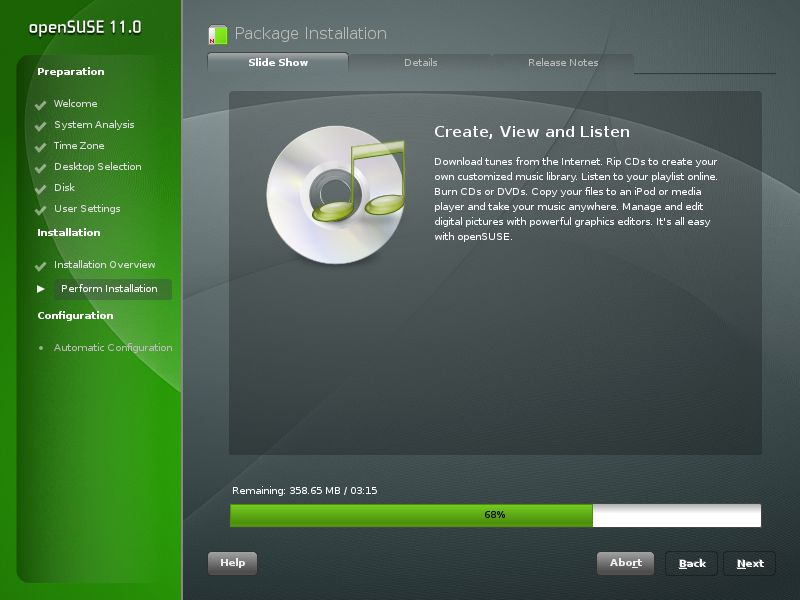
 

 

  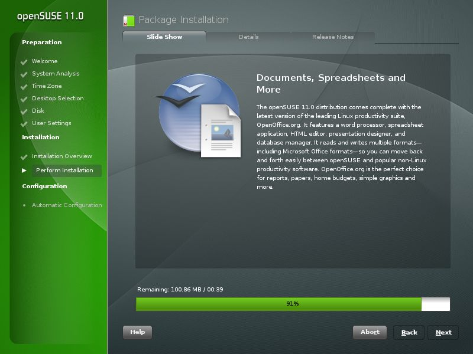
 

 

  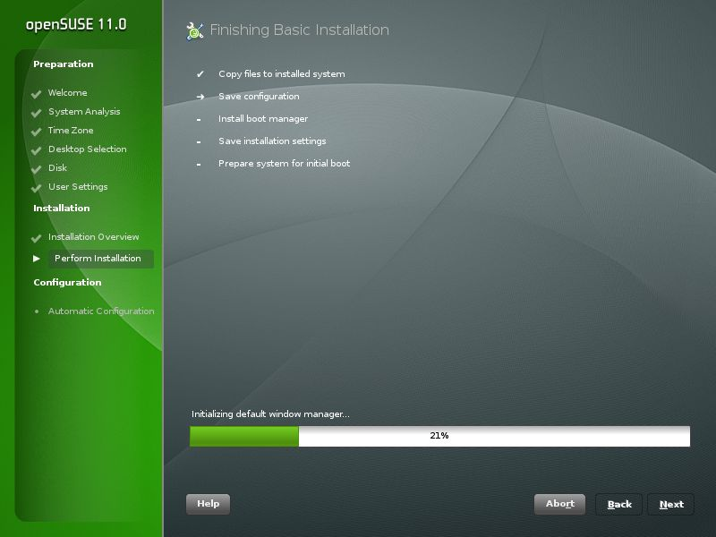
 

 

 

 

  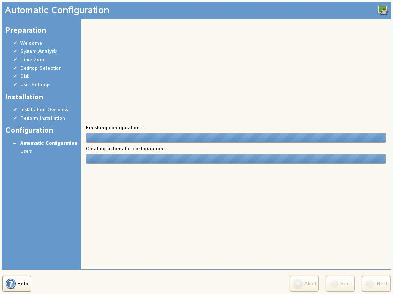
 

 

 

 

  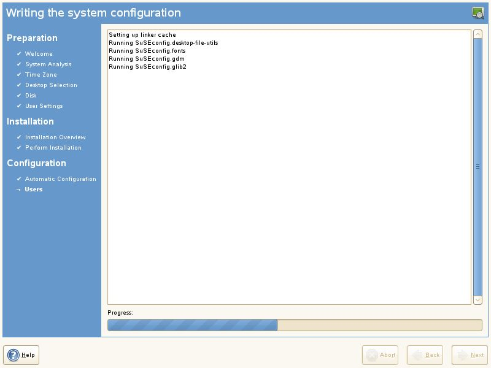
 

 

 

 

  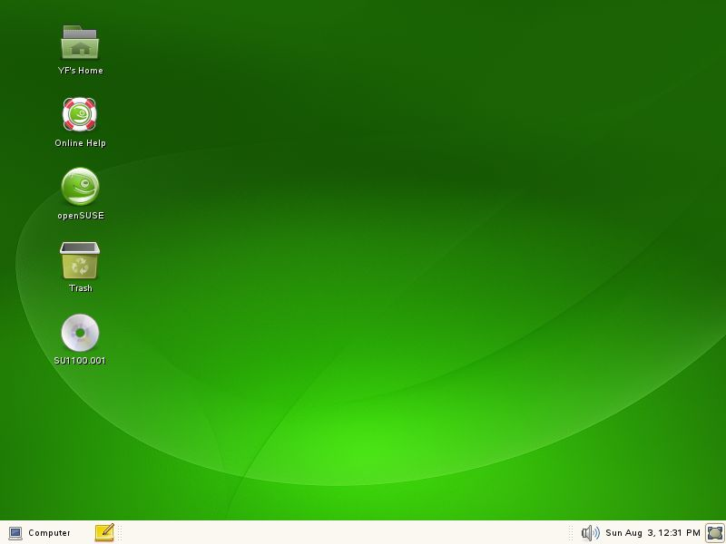
 

 

  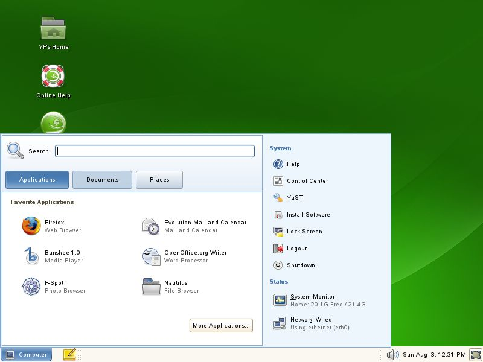
 

 

  <strong>
   特效和ubuntu一样。
  </strong>
 

 

  <strong>
   后来。。由于我清理硬盘的误操作，把他们给删了~~~
  </strong>
 

