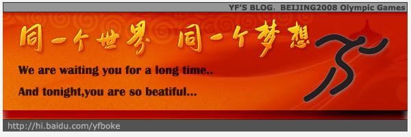
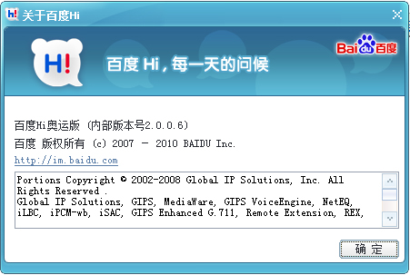

# 北京奥运会，我们等待你那一刻！Beijing Olympics Games! 

> 2008-08-08

 
 

  北京奥运会，我们等你等得太久太久了。
 

 

  今天晚上的奥运会将是多么好看！
 

 

  鸟巢，水立方，肯定会格外精彩。
 

 

  我在此时8月8日8时8分，发布这篇博文，心情也格外激动。
 

 

  因为今天不仅是奥运会还是很吉利的日子。
 

 

  没什么好说的，那么一起来期待好看的奥运会开幕式吧！
 

 

  我肯定它会比韩国偷拍的开幕式还要精彩。
 

 

  估计这一刻也是无法再现的，因为，至少在我的一生中有可能就这一回看到东道主是我国的奥运会吧！
 

 

  好！现在开始了！
 

 

  一起看吧！中国马上就要出场了！
 

 

  下面奉献一首北京欢迎你！
 

 

  HI也改头换面了
 

 
 

  再来张我的发表日期
 

 

  
 

 

  <strong>
   最近情况：
  </strong>
 

 

  新版的header整整PS了我一天，属于大作吧！
 

 

  这只是我的头部header新版的初步版本---flash YF5.0 BETA1
 

 

  以后我的header将会有以下更新：
 

 

  1.增加搜索框
 

 

  2.对好友进行连接
 

 

  3.对空白地区进行填充，比如开始菜单上面，没有东西。很空。但是有菜单会很乱。
 

