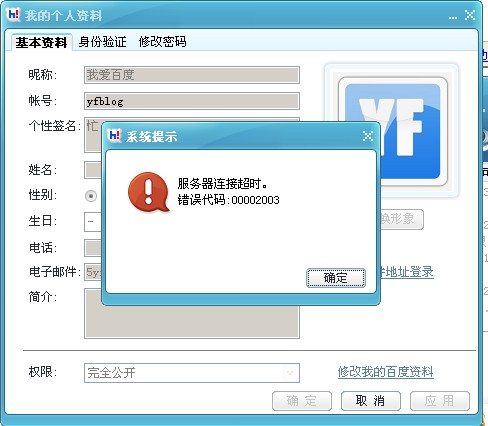

# Baidu HI屏蔽用户名 

> 2008-08-31

 

  
 

 

  最近我这台电脑没有PS,FLASH，自然没做文章头图。没办法。
 

 

  （本质：其实就是懒）
 

 

  上HI的时候
 

 

  想换个用户名，结果。。。发现！
 

 

  百度会屏蔽 以 昵称包含字符为：百度的 id。
 

 

  服务器拒绝了这个请求。。。
 

 

  HI未必也太严了~~~防止冒充官方。
 

 

  不过现在HI确实是很多骗子，大家小心啊！
 

 

  其他用户名均可。\
 

 

  截图：
 

 

  
 

