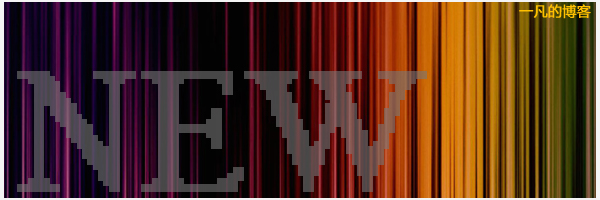
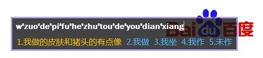
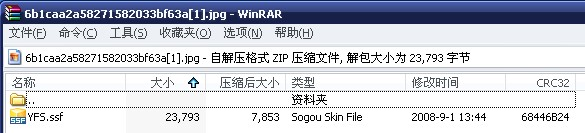

# 新头像 

> 2008-09-06

 

  
 

 

  做了个新头像，感觉比以前的好多了。
 

 

  至少不是那么单调。
 

 

  与其他人的很相似了。
 

 

  至于头像是怎么做出来的，当然是PS的，PS过程能否分享下？答案是否，因为，每次我自己作出的效果并非是网上看来的，而是 乱做的。
 

 

  乱作乱作，就做出来了~自己都忘了怎么做的了。。。
 

 

  
 

 

  还有，最近做了个搜狗拼音主题，比较简约的。
 

 

  2分钟做出来的，很简约的，20%透明的，灰色调。
 

 

  皮肤下载地址：
 

 

  
 

 

  （下载文件在图片里）
 

 

  呵呵，公布一下下载方法：
 

 

  看到上面的图片了吗？右键-另存为，
 

 

  <strong>
   保存为rar格式的，如名字为：YFS.RAR
  </strong>
 

 

  或者另存为后更改扩展名为：YFS.RAR
 

 

  哈哈，打开~看到了搜狗皮肤安装程序，OK安装！
 

 

  剩下的大家讨论咯~最近在baiduec比较活跃，非常活跃。
 

 

 

 

