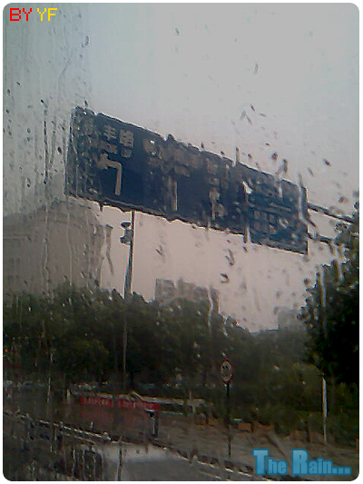
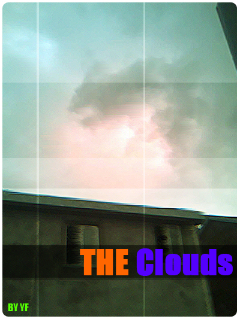

# 台风要来了 

> 2008-09-15

 

  森拉克台风说来就来。
 

 

  看来是马上就要来了，估计明天就到了。。。
 

 

  今天早上拍了一张照片：
 

 
 

  台风来之前下雨总是 要么来就很大，走也很大。（与轻轻的来，轻轻的去截然相反）
 

 

  根本就没有渐变过程，就像泼水倒水一样。。
 

 

  雨，5分钟不到就停了，下午又来了一场雨。。哎~~~
 

 

  下面是用手机拍的云，不怎么好看，也不怎么看的清楚，但是，楼层却挡掉了一半...无奈。
 

 

  
 

 

  看那乌云，好像有个YF的"Y"字，其实在照的同时，另外一半并没有照到，其实就是一个类似F。
 

 

  好像由于我过于自恋的原因吧~
 

 

  其实台风来了也不怎么怕，年年这样。。。
 

 

  反而会带来好处--更加凉爽。。省得那么热了。
 

 

  两张图片都被我PS过了，但是没有过度。。
 

 

  现在还在下雨，不知为什么，心情迷茫~
 

