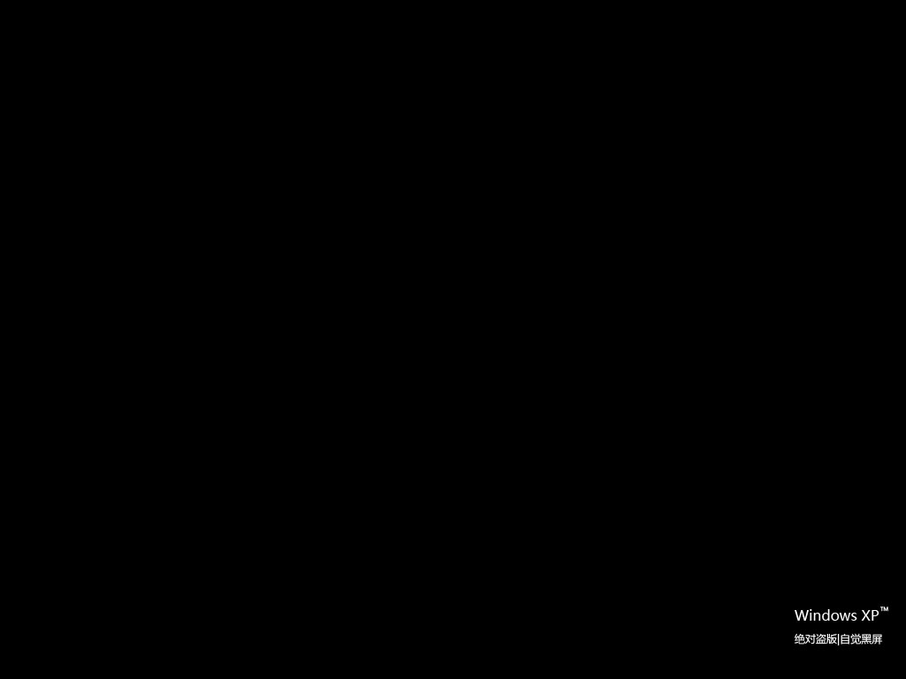

# 我---盗版了 

> 2008-10-19

 

 

 

  <strong>
   如果你是盗版的XP用户，看到这个可能是黑屏；如果你是正版的XP用户，看到这个当然也是黑屏。
  </strong>
 

 

  使用盗版的Windows
 

 

  使用盗版的OFFICE
 

 

  使用盗版的....etc.
 

 

  使用盗版的
  <strong>
   百度空间
  </strong>
  。
 

 

  难道这是百度空间防盗版计划？（Baidu Space WGA？）
 

 

  黑屏警告一次吧~（
  <strong>
   开玩笑，正常的维护
  </strong>
  ）
 

 

  汗了~最近中了一个病毒，超无聊的，彻底囧掉了。
 

 

  会自动每隔30分钟修改你的LSP（LSP是网络连接的重要东东）
 

 

  找不到这个病毒进程，却总是会自动改，无解。
 

 

  改掉我的LSP会不能上网，让我只能每隔30分钟初始化一次LSP。（SHIt!）
 

 

  无奈之下，只好重装。
 

 

  为了保险起见，先另一个区安装了win2003，然后删掉了XP。
 

 

  最近关于盗版的XP黑屏事件闹得沸沸扬扬。
 

 

  正巧赶上我空间黑屏。（汉！）
 

 

  无聊再cnbeta上看到一个桌面，超有创意，于是自己也PS个了。
 

 

  下面是壁纸(1024X768)：
 

 

  喜欢的自己下
 

 

 

 

  
 

 

  （放大就知道是什么了）
 

 

  顺便批判下MS Windows和那个BT型的修改LSP病毒（那个病毒属于无用型，因为它根本就不会弹出广告之类或者具有一定经济利益的东西（比如木马），那个病毒只是想让你不能上网，太BT了！）
 

