# 晒晒手机S60的软件 

> 2009-03-07

 

  至于有些同学提出我以前用的不是5310么，我是和我一个朋友换了。他用S60不习惯，我正好用S60挺习惯的。。
 

 

  我现在的是5320,nokia的,操作系统是：Symbian 60 3rd fp2,感觉挺不错的。（S60是操作系统，不是型号...）
 

 

  手机RAM内存：128M，T-flash卡内存：512M。CPU：ARM 400多MHZ。。。
 

 

  玩游戏啊，上网啊，都比较爽的。
 

 

  <strong>
   1.手机上看RMVB,RM影片。
  </strong>
 

 

  这是我感觉最爽的事情了，Symbian 60 3rd fp2虽然自带了一个软件---RealPlayer，但是鸡肋，只能播放很低的分辨率的rmvb，rm视频，这是让人很不爽的。
 

 

  于是我在opda上看到了一个软件---run（
  <a href="http://blog.sina.com.cn/runsymbian" target="_blank">
   他的博客
  </a>
  ）,呵呵，昨天他刚刚更新，这个软件无论多大的分辨率都能播放，只不过有点卡罢了，而且比特率很大的也能播放。。。很过瘾，但遗憾的是，我的手机t-flash卡只有512M，S60的软件，游戏占去了300多M，每次看RMVB都要找上下集的那种。现在t-flash卡也挺便宜的，早知道再买一个卡就是了。。。
 

 

  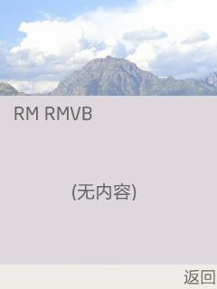
 

 

  这个软件极其的精简，上面的就是打开rmvb的“打开”对话框。因为我没放rmvb文件，所以就没有。。
 

 

  功能暂时还没有 快进，这很麻烦。。。
 

 

  2.手机上运行windows...
 

 

  今天终于把这个给截图截下来了。。。
 

 

  等等，先看看运行前的 内存可用量---79.7M
 

 

  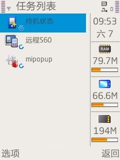
 

 

  然后启动它呢？
 

 

  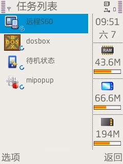
 

 

  哈哈，占用了30多M。。。这还仅仅是启动windows3.1呢。。如果是98，需要虚拟内存。
 

 

  好了，不多说了，启动widnwos3.1（这里只有3.1的截图，因为98之类的实在太卡了，无法截图）
 

 

  几秒种后....
 

 

  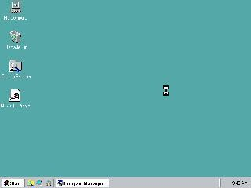
 

 

  然后又过了一会，启动完成了。
 

 

  字几乎看不清。打开 my computer，然后能看到C盘和D盘，D盘就是我的内存卡，显然这是一个配置文件映射的。
 

 

  然后我打开了，纸牌。
 

 

  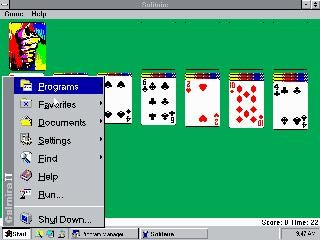
 

 

  很怀旧吧？，这个dosbox还可以运行很多dos游戏。。。
 

 

  我只能截图这么多了，运行windows3.1应该来说是相当的流畅。。但截图很难。
 

 

  至于怎么控制。先按下通话键，激活了鼠标，然后上下左右键控制鼠标，左软键是左键，右软键是右键，双击是中间的那个按两下。。。
 

 

  <strong>
   3.手机看OFFICE文件---word,ppt,excal
  </strong>
 

 

  这个其实就是自带的软件---quickoffice
 

 

  让我给破解了，不用收费了，哈哈。
 

 

  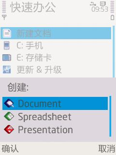
 

 

  没有错，第一个是doc，第二个是xls，第三个是ppt。
 

 

  几乎和电脑的一样。
 

 

  <strong>
   4.手机连接互联网
  </strong>
 

 

  其实我最欣赏的浏览器是opera，速度很快，但有很多不充足之处，如：无法缩放，无虚拟鼠标
 

 

  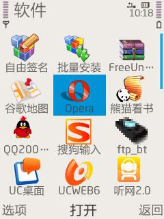
  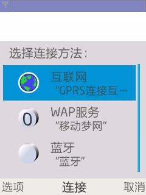
 

 

  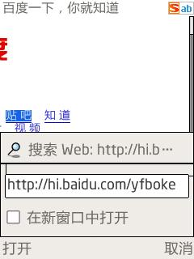
  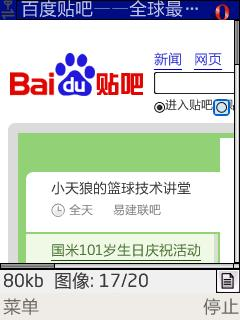
 

 

  但我最欣赏的却是nokia自带浏览器，支持flash，可以在线上youku之类的，爽。
 

 

  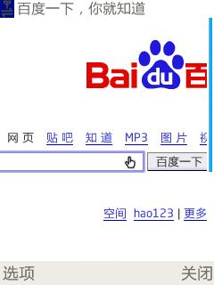
  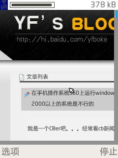
 

 

  至于有些同学提出，为什么不用skyfire？
 

 

  这个软件在ppc上可能是极品，但在Symbian上是鸡肋。卡得无法接受。
 

 

  <strong>
   5.手机输入法---搜狗拼音
  </strong>
 

 

  这个很方便，虽然有很多人喜欢用A4，但是用来用去还是觉得搜狗好一点，直觉吧。。
 

 

  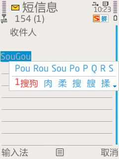
 

 

  <strong>
   6.音乐播放器
  </strong>
 

 

  总得来说，音质还是自带的音质好，但是不能显示歌词，最近发现了一个很华丽的软件，而且歌词封面都能自动上网下载，应该来说很不错了
 

 

  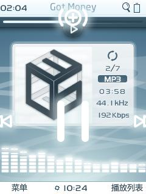
  
 

 

  其实酷狗也不错，本来说好了，2.0要发布的，现在不发不了。。汗
 

 

  
 

 

  <strong>
   7.手机QQ系列
  </strong>
 

 

  QQ我在电脑上不怎么上，但手机上偶尔会上。因为手机的msn太无趣了。
 

 

  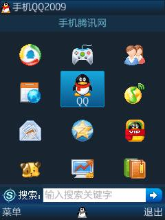
  
 

 

  至于QQ游戏大厅，在手机上就可以玩，和电脑上的QQ对战。不错（我不是内测用户，但可以玩）
 

 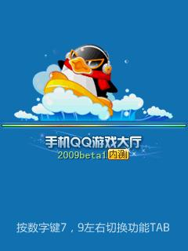
 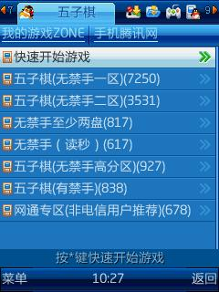
 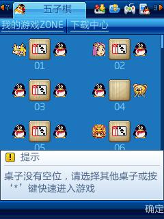
 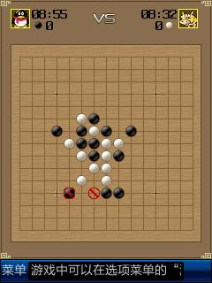
 

 

 

  8.手机的文件管理软件
 

 

  自带的功能太不强大了，文件动力实在是很强大，而且也很好看，截图上是看不出的，因为图片是被压缩了的。支持多窗口管理。
 

 

  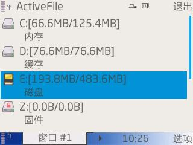
 

 

  <strong>
   9.手机电视
  </strong>
 

 

  手机电视很多，gglive确实不错。
 

 

  上次去北京，用gglive看大片（《保持通话》），很过瘾。。
 

 

  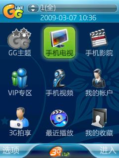
 

 

  流量方面也挺少的，看一个大片才50M，应该来说是非常省了。
 

 

  （电脑上要400M）
 

 

 

 

  最后至于你问我手机的字体是什么？微软雅黑。
 

