# 初测手机构建web服务器[大量的图] 

> 2009-03-16

 

  我很早就想过用手机构建服务器，结果，近日看cb，果然有这种可能。
 

 

  <a href="http://www.cnbeta.com/articles/79370.htm">
   http://www.cnbeta.com/articles/79370.htm
  </a>
 

 

  于是就按照这个做了一遍。果然行得通。
 

 

  不相信吧？其实理论上是可以的。就是主要是网速问题。。
 

 

  我的手机系统是S60。
 

 

  先是注册了一个二级域名
 

 

  yfss.mymobilesite.net
 

 

  (不要访问，1.如果我手机开着，会浪费一点流量，虽然我包月，但我喜欢看电视 2.手机关机或打电话的时候或连接电脑的时候会提示错误)
 

 

  首先下载安装程序。共2.1Mb，安装在手机上了之后。。。
 

 

  然后再运行程序，刚刚运行，就要提示开启web服务（一种类似于iis的服务）。
 

 

 

 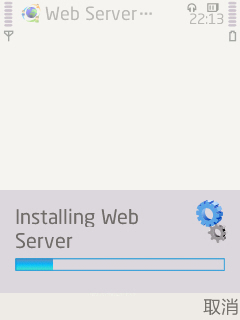
 

  开了足足有1分钟才开启。。。
 

 

  然后就进入了设置页面。
 

 

  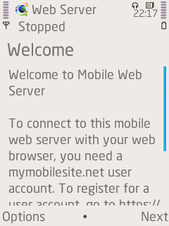
 

 

  先是欢迎界面
 

 

  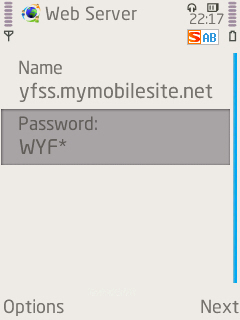
 

 

  点击下一步 输入用户名 密码
 

 

 

 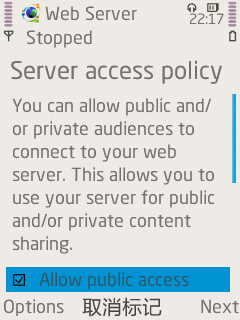
 

  同意公共性
 

 

 

 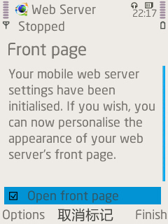
 

  进入第一个页面
 

 

 

 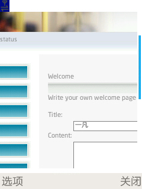
 

  进入的这个页面，是内置的，不是上网的。地址是127.0.0.1。
 

 

 

 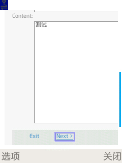
 

  最后根据cb上换了个css。
 

 

 

 

  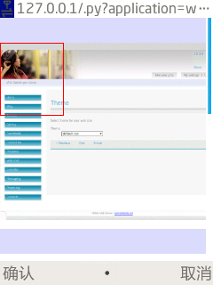
 

 

  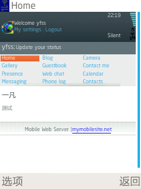
 

 

  网速是相当的慢。
 

 

  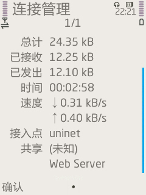
 

 

  以至于进入我的网站的网页速度是相当的慢。。。
 

 

  还是3G好。GPRS就是慢。。不一会就超时了
 

 

  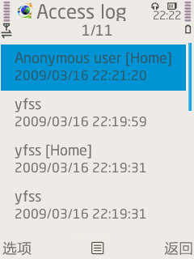
 

 

 

 

  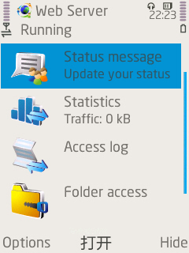
 

 

  这不应该算是一个blog，应该是个web服务器，因为他有一个最基本的特征--发送 接收 数据包。
 

 

  再来看看PC上的效果
 

 

  打开yfss.mymobilesite.net
 

 

  稍等片刻。
 

 

  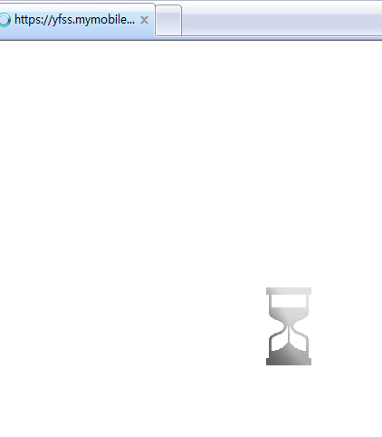
 

 

  这个图片显示了3分钟，可见联通的网速。。。
 

 

  然后。。
 

 

  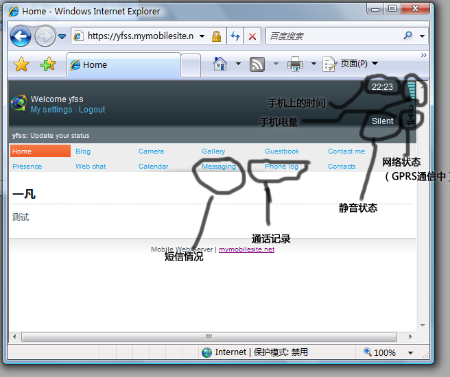
 

 

  进入了。。
 

 

  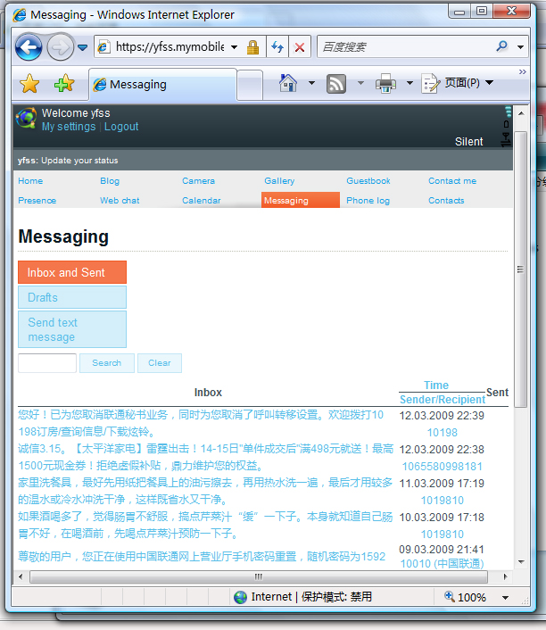
 

 

  好了！有S60机的朋友也可以去试一下哦~
 

