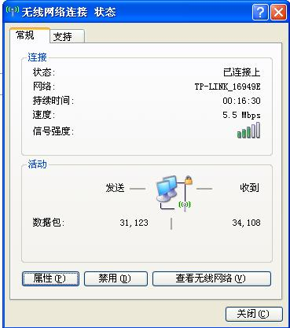

# wifi体验 

> 2009-06-11

 

  wifi真不错。。。
 

 

  我在外地，用wifi随便试了一下，结果，真连接上了！
 

 

  
 

 

  网速还是比较快的，我是免费接入的。
 

 

  
 

 

  由于信号比较差，就这样了。。。
 

 

  
 

 

  后来把本本挪了挪，好了很多！！！
 

 

  维持在300KB/S左右。
 

 

  我在小旅馆，顺便说下，隐约听到隔壁有人在ML。。。
 

 

  最近想买一个ipod touch2，忍不住了。。。
 

