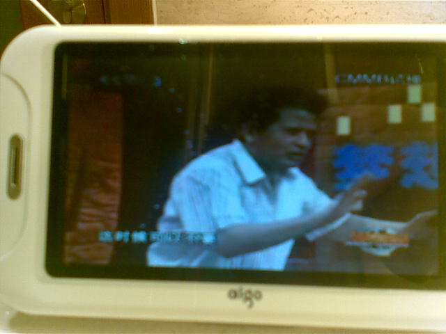
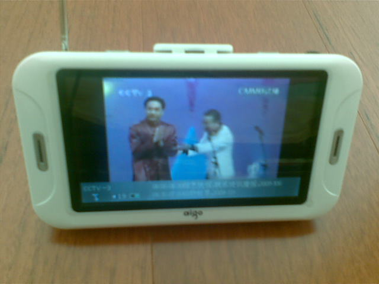
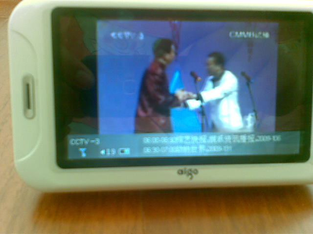
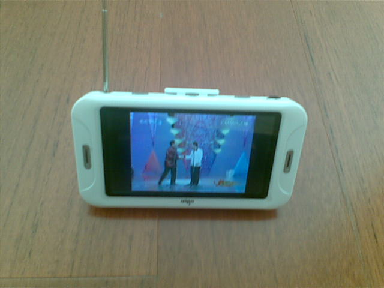
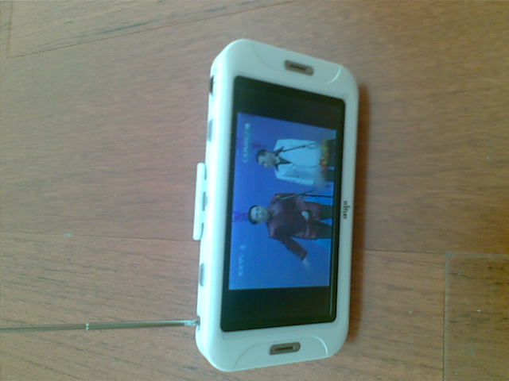

# CMMB移动电视（F968TV） 评测 

> 2009-06-26

 

  地区：浙江省宁波市某区某房10楼
 

 

  测试人：本人
 

 

  测试机型：爱国者 F968TV
 

 

  简介：拍照效果不是很好，当然了，还有视频，我使用我的手机（5320）照的。200万像素。可能太模糊看不清
 

 

  总的来说还是款不错的机子。
 

 

  支持rmvb和rm播放。
 

 

  信号不是很好。
 

 

  唯一不足的就是是个宽屏，看电影还行，看电视由于分辨率限制，人物被啦宽了。
 

 

  它的续航能力也是很不错的，我看了一天了，电池还没用完。
 

 

  下面是评测视频：
 

 

  <embed allowscriptaccess="never" height="390" loop="false" menu="false" play="true" pluginspage="http://www.macromedia.com/go/getflashplayer" src="http://player.youku.com/player.php/sid/XMTAxMTQ5MjIw/v.swf" style="width: 450px; height: 390px;" type="application/x-shockwave-flash" width="450" wmode="transparent">
  </embed>
 

 

  还有图片：
 

 

 

 
 
 
 
 

  
 

 

 

 

  话说昨天安装ubuntu了。明天再汇报结果吧~
 

 

 

 

  PS:迈克杰克逊一路走好~
  
 

