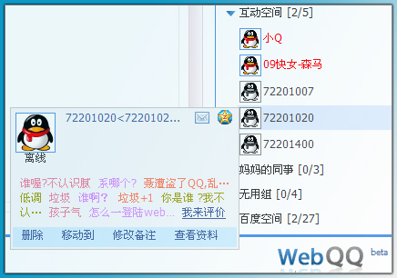
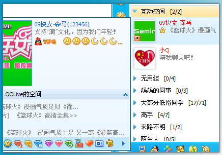
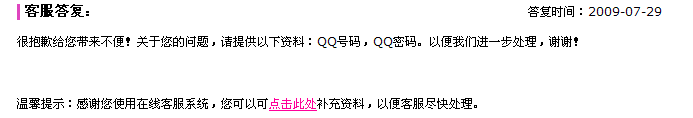
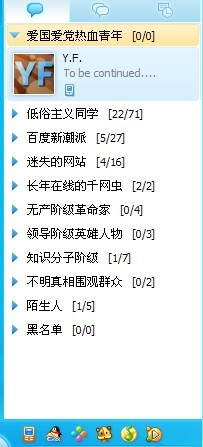

# WebQQ好友读取出未知好友-72201020,72201007,72201400 

> 2009-07-29

 

  webqq大家用过吗（web.qq.com）已经是公厕版本了
 

 

  可惜似乎好友读取发生了混乱，有个qq号码为72201020的不明真相的同志被强行加入了部分QQ的好友内。
 

 

  本人还发现了很多诸如72201开头的QQ号码（如图1），经确认本人从未加过这个QQ好友，而且QQ 2009 SP1内也未显示（如图2）
 

 

  而且大家可以从webqq那里的好友印象看出，这个qq已经被不少人加入了，因为好友印象都挤满了
 

 

  (我的QQ分组请勿见怪)
 

 

  图1：
 

 

  
 

 

  图2：
 

 

  
 

 

  不难看出多出了几个常年不在线的位置好友：
 

 

  72201007
 

 

  72201020
 

 

  72201400
 

 

  都是以72201开头的，莫非是tx特务？
 

 

  第一个是007.-_-||
 

 

  tx的好友数据库还是相当乱的。。。
 

 

  官方最新回复：
 

 

  
 

 

  晕死了，要我提供qq密码...随他便了。
 

 

  PS:
 

 

  有些同学对于我的QQ分组提出了强烈的抗议，于是本人将qq分组修改一下，新分组：
 

 

 

 

