# QQ for linux beta1 评测【图】 

> 2009-07-30

 

  这个版本很早就出来了，我知道的，只不过是今天有兴趣到ubuntu下玩一下。
 

 

  我的ubuntu很简洁。因为也没怎么用过，不过系统的易用性确实不错，也很稳定，开启了特效，也很炫，就是不知道怎么把特效录下来，截图也不行。
 

 

  不多说了，先说说为啥用QQ for linux。
 

 

  以前在linux下是没有QQ的，是用一个叫做PIDGIN的自带的软件，这个软件可以登录十余种的IM软件的号码，可是....
 

 

  这次登陆竟然......说明QQ要我们强行下载linux版本，汗！
 

 

 

 

  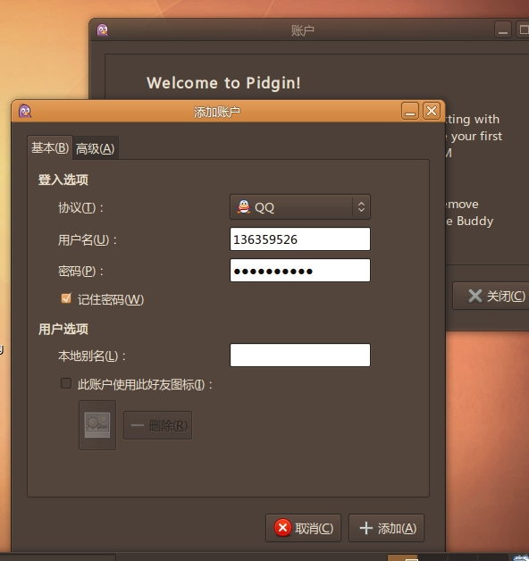
 

 

  然后
 

 

 

 

  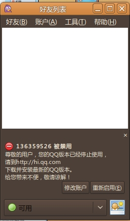
 

 

  for linux之前的还是没有这样的提示的。
 

 

  算了，干脆下载个 QQ FOR LINUX BETA1吧，顺便评测它。。
 

 

  下载完毕后，经过安装，可以看到桌面出现了个“腾讯QQ”的图标
 

 

  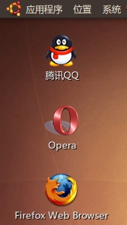
 

 

  双击打开它。
 

 

  出现登陆界面，登录了，进入与windows下的QQ2009类似界面
 

 

  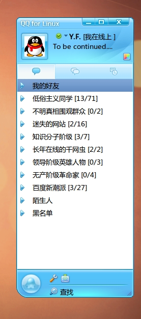
 

 

  恩不错，似乎功能简陋了点。结果一看，果真是这样。
 

 

  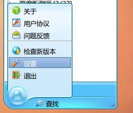
 

 

  经典的QQ菜单
 

 

  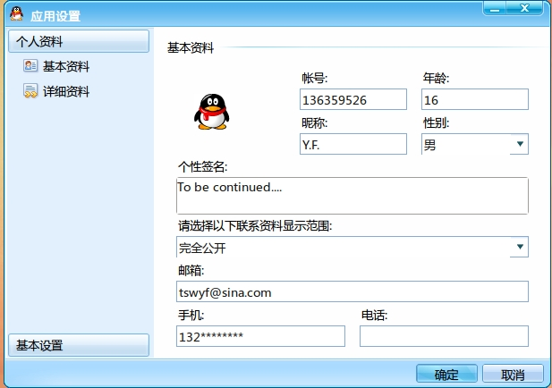
 

 

  资料设置
 

 

  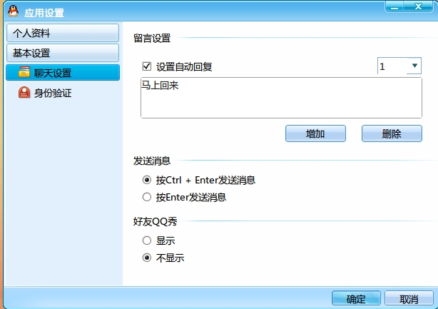
 

 

  聊天设置
 

 

 

 

  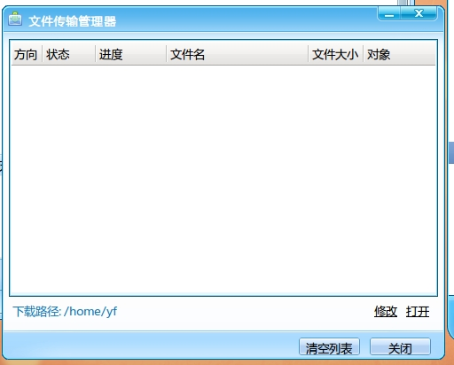
 

 

  这个比较新颖，为什么不与for windows 的版本统一呢
 

 

  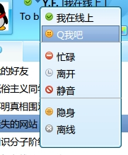
 

 

  状态设置
 

 

  
 

 

  竟然可以换肤
 

 

  
 

 

  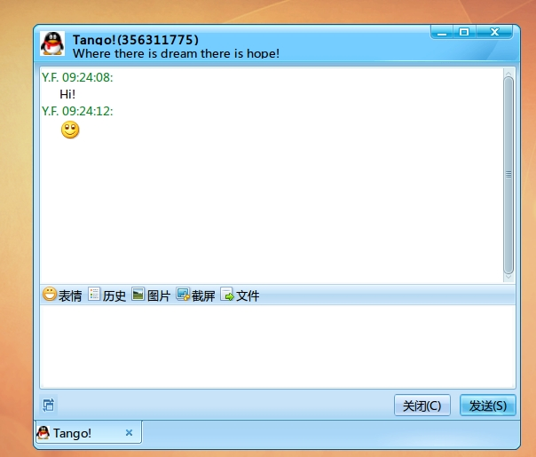
 

 

  再看看聊天的...功能，和QQ2009拥有着同样功能的提示功能
 

 

  不难看出，只有表情，图片，文件可以发，连基本的语音都没有，视频聊天就更别说了，不过大家可以看到下面的那个...类似QQTAB的。是linux特有功能可以设置一块管理。。。
 

 

  QQ for linux beta1比较简陋，功能只有最基本的，有时候连QQ FOR S60都比不上。而且显然是UI 的BUG 摆出，很多方面设计者都没有考虑到，如字体颜色之类的。下面我说说
  <strong>
   BUG：
  </strong>
 

 

  <strong>
   1.主题换成深颜色的，文字字体也跟着变
  </strong>
 

 

  <strong>
   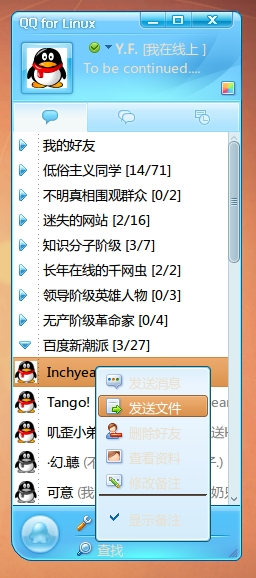
  </strong>
 

 

  <strong>
   这是我经常用的主题，文字基本上看不清。
  </strong>
 

 

  <strong>
   2.不能读取自定义头像，不能放大化。
  </strong>
 

 

  <strong>
   头像不能大图标：
  </strong>
 

 

  <strong>
   
  </strong>
 

 

  <strong>
   3.QQ好友备注无法显示，导致过多好友不认识
  </strong>
 

 

  <strong>
   如图上
  </strong>
 

 

  <strong>
   4.QQ群功能简陋无敌，群备注无法显示，群好友列表无法显示，群公告无法显示，甚至连群名称都无法显示。
  </strong>
 

 

  <strong>
   
  </strong>
 

 

  <strong>
   空。
  </strong>
 

 

  好了，优缺点都摆在这里了，和for windows版本简直无法比，要想在linux下体验for windows版本，可以使用wine软件启动就OK拉~
 

 

  大家也可以自己看看咯~~~
 

 

 

