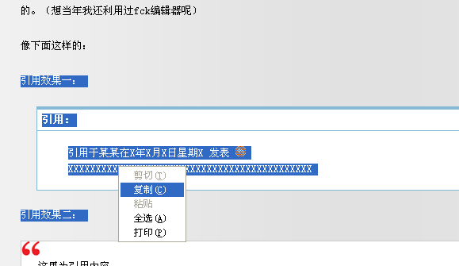

# 在百度空间里添加“引用”标签 

> 2009-08-09

 

  引用效果我是跟52abc学的。52abc是跟worldpress学的。
 

 

  记得我在2008-1时就有这个构想，就是不会弄（文章里弄了个框框：
  <a href="http://hi.baidu.com/yfboke/blog/item/2ce18903d13c8ce808fa938d.html">
   http://hi.baidu.com/yfboke/blog/item/2ce18903d13c8ce808fa938d.html
  </a>
  ）
 

 

  然后在2008-7时实现了（
  <a href="http://hi.baidu.com/yfboke/blog/item/d6130c0e832a38cf7acbe175.html">
   http://hi.baidu.com/yfboke/blog/item/d6130c0e832a38cf7acbe175.html
  </a>
  ）
 

 

  其实引用这个模块在fck编辑器（fckeditor）上是有的，可是百度却追求一贯的“简洁”的风格，取消了fc编辑器中的“插入引用”，这也是可以理解的。（想当年我还利用过fck编辑器呢）
 

 

  像下面这样的：
 

 

  引用效果一：
 

 引用:
 <blockquote>
  引用于某某在X年X月X日星期X 发表
  
   
  XXXXXXXXXXXXXXXXXXXXXXXXXXXXXXXXXXXXXXXXXXXX
 </blockquote>
 

  引用效果二：
 

 

  <code>
   这里为引用内容
  </code>
 

 

  更多引用效果。。大家可以自己制作。。
 

 

  这种都是CSs+html实现的，优点：
 

 

  可以随时根据模板的变化而改变引用模块效果。
 

 

  如果单纯的div也是可以办到的。（直接复制粘贴的方法）
 

 

  这里写如何实现CSS+HTML。
 

 

 

 

  我估计大家肯定都喜欢引用效果一（引用效果一，是绝大多数论坛里的效果，引用效果二是我独家编写的，效果简陋），那就讲讲如何实现引用效果一吧。
 

 

  <strong>
   1.添加代码
  </strong>
 

 

  首先百度空间-管理-空间装扮-模块-正在使用的模板-编辑此模板
 

 

  这时会看到一个大大的文字编辑框，将其拉到最后。添加以下代码：
 

 

  <code>
   /**2.类似论他的方法**/ .blockcode, .quote { font-size: 12px; margin: 10px 20px; border: solid #86B9D6; border-width: 4px 1px 1px;background:#fff;background-repeat: repeat-x; background-position: 0 0; overflow: hidden; } .blockcode h5, .quote h5 { border: 1px solid; border-color: #fff #fff #86B9D6 #fff; line-height: 26px; padding-left: 5px; color: #333; } .blockcode code, .quote blockquote { margin: 1em 1em 1em 3em; line-height: 1.6em; } .blockcode code { font: 14px/1.4em "微软雅黑", Courier, monospace; display: block; padding: 5px; }
  </code>
 

 

 

 

 

 

  <strong>
   2.写文章时添加引用
  </strong>
 

 

  方法①：直接复制上面的引用框到你的百度编辑器上，然后把里面的文字改掉即可。（此方法不好用，需要多次尝试，但是方便）
 

 

  
 

 

  方法②：在某fck编辑器下添加，然后复制
 

 

  （在fck编辑器下。点击那个
  <strong>
   引号
  </strong>
  图标，然后就会让你写添加的内容）
 

 

  你添加好后，把你要写的文章也写好后，可以复制到百度的编辑器上。。
 

 

  在这里，找到一个网站，供大家使用：
  <a href="http://www.master8.net/fck/">
   http://www.master8.net/fck/
  </a>
 

 

  我估计没几个人能看懂。。
 

 

  如果方法②失效或者不行，方法①又不会弄得话。。。
 

 

  那还是弄个div算了
 

