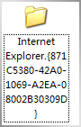

# [3P]找回逃跑的IE图标 

> 2009-08-17

 

  在安装软件的同时，安装了一恶意软件。
 

 

  不仅篡改了IE主页，而且删除了我桌面的IE图标。气愤不已。
 

 

  在这个时候，大多数HI友都是使用各种软件如“360安全软件”恢复。
 

 

  其实360恢复的挺全面的，我也挺推荐的。不过今天不同了，我在网上看到了一个小窍门。
 

 

  能快速找到逃跑的IE图标。。。
 

 

  （IE图标逃跑了？用桌面-右键-属性-桌面-自定义桌面...，可是这个却...没有呀！这就麻烦了，可能是恶意软件改了注册表）
 

 

  如下图：
 

 

  
 

 

  就是一个小窍门：
 

 

  在任意文件夹（最好不要在桌面）下，
  <strong>
   新建文件夹——名字为：Internet Explorer.{871C5380-42A0-1069-A2EA-08002B30309D}
  </strong>
 

 

  （是不是有点怪？不要怪。。）
 

 

  
 

 

  然后将该文件夹复制到桌面即可
 

 

  
 

 

  <strong>
   恢复IE方法固然很多，但是感觉这样的方法十分简单！
  </strong>
 

 

  <strong>
   PS:我也试试cnbeta的方法[P]...被骗进来了吧
  </strong>
 

