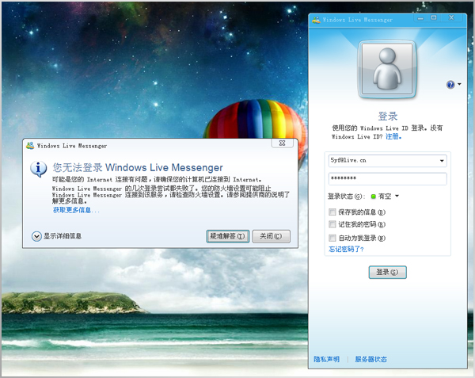

# 网络断网 

> 2009-08-17

 

  昨天开始，就开始断网了，我也不知道怎么回事。（我也没干坏事^/^）
 

 

  试了3个系统，均提示:网络电缆没有插好。
 

 

  我看看本本后面，嗯...信号灯确实没有亮。。。
 

 

  昨天由于一晚没有接触到网络，几乎处在崩溃边缘。不能入睡……
 

 

  今天一大早，就叫个网络维修人员过来，帮忙看看，他起初是怀疑我电脑有问题，拿了几张光盘，什么都没带，什么网线之类的。。。
 

 

  他整了半天。大汗淋漓。
 

 

  
 

 

  我提醒他，是不是网线断了，他说他也这么觉得，于是他又回去取了根网线来，依然不行……
 

 

  我又提醒他，是不是内部线路有问题，他说可能这样吧，于是他又跑到总机房，给我换了个插头，依然不行……
 

 

  我再提醒他，是不是机房内的网线有问题，他无语，再去总机房，换了根总线，果然，我这里竟然可以上了。
 

 

  最后原因查出了：是机房总线的线路老化导致的。（&amp;￥……，汗，一个晚上不能上网……损失巨大！）
 

 

  今天终于可以上了吧。但是刚上MSN...（我一同学告诉我他的MSN，让我加他）
 

 

  却提示：
 

 

  
 

 

  我暴汗中……
 

 

  后来在cnbeta.com上看到。。。
  <strong>
   MSN全国断网。
  </strong>
 

 

 

