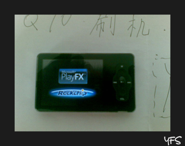
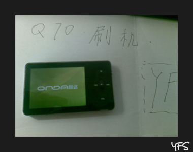
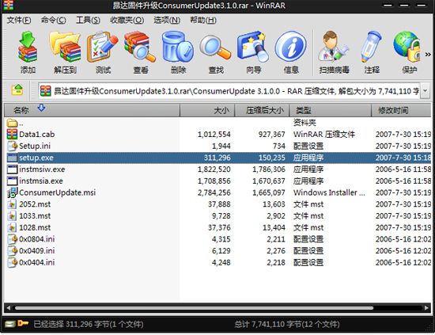
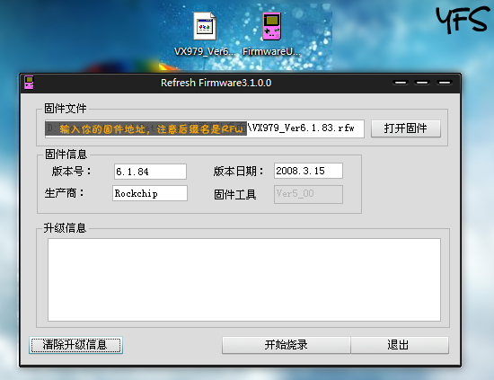
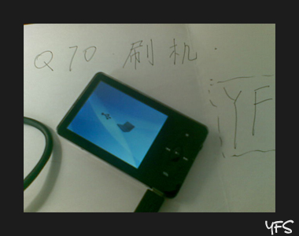

# [多P]纽曼Q70刷机——变成昂达VX979,支持flv,playfx,多款游戏 

> 2009-08-18

 

  纽曼十分不厚道，Q70这款老机老久不更新，固件不出，对不起我们啊。
 

 

  因此，我选择了刷机……
 

 

  <strong>
   刷机，十分危险的，没有胆量的机友，请勿轻易尝试！
  </strong>
 

 

  虽然Q70和VX979是两家不同公司，而且还是昂达厚道点，那我们就投靠昂达吧！昂达979还是有点好处的，
  <strong>
   支持flv（大喜！）
  </strong>
  ，而且还有很多游戏（那也不好玩），不像q70就一个游戏...（俄罗斯方块）
 

 

  好了，我们长话短说，开始吧！
 

 

  先看看刷机后的样子：
 

 

  既然刷机后是昂达的固件，开机就是
  <strong>
   昂达
  </strong>
  的样子咯
 

 

  
 

 

  开机出现playFX..
 

 

  
 

 

  然后进入昂达欢迎界面
 

 

  
 

 

  操作界面比纽曼的更华丽，更好看
 

 

  <strong>
   SETP1
  </strong>
  首先大家要确认一下自己的设备是不是：
  <strong>
   纽曼Q70
  </strong>
  （不管是T4 还是T7均可）
 

 

  <strong>
   SETP2
  </strong>
  然后大家准备两个文件，网上均可下载：
 

 

  <strong>
   ConsumerUpdate
  </strong>
  3.1.0.0和
  <strong>
   VX97906.01.0084
  </strong>
  版本固件
 

 

  均可以在gougou.com搜索得到并且使用迅雷下载。打开下载的
  <strong>
   ConsumerUpdate
  </strong>
 

 

  <strong>
   SETP3
  </strong>
  打开下载的ConsumerUpdate压缩包，如图：
 

 

  
   
  打开setup.exe，然后按下一步下一步安装，安装完毕后，我们就可以看到：
 

 

  开始-程序多出了个FirmwareUpdate，没错，就是他，准备好了。
 

 

  <strong>
   SETP4
  </strong>
  把下载好的昂达VX979固件解压出来放到一个位置。
 

 

  这时我们开始配置Q70了，Q70找到 设置-系统设置-固件升级-提示固件升级？-点确定。
 

 

  然后提示让你插入USB线。咱们把心爱的usb数据线插入PC。
 

 

  这时，系统右下角提示找到新硬件，弹出对话框，选择自动查找并安装。下一步下一步即可，最终提示安装成功！
 

 

  <strong>
   SETP5
  </strong>
  开始-程序-FirmwareUpdate，打开它。
 

 

  
 

 

  好了，点击开始烧录，中间过程会提示是否烧录（为英文），点击yes，此时就已经开始了，需要等待5-20分钟，耐心等待，这个程序可能会出现：未响应状态，这是很正常的，经常刷机的朋友都知道，等一会就会好了，是程序繁忙的表现，中间千万不要断电！如果一旦断电，结果可能是不可逆的，落下终身遗憾。
 

 

  <strong>
   SETP6
  </strong>
  等待下面的升级信息中提示：升级成功，这时你才能关闭程序，拔出usb数据线。
 

 

  等待30秒后，再插入数据线，看到了…屏幕上提示：system init，意味系统初始化，你只需等待，等待差不多1分钟吧，系统自动配置好了，就进入了链接PC模式了。
 

 

  这时候你可以轻松的拔出数据线，再开机，就看到了昂达的启动画面咯~
 

 

  再插入数据线：
 

 

  
   
 

 

 

 

 

 好了~就写到这里了
 

 

 

  YF全程报道，没胆量的机油请勿轻易尝试，我已经说明的很详细了，如果出现机器白屏或者根本无法开机的状况，本人概不负责，刷机应本着试试看的态度，危险是不可避免的。
 

 

  PS:固件刷完后，有些功能如FM不能用（没这芯片），还有按键顺序会颠倒，音量无法调节，后退键失效。如果不满意还是可以刷回Q70的
 

 

  <strong>
   刷机白屏后挽回方法，按住M键，再刷~
  </strong>
 

