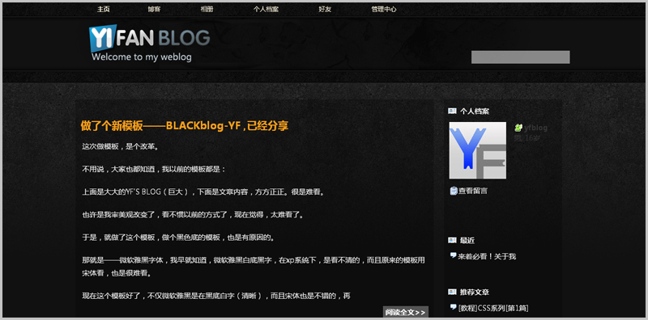
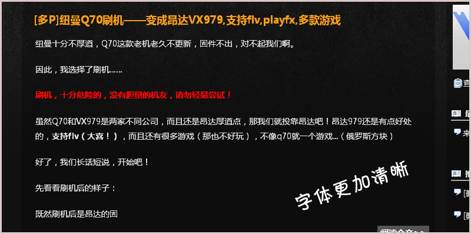

# 做了个新模板——BLACKblog-YF ,已经分享 

> 2009-08-19

 

  <strong>
   最佳分辨率：1280*1024
  </strong>
 

 

  <strong>
   浏览器：IE5.5,IE6,IE7,IE8,Firefox,Opera,Chrome（浏览器全支持）
  </strong>
 

 

  这次做模板，是个改革。
 

 

  不用说，大家也都知道，我以前的模板都是：
 

 

  上面是大大的YF'S BLOG（巨大），下面是文章内容，方方正正。很是难看。
 

 

  也许是我审美观改变了，看不惯以前的方式了，现在觉得，太难看了。
 

 

  于是，就做了这个模板，做个黑色底的模板，也是有原因的。
 

 

  那就是——微软雅黑字体，我早就知道，微软雅黑白底黑字，在xp系统下，是看不清的，而且原来的模板用宋体看，也是很难看。
 

 

  现在这个模板好了，不仅微软雅黑是在黑底白字（清晰），而且宋体也是不错的，再者说，字体也让我调大了（刚刚调大），很多人反映字太小，这是因为微软雅黑字体与宋体差别大，所以我为了照顾宋体用户，加大了字体，而且微软雅黑用户，也不难看。
 

 

  <strong>
   关于IE6下很难看
  </strong>
 

 

  关于这个，我只能说：IE6即将淘汰，升级你的IE吧，或者换为FF或OP，IE6不支持PNG，这也太废柴了，以后的模板我都不向下兼容了。
 

 

  模板已经分享了
 

 

  分享地址：
  <a href="http://hi.baidu.com/yfboke/modify/preview/2e685b2d06f29634359bf76f.css">
   http://hi.baidu.com/yfboke/modify/preview/2e685b2d06f29634359bf76f.css
  </a>
 

 

  （YIFUN改为用户的名字了）
 

 

  我的模板浏览图：
 

 

  
 

 

  
 

 

 

 

  事实上。我想象的模板样子与现在差别很大，理想和现实差别大，很正常，算了！
 

 

  板子还没做好，拿去的话，跟我说一声哈^_^
 

 

  当前进度
 

 

  ■■■■■■■■■■■■■■■■■□□□85%
 

