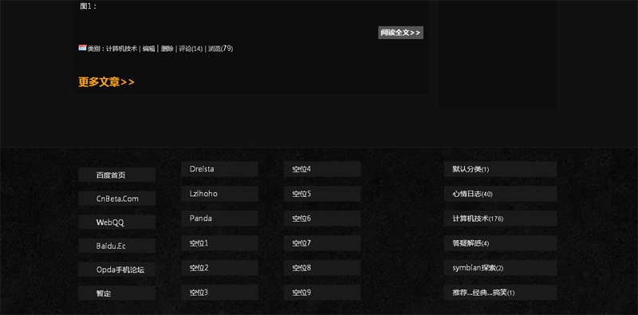

# 招募友情链接——效果绝美 

> 2009-08-20

 

  经过一天的努力，克服了N多困难，footer终于做好啦~css差了很多。
 

 

  在这里，特别感谢
  <strong>
   Inchyea
  </strong>
  提供思路。——z-index解决div层问题，瞄记问题
 

 

  什么是footer？
 

 

  就是下面的ft，什么是ft?就是写©2009 Baidu的东西，我把它放了N多个模块。
 

 

  其中第一项是：常去网站
 

 

  第二项和第三项是：友情链接
 

 

  第四项是：文章分类
 

 

  具体效果我就不描述了，估计我这种效果的在百度空间里没几个，挺特别的，我觉得创意不错（WP模板大部分都这样），有效的分配了布局。
 

 

  点击下面的图片查看吧……
 

 

  
 

 

  好了，现在开始招募友情链接：
 

 怎么办到的呢？大家不用去看源代码，我公开一下，希望大家提提建议：（代码可能只适用我的博客，加到你的空间里可能会乱掉）
 <code>
  /**创意——FOOTER模板中的模块**/
   
  html body center div#ft{color:#0d0d0d!important;line-height:352px!important;vertical-align:bottom!important;height:352px!important;background:url(
  <a href="http://hiphotos.baidu.com/yfboke/pic/item/97c8a92a48074307d42af1de.jpg">
   http://hiphotos.baidu.com/yfboke/pic/item/97c8a92a48074307d42af1de.jpg
  </a>
  ) repeat-x !important;z-index: 20 !important;}
   
  #mod_artclg .modtit,#mod_artclg .modtl,#mod_artclg .modtc,#mod_artclg .modtr,#mod_artclg .modth{display:none !important}
   
  #mod_artclg{position:absolute;z-index:10;bottom:-420px}
   
  #mod_artclg div.item{background:#1A1A1A!important;color:fff !important;line-height:30px !important;width:220px !important;}
   
  #mod_links .modtit,#mod_links .modtl,#mod_links .modtc,#mod_links .modtr,#mod_links .modth{display:none !important}
   
  #mod_links{position:absolute;z-index:14;bottom:-420px}
   
  #mod_links div.item{background:#1A1A1A !important;color:fff !important;line-height:30px !important;width:150px !important;height:28px !important}
   
  #mod_mylink2 .modtit,#mod_mylink2 .modtl,#mod_mylink2 .modtc,#mod_mylink2 .modtr,#mod_mylink2 .modth{display:none !important}
   
  #mod_mylink2{position:absolute;z-index:13;bottom:-420px}
   
  #mod_mylink2 div.item{margin-left:200px !important;background:#1A1A1A !important;color:fff !important;line-height:30px !important;width:150px !important;height:28px !important}
   
  #mod_mylink3 .modtit,#mod_mylink3 .modtl,#mod_mylink3 .modtc,#mod_mylink3 .modtr,#mod_mylink3 .modth{display:none !important}
   
  #mod_mylink3{position:absolute;z-index:12;bottom:-420px}
   
  #mod_mylink3 div.item{margin-left:400px !important;background:#1A1A1A !important;color:fff !important;line-height:30px !important;width:150px !important;height:28px !important}
 </code>
 

  空位很多...快来抢空位吧~
 

 

  
 

 

  <strong>
   1.有一定的访问量
  </strong>
 

 

  <strong>
   2.有一定的特色，如模板或博文
  </strong>
 

 

  如果满足以上任意一项，你就可以回复申请，申请很简单就说一下我要申请就好了。
 

 

  凡发表过评论的均可链接，链接明天或后天揭晓。
 

