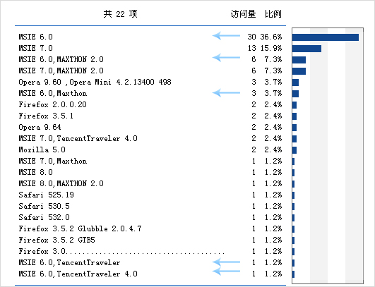
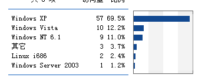
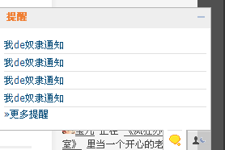

# 安排,计划,惊叹,幻想 

> 2009-08-22

 

  <strong>
   安排
  </strong>
 

 

  马上还有6天就开学了，就
  <strong>
   进入
  </strong>
  了我的
  <strong>
   高中生涯
  </strong>
  了。（非常珍惜这六天）
 

 

  我知道日子会不好过，但是也要过。上网次数会少了，对于我这种重度的网络成瘾绝症患者来说，这无疑是一个重重的打击。也许，两个礼拜上一次网，或者一个月上一次网，而且糟糕的是，还是手机上网。
 

 

  但是..我会用手机发文章的。（我的手机就是我的移动互联网）
 

 

  我知道，我不上网，会有不良反应的，这是很正常的。
 

 

  这也是没办法的，大学是要考的，所以要努力的。我是住宿的，而且还要军训（我从来没训过，也不知道会咋样....像我这种著名宅男是最怕军训的）
 

 

  这两天都在安排住宿的事情，比如被子，衣服，学习用品之类的。
 

 

  <strong>
   计划
  </strong>
 

 

  没啥计划，其实很想做一个flash空间板子，我知道我有能力做，但是没时间了，如果用这么短的时间做个很难看的，还不如不做了。
 

 

  要知道，我现在的板子，做了好长时间呢~（我CSS,PS自学，技术有限）
 

 

  不过，打算写个“
  <strong>
   ubuntu安装全过程
  </strong>
  ”文章，以前52abc发过一个，可惜被他删了。我再写一个。
 

 

  <strong>
   惊叹
  </strong>
 

 

  我原来的板子，是不兼容IE6的，昨天我在的BLOG做了个调研，偷偷的统计了一下IE6用户，不统计不知道，一统计下一跳。
 

 

  
 

 

  昨天下午到凌晨0点的访问结果如上。
 

 

  初步算了一下，36.6+7.3+3.7+1.2+1.2=
  <strong>
   50%！
  </strong>
 

 

  也就是说，每日200IP的流量大约有一半的人用IE6，也就是说，一般人看不惯我的模板
 

 

  瀑布汗！IE6用户死不绝，这我也不赖他们，很多人在网吧上网，都是ie6。
 

 

  <strong>
   好吧~只能使用临时解决办法——浏览器全支持，但是效果不如以前好看。
  </strong>
  （主页面,BLOG页面和以前一样）
 

 

  
 

 

  看来IE6和XP一样死不绝啊（其他系统是 手机）
 

 

  至于统计怎么调查，我告诉您，这数据绝对准。
 

 

  如果您想在我BLOG干坏事的话...嘿嘿，请您先代理吧。
 

 

  IP全都能记录。
 

 

  
 

 

  包括IP我就不公布了~嘿嘿。
 

 

  <strong>
   幻想
  </strong>
 

 

  幻想再放两天假，比如什么特殊情况什么，如果这样，我就可以制作一套Flash模板了。
 

 

  
 

 

  YF快快奴隶（努力）吧~
 

 

  我很傻很天真，请勿BS我~
 

