# Ubuntu 9.04 - 安装 使用 美化 娱乐 维护 等指南 

> 2009-08-23

 

 

 

  <strong>
   
  </strong>
 

 

  <strong>
   前言
  </strong>
 

 

  我承认,我UBUNTU玩的不是一天两天的了。但还是对linux一知半解，既然这样，发个文章，跟大家讨论讨论,全文在UBUNTU系统下写成.
 

 

  该文章确实是本人亲手写成，截图也是亲自截图，某些同学说我的文章和某些文章撞车了，那没关系，都是些ubuntu的。
 

 

  我linux很烂的，高手请勿鄙视我，52abc写过一个类似这样的文章，可惜删了。
 

 

  先介绍一下ubuntu吧:
 

 

  ubuntu是linux的一个发行版，是开源的，免费的。
 

 

  ubuntu的读音为：无奔突
 

 

  <strong>
   为什么安装ubuntu？
  </strong>
 

 

  1.免费，2.特效很好，3.易用
 

 

  对于第三点，可能很多人都不认同，起初我也不认同，但是后来我还是被ubuntu折服了。
 

 

  ubuntu的确易用，为什么呢？1.安装软件十分简便，不用在网页下下载安装包，直接用软件管理器，搜索再安装（也可以在网页上下载...麻烦）2.安全，不是说没有linux病毒，但是...毕竟ubuntu的软件管理机制很严格...3.wine，这个并不是虚拟机，但会运行windows程序，提供了windows程序接口，这样，linux下运行windows变得轻而易举（我也运行过3D游戏，有点卡），所以软件问题就不用难了。
 

 

  <strong>
   需要的配置要求?
  </strong>
 

 

  ubuntu没有配置限制,一般来说,现在的主流配置,运行是十分流畅的,显卡好点的能流畅运行特效,只要能运行VISTA,ubuntu肯定能,如果Vista不能运行的话,ubuntu也可以试试.
 

 

  <strong>
   如何获得？
  </strong>
 

 

  因为ubuntu是开源免费的，所以可以在其官网下载“纯”的ubuntu。
 

 

  地址：
  <a href="http://www.ubuntu.org.cn/">
   http://www.ubuntu.org.cn/
  </a>
 

 

  1.下载
 

 

  我建议下载桌面版的，服务器版一般用户不需要。
 

 

  下载请到：
  <a href="http://www.ubuntu.org.cn/getubuntu/download/">
   http://www.ubuntu.org.cn/getubuntu/download/
  </a>
 

 

  700MB
 

 

  选择版本，语言，下载，建议用迅雷下载（我以前网速的话，能达到10M/S，现在我的网速被限速了，500KB/S）
 

 

  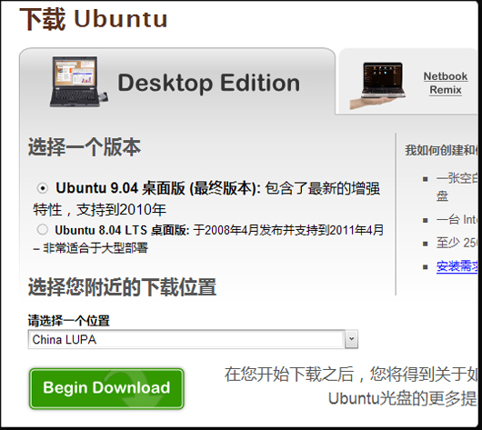
 

 

  2.免费寄给我一个光盘
 

 

  传送地址：
  <a href="https://shipit.ubuntu.com/">
   https://shipit.ubuntu.com/
  </a>
 

 

  我没收到过，因为我根本没按提交（感觉没用，不浪费资源了），很多好友都收到了，的确是免费的
 

 

  据说收到CD要1-2个月。。。
 

 

  <strong>
   得到安装包，下一步？
  </strong>
 

 

  我这里有很多种安装方法：
 

 

  1.光盘安装（推荐）
 

 

  ①先把下载到的ISO通过nero等刻录软件刻录到空光盘上，自己不会可以到电脑店刻录
 

 

  ②重新启动，插入光盘，调整bios，改到cd/dvd引导，再重启
 

 

  ③进入了ubuntu选择页面，选择
 

 

  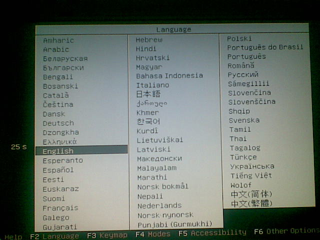
 

 

 

 

  选择简体中文
 

 

  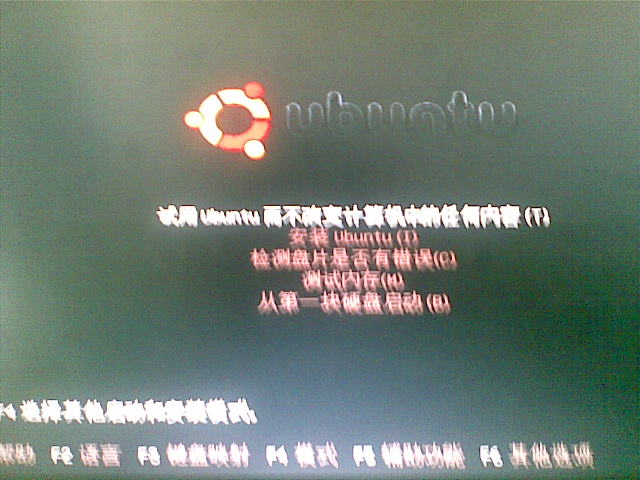
 

 

  选择第一个选项——试用ubuntu
 

 

  然后就能进入ubuntu界面，点击桌面的 安装...
 

 

  根据提示一步一步的下一步进行。
 

 

  尤其是分区，我跟你说，这个很重要。
 

 

  具体方法：在windows下（其他平台下也可以），使用分区软件先腾出一个3－8GB左右的分区。
 

 

  然后在linux系统下，安装界面中，跳到分区的时候。
 

 选择手动分区，把空出来的分区，”/“分个3G，“/swap“分个内存容量的两倍，最好再分个“/home“，大小，看你的硬盘啦
 

  （我就没分/home）
 

 

  安装视频:(我录得不好,请不要BS我)
 

 

  <embed allowscriptaccess="never" height="390" loop="false" menu="false" play="true" pluginspage="http://www.macromedia.com/go/getflashplayer" src="http://player.youku.com/player.php/sid/XMTAxMTQ0NDIw/v.swf" type="application/x-shockwave-flash" width="450" wmode="transparent">
  </embed>
 

 

  <embed allowscriptaccess="never" height="390" loop="false" menu="false" play="true" pluginspage="http://www.macromedia.com/go/getflashplayer" src="http://player.youku.com/player.php/sid/XMTAxMTQ1NTQ0/v.swf" type="application/x-shockwave-flash" width="450" wmode="transparent">
  </embed>
 

 

  <embed allowscriptaccess="never" height="390" loop="false" menu="false" play="true" pluginspage="http://www.macromedia.com/go/getflashplayer" src="http://player.youku.com/player.php/sid/XMTAxMTQ1Njk2/v.swf" type="application/x-shockwave-flash" width="450" wmode="transparent">
  </embed>
 

 

  2.硬盘安装
 

 

  详见：http://wenwen.soso.com/z/q16321255.htm
 

 

  3.wubi安装
 

 

  在windows界面下，解压得到的iso文件（使用winrar），打开其目录下的wubi.exe。
 

 

  根据wubi.exe的提示进行下一步操作。
 

 

  然后重启系统了。具体操作和1一样。
 

 

  4.虚拟机安装
 

 

  使用vmvare虚拟机安装
 

 

  有两种安装方式：
 

 与1一样,就是要载入iso罢了
  
 

  5.GHOST安装
 

 

  下载gho文件,使用ghost安装,安装后就是全新的系统.
 

 

  <strong>
   安装后-配置源
  </strong>
 

 

  配置源,什么是源?
   
  按照我的理解,源就是指提供ubuntu各种安装包的服务器(例如:语言文件,软件,游戏)
   
  ubuntu中源很重要.
   
  首先.我们先看看配置是否正确
   
  按照如图操作
 

 

  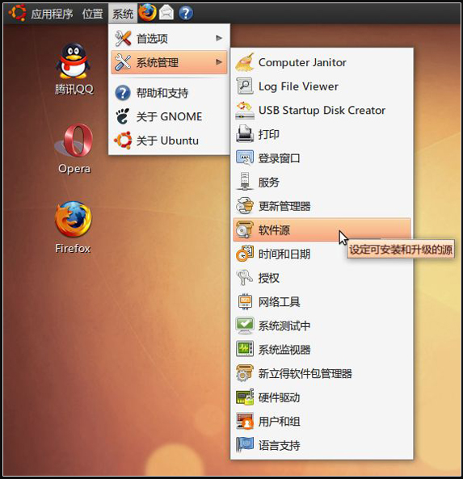
 

 

  <strong>
   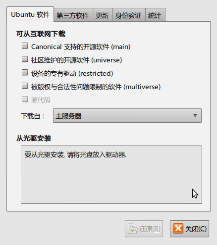
  </strong>
 

 

  确认跟上面一样后,我们开始下面的操作了
 

 

  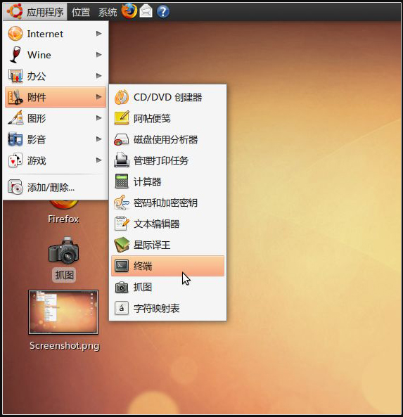
 

 

  打开终端
 

 

  输入:sudo gedit /etc/apt/sources.list 按回车(可能提示输入密码,你输入把,密码不会显示的按回车即可)
 

 

  
 

 

  接下来,删掉里面内容
 

 

  输入:(我建议使用163源,速度很快)
 

 

  （更多源请详见：
  <a href="http://www.baidu.com/s?wd=ubuntu+9.04+%D4%B4">
   http://www.baidu.com/s?wd=ubuntu+9.04+%D4%B4
  </a>
  ）
 

  
 <code>
  deb http://mirrors.163.com/ubuntu/ jaunty main restricted universe multiverse
   
  deb http://mirrors.163.com/ubuntu/ jaunty-security main restricted universe multiverse
   
  deb http://mirrors.163.com/ubuntu/ jaunty-updates main restricted universe multiverse
   
  deb http://mirrors.163.com/ubuntu/ jaunty-proposed main restricted universe multiverse
   
  deb http://mirrors.163.com/ubuntu/ jaunty-backports main restricted universe multiverse
   
  deb-src http://mirrors.163.com/ubuntu/ jaunty main restricted universe multiverse
   
  deb-src http://mirrors.163.com/ubuntu/ jaunty-security main restricted universe multiverse
   
  deb-src http://mirrors.163.com/ubuntu/ jaunty-updates main restricted universe multiverse
   
  deb-src http://mirrors.163.com/ubuntu/ jaunty-proposed main restricted universe multiverse
   
  deb-src http://mirrors.163.com/ubuntu/ jaunty-backports main restricted universe multiverse
 </code>
 

  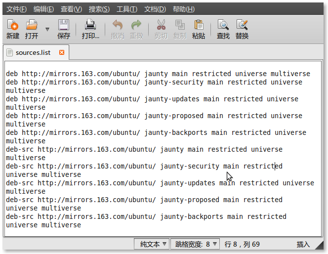
 

 

  保存后.
 

 

  回到终端:
 

 

  继续输入:
 

 

  sudo apt-get update
 

 

  然后会一堆的提示.不用管了,等到它回到终端的状态,咱们就关闭了吧~
 

 

  好了,源更新完毕!
   
 

 

  <strong>
   安装后-语言
  </strong>
 

 

  很多人反应,安装后,语言是半英文半中文的,而且没有中文输入法,有些人就会想,这是什么破系统.
 

 

  你错了,ubuntu为了节省空间,把语言给精简了,真正的ubuntu的完整版安装光盘是高达3G多.
 

 

  既然精简了,我们也可以把它给还原回来.
 

 

  系统(左数第3个)-系统管理(第2个)-语言支持(最后一个):
 

 

  这时候会提示上次的语言没有安装完,点击继续,就会弹出继续下载的界面.
 

 

  如果没有弹出,我们这样...
 

 

  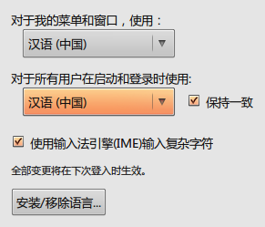
 

 

  好啦,语言我们就配置完毕了!
 

 

  <strong>
   安装后-配置
  </strong>
 

 

  没有十全十美的计算机,除非你驱动都是开源的,否则肯定会有硬件不能正常运行,如果你显卡特效开不起,说明你的驱动之类的可能没安.
 

 

  在ubuntu下安装驱动很简单的.
 

 

  系统-系统管理-硬件驱动
 

 

  把上面没开启的点成绿色,开启状态即可
 

 

  经过一次次重启,直到下面状态,我们就是万事大吉了
 

 

  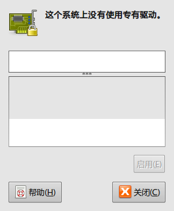
 

 

  <strong>
   安装后-特效
  </strong>
 

 

  驱动装好了,特效我们是可以开启了.
 

 

  桌面右键-更改桌面背景-视觉效果
 

 

  选择 扩展
 

 

  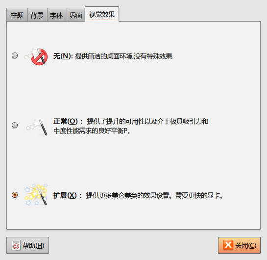
 

 

  使用后,大家会看到如同果冻效果的界面...十分好玩.
 

 

  <strong>
   安装后-美化
  </strong>
 

 

  刚刚安装新系统后,看着很不习惯,这是很正常的.
 

 

  其实ubuntu不需要美化的,为什么呢?它的特效已经开启.已经很不错了.
 

 

  我们做的,只是改改主题,字体,背景罢了.
 

 

  还是那个
 

 

  桌面-右键-改变桌面背景-背景
 

 

  大家可以选择添加,把好看的背景家进去
 

 

  主题
 

 

  
 

 

  大家可以自由的选择。呵呵。还有安装...大家主题可以网上下载。
 

 

  更改字体
 

 

  我只能说自带的字体太难看。我们换一个吧
 

 

  感觉还是微软亚黑字体最好看。那么好吧！
 

 

  进入windwos系统分区找到雅黑字体文件,复制到/usr/share/fonts/truetype下就可以了
   
  具体：以管理员权限运行命令sudo nautilus /usr/share/fonts/truetype打开文件管理器,创建一个文件夹msyahei，把字体放进入，然后到主题设置那设置一下字体就可以了。
 

 

  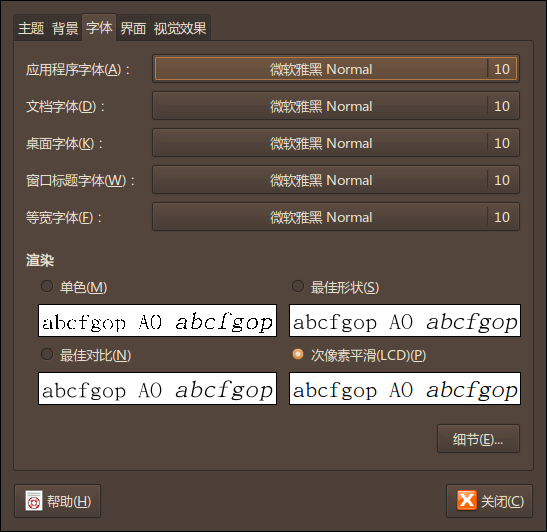
 

 

  OK设置完毕！
 

 

  <strong>
   安装后－软件
  </strong>
 

 

  安装后，浏览器已经自带了，这点很好——是FIREFOX，这款浏览器很优秀。
 

 

  我再推荐一款——OPERA，这是挪威的浏览器，也很优秀。
 

 

  聊QQ的话，只能使用QQ FOR LINUX版本了，很废柴，等待BETA2吧～
 

 

  好啦，现在开始教大家如何安装软件
 

 

  有两种方式：
 

 

  1.使用新立得软件包管理器安装
 

 

  系统－系统管理－新立得软件包管理器
 

 

  搜索你要的软件／游戏
 

 

  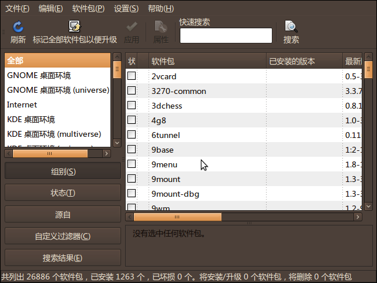
 

 

  例子：快速搜索输入opera
 

 

  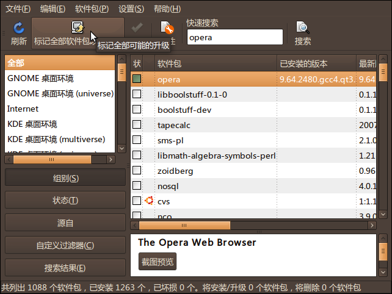
 

 

  找到啦，第一个就是，双击它
 

 

  然后点击 “应用”按钮
 

 

  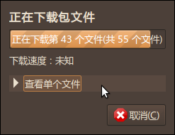
 

 

  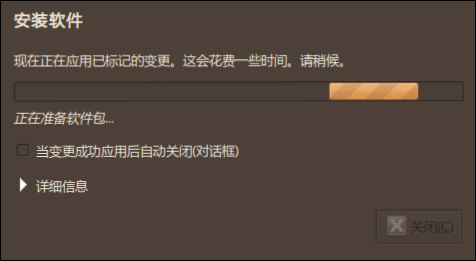
 

 

  等这个完毕之后。
 

 

  我们就可以在
 

 

  应用程序－internet中看到opera拉～
 

 

  软件安装完毕！
 

 

  2.网上下载（不做介绍，十分简单）
 

 

  3.终端命令
 

 

  打开终端，输入sudo apt-get +你要的软件名称
 

 

  根据提示安装
 

 

  <strong>
   安装后-更改grub/启动顺序
  </strong>
 

 

  在ubuntu安装完毕后，很多同学都发现，我的系统默认启动顺序被ubuntu强行更改了，使得ubuntu到了第一位，这样不好，很多低俗同学就又要说啦：ubuntu不好用。
 

 

  因为windows软件毕竟多，尽管ubuntu下有wine软件（下文我会介绍到），那么如此。就跟我改启动顺序吧
 

 

  对了，提一下，控制启动的软件叫grub。
 

 

  打开终端；输入：
 

 

  sudo gedit /boot/grub/menu.lst
 

 

  看到
 

 <code>
  title Ubuntu 9.04, kernel 2.6.28-13-generic
   
  uuid a282a4d1-ff70-42ed-9702-695f6e456dbd
   
  kernel /boot/vmlinuz-2.6.28-13-generic root=UUID=a282a4d1-ff70-42ed-9702-695f6e456dbd ro locale=zh_CN quiet splash
   
  initrd /boot/initrd.img-2.6.28-13-generic
   
  quiet title Ubuntu 9.04, kernel 2.6.28-13-generic (recovery mode)
   
  uuid a282a4d1-ff70-42ed-9702-695f6e456dbd
   
  kernel /boot/vmlinuz-2.6.28-13-generic root=UUID=a282a4d1-ff70-42ed-9702-695f6e456dbd ro locale=zh_CN single
   
  initrd /boot/initrd.img-2.6.28-13-generic title Ubuntu 9.04, memtest86+
   
  uuid a282a4d1-ff70-42ed-9702-695f6e456dbd
   
  kernel /boot/memtest86+.bin
   
  quiet ### END DEBIAN AUTOMAGIC KERNELS LIST # This is a divider, added to separate the menu items below from the Debian
   
  # ones.
   
  title Other operating systems:
   
  root # This entry automatically added by the Debian installer for a non-linux OS
   
  # on /dev/sda1
   
  title Microsoft Windows XP Home Edition
   
  rootnoverify (hd0,0)
   
  savedefault
   
  makeactive
   
  chainloader +1
 </code>
 

  第一种方法，调整启动选项的顺序，把最后的windows启动选择调到第一个 即：
   
  <code>
   # This is a divider, added to separate the menu items below from the Debian
    
   # ones.
    
   title Other operating systems:
    
   root # This entry automatically added by the Debian installer for a non-linux OS
    
   # on /dev/sda1
    
   title Microsoft Windows XP Home Edition
    
   rootnoverify (hd0,0)
    
   savedefault
    
   makeactive
    
   chainloader +1 ### END DEBIAN AUTOMAGIC KERNELS LIST title Ubuntu 9.04, kernel 2.6.28-13-generic
    
   uuid a282a4d1-ff70-42ed-9702-695f6e456dbd
    
   kernel /boot/vmlinuz-2.6.28-13-generic root=UUID=a282a4d1-ff70-42ed-9702-695f6e456dbd ro locale=zh_CN quiet splash
    
   initrd /boot/initrd.img-2.6.28-13-generic
    
   quiet title Ubuntu 9.04, kernel 2.6.28-13-generic (recovery mode)
    
   uuid a282a4d1-ff70-42ed-9702-695f6e456dbd
    
   kernel /boot/vmlinuz-2.6.28-13-generic root=UUID=a282a4d1-ff70-42ed-9702-695f6e456dbd ro locale=zh_CN single
    
   initrd /boot/initrd.img-2.6.28-13-generic title Ubuntu 9.04, memtest86+
    
   uuid a282a4d1-ff70-42ed-9702-695f6e456dbd
    
   kernel /boot/memtest86+.bin
    
   quiet
  </code>
 

 

  第二种是注释掉其他启动项，把
  <code>
   title Ubuntu 9.04, kernel 2.6.28-13-generic
    
   uuid a282a4d1-ff70-42ed-9702-695f6e456dbd
    
   kernel /boot/vmlinuz-2.6.28-13-generic root=UUID=a282a4d1-ff70-42ed-9702-695f6e456dbd ro locale=zh_CN quiet splash
    
   initrd /boot/initrd.img-2.6.28-13-generic
    
  </code>
  quiet
   
  等等 保留xp之外的前面都加上＃注释掉
  <code>
   # title Ubuntu 9.04, kernel 2.6.28-13-generic
    
   # uuid a282a4d1-ff70-42ed-9702-695f6e456dbd
    
   # kernel /boot/vmlinuz-2.6.28-13-generic
    
   # root=UUID=a282a4d1-ff70-42ed-
    
   # 9702-695f6e456dbd ro locale=zh_CN quiet
    
   # splash
    
   # initrd /boot/initrd.img-2.6.28-13-generic
    
   ＃ quiet
  </code>
 

 

  第三种就是修改启动默认标号，即修改
  <code>
    
   # You can specify 'saved' instead of a number. In this case, the default entry
    
   # is the entry saved with the command 'savedefault'.
    
   # WARNING: If you are using dmraid do not use 'savedefault' or your
    
   # array will desync and will not let you boot your system.
    
   default 0
    
   改为default     X
    
  </code>
  如果你的xp的title数下来是几就改几，第一个是0，一次类推
   
  这样会将启动选择条默认在你选择的系统上
 

 

  <strong>
   安装后-运行MS Windows程序
  </strong>
 

 

  以前我经常提到一个软件叫做wine，英文意思是酒。
 

 

  但实际的名字叫做：Wine Is Not an Emulator
 

 

  意思是，wine不是一个模拟器。
 

 

  很多同学都误解wine是个虚拟机，在虚拟框架下，运行windows程序，这位同学，你错了。
 

 

  wine只是调用了windows的api而已，还是在linux框架下执行的。
 

 

 

 

  如何得到WINE？
 

 

  打开终端，输入：sudo apt-get install wine
 

 

  执行。
 

 

  不一会，会提示是否安装，我们输入Y之类的。按照要求，自动下载。然后根据提示安装。
 

 

  安装之后，我们会看到应用程序中多了一个目录叫做wine
 

 

  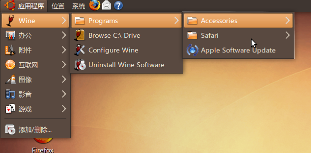
 

 

  这个就如同windows的程序.
 

 

  .
  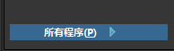
 

 

  如何安装windows程序？
 

 

  其实很简单。大部分软件的安装方式是：(我只介绍大部分的)
 

 

  我们介绍就两种类型的吧：
 

 

  1.绿色版软件
 

 

  很简单，我们那PS绿色版举例子吧
 

 

 

 

  未完待续...
 

 

 

