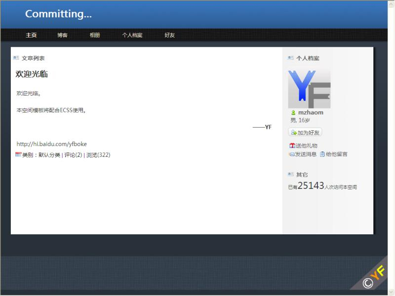

# 清爽蓝色调 Preview——新制作的模板,已分享 

> 2009-08-23

 

  在我开学前，我想多做点板子，并且分享之，否则某些低俗同学会站起来说我太自私，每次都是给我自己做板子。而且分享后也不完整。
 

 

  开学后肯定没时间做板子了，那样就对不起大家了。
 

 

  名字就定为 清爽蓝色调 吧 目前是Preview版
 

 

  此后还可能出Beta1，Beta2（人人都要学TX）
 

 

  至于有些同学提出来，要css参考一下，没关系，那去吧，就是最好不要分享，因为这个板子也是做了我两个小时啊（我技术有限）
 

 

  这个板子我还是挺满意的，至少比现在的这个满意。
 

 

  最佳的浏览器是：IE6以上（未测试，应该是这样，希望大家测试）
 

 

  感觉各个页面都很完美。风格是很清爽的。
 

 

  至于字体，最好使用微软雅黑。没有微软雅黑，效果也不错的。
 

 

  我本来博客也想用这个板子着，后来想想还是算了，看BLOG的人继续拉窗帘看吧（已经改进了，但还是暗）
 

 

  板子的测试空间：
  <a href="http://hi.baidu.com/commit">
   http://hi.baidu.com/commit
  </a>
 

 

  这个板子的效果图：
 

 

  
 

 

  （commit空间百度请勿和谐它，它没干坏事。）
 

 

  
 

 

  （点击上面图片使用模板，因为百度有那个红色的条条，如果你喜欢就直接点使用，不要管上面的浏览效果。谢谢，实际效果以浏览空间为准（
  <a href="http://hi.baidu.com/commit">
   http://hi.baidu.com/commit
  </a>
  ））
 

