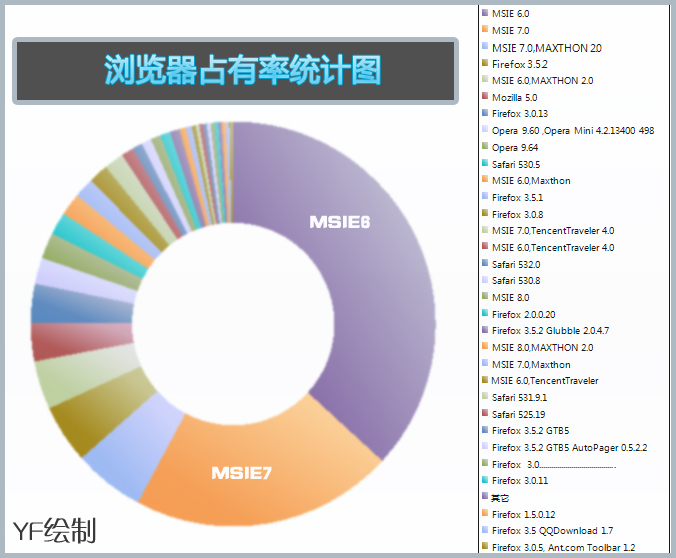

# 不抛弃,不放弃 IE用户 [附:浏览器占有率不完全统计图] 

> 2009-08-25

 

  很多人在设计网页的时候，都会放弃IE6用户，声称不能再向下兼容了。
 

 

  这也是很正常的，IE6这么废柴的浏览器早该淘汰了，很多新的语法都不支持。
 

 

  但是！一个很现实的问题，IE6用户群确实存在，而且很大。IE用户群也很大。非IE用户群仅占到不足30%。
 

 

  以前我的BLOG是不支持IE6的，在此期间，我做了个调查，今天我把统计报告发上来。
 

 

  <strong>
   由于我的blog面相的用户群不同，大部分还是来我BLOG观光的，所以统计图具有一定的针对性，我是就事论事。
  </strong>
 

 

  几天的统计，估计统计数据已经快要过千了，这我才敢拿出来给大家看。统计的网站就是我的BLOG——及各个子页面。
 

 

  
 

 

  由于统计网页的统计的很详细，具体是马桶浏览器或是腾讯浏览器之类的也分出来了，还有火狐的版本号也很详细，所以给大家参考带来了麻烦，为此本人先说声不好意思。
 

 

  IE6用户占有44%（包括了腾讯，马桶之类的浏览器）
 

 

  所以，在设计网页的时候，一定要考虑IE6用户，至于兼容非IE浏览器，是可以不考虑的。
 

 

  这个是我通过 表格软件excel通过PS加工，得到的。
 

 

  IE6用户和xp和春哥一样，都会永生。是无敌的。
 

 

  PS:
 

 

  <strong>
   还有1天就开学了，开学了，我就没多长时间上网了，我会想念你们的！
  </strong>
 

 

  细心的朋友会发现，我的blog的header刷新一下会变色。
 

