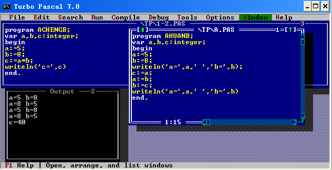

# NOIP第一课 

> 2009-09-30

 

  好久没上网了，终于国庆了，ye~
 

 

  开学已经整整一个多月了，同学都认熟了
 

 

  每天都挺充实的，说实在的，也挺单调无味的。
 

 

  每天干的事情不过就是吃饭学习睡觉等.
 

 

  学习特别紧.也没什么时间摸摸电脑.不过我是 电脑课代表+电教设备管理委员.
 

 

  而且
 

 

  学校有个NOIP社团，我也报名了。
 

 

  太棒了，终于可以在学校学习编程了（pascal），终于可以从零学起了
 

 

  第一节课讲了一些理论知识，然后老师举了一些例子阐释了程序的 顺序执行 分支执行 顺序执行
 

 

  当然，我自学过一点pascal，这些我是知道的。然后讲了如何赋值
 

 

  第一节课我写的代码如下：
   
  ab值互换（a为5，b为8）
   
  <code>
   program AHUANB;
    
   var a,b,c:integer;
    
   begin
    
   a:=5;
    
   b:=8;
    
   writeln('a=',a,' ','b=',b);
    
   c:=a;
    
   a:=b;
    
   b:=c;
    
   writeln('a=',a,' ','b=',b)
    
   end.
  </code>
 

 

  c的值为a与b的乘积：
   
  <code>
   program ACHENGB;
    
   var a,b,c:integer;
    
   begin
    
   a:=5;
    
   b:=8;
    
   c:=a*b;
    
   writeln('c=',c)
    
   end.
  </code>
 

 

  
 

 

  今天是30号，明天我还等着看阅兵呢。放假8天，幸福中……
 

 

  话说我也会在手机上运行tp了。。。
 

