# 国庆阅兵 

> 2009-10-01

 

  拍摄地点：北京朝阳区复兴门商业城前
 

 

  拍摄人：YF
 

 

  拍摄时间：2009.10.1
 

 

  效果不是很好，用5320的200W像素拍摄的，有视频。
 

 

  很壮观。拍摄地点有很多人，到处都是拿着相机拍摄的，很多人带着专业摄像机。
 

 

  还有很多老人，他们都观看过89，99年的阅兵式。
 

 

  在这里8点就很多人了，11点左右，开始有飞机 大炮 坦克 装甲车开过。今天天气特别的好，有点小风，有阳光。
 

 

  特别说一下那飞机，会喷五颜六色的气。
 

 

  视频：
 

 

  <embed allowscriptaccess="never" height="390" loop="false" menu="false" play="true" pluginspage="http://www.macromedia.com/go/getflashplayer" src="http://player.youku.com/player.php/sid/XMTIyNTUwNjYw/v.swf" style="width: 450px; height: 390px;" type="application/x-shockwave-flash" width="450" wmode="transparent">
  </embed>
 

 

  下面是我拍的一些照片。
 

 

  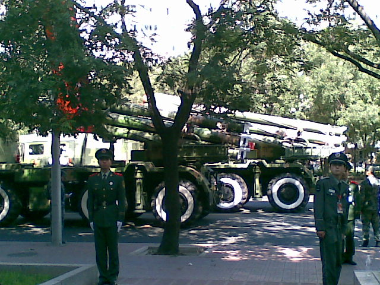
 

 

   
  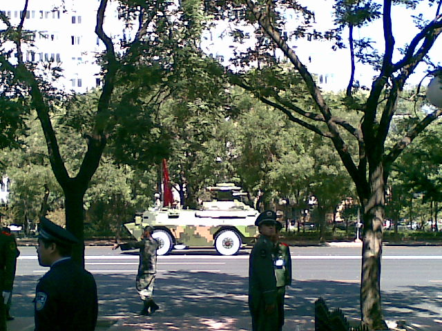
 

 

   
  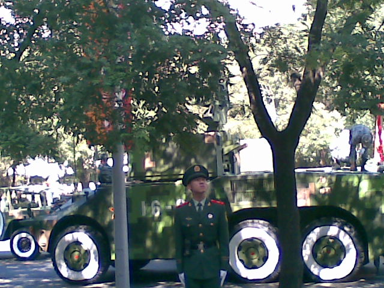
 

 

   
 

 

   
 

 

   
  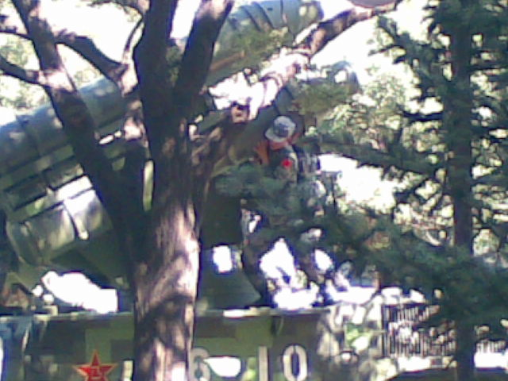
 

 

   
  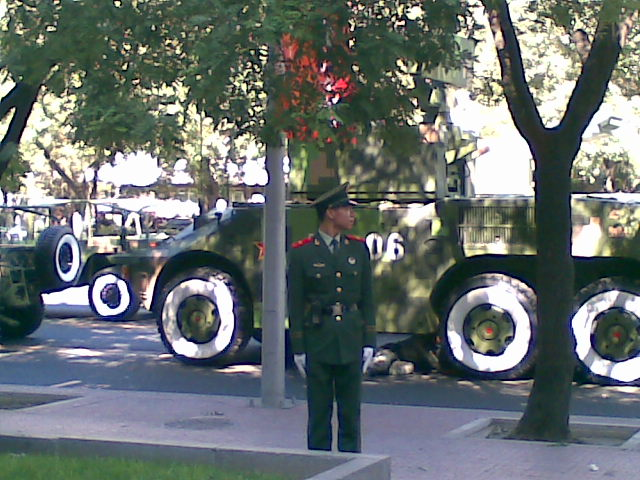
 

 

   
  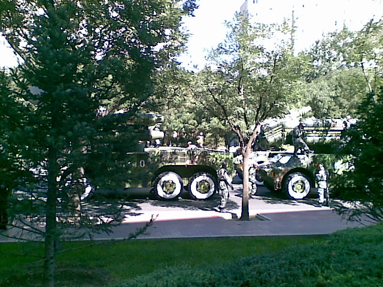
 

 

   
  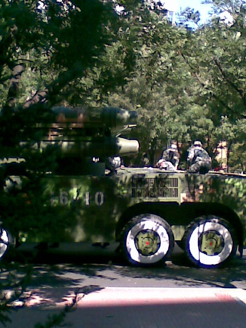
 

 

   
  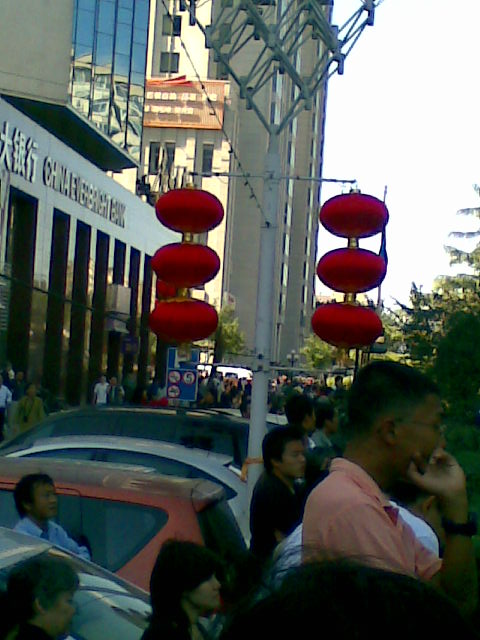
 

 

  观看人数之多
   
  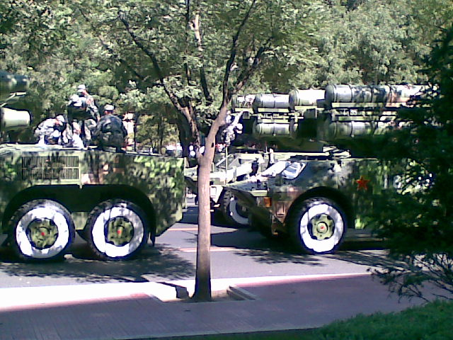
 

 

   
  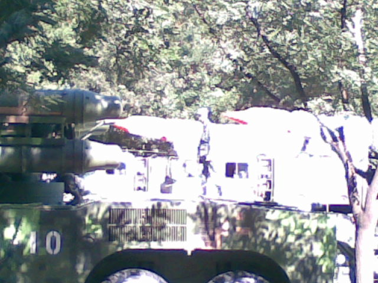
 

 

   
  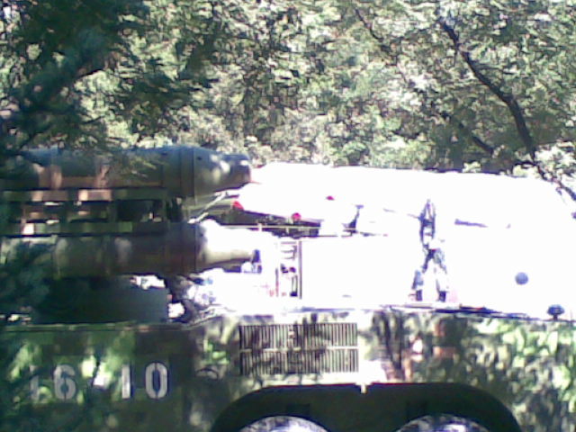
 

 

   
  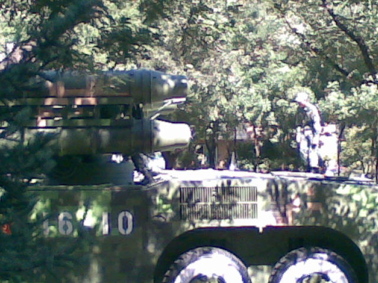
 

 

   
  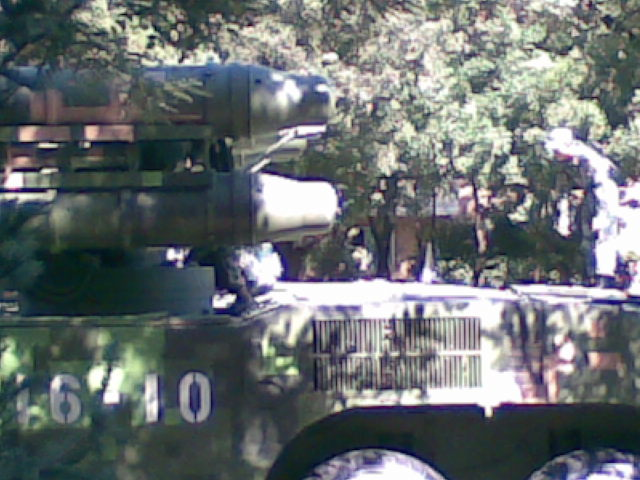
 

 

   
  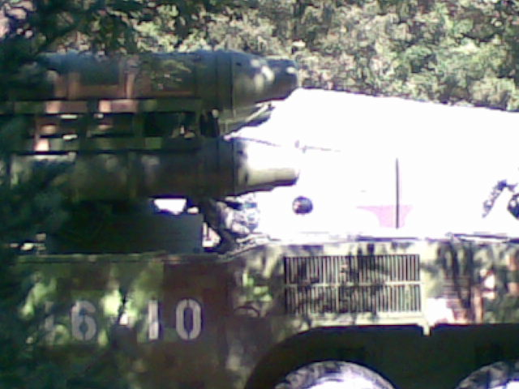
 

 

   
  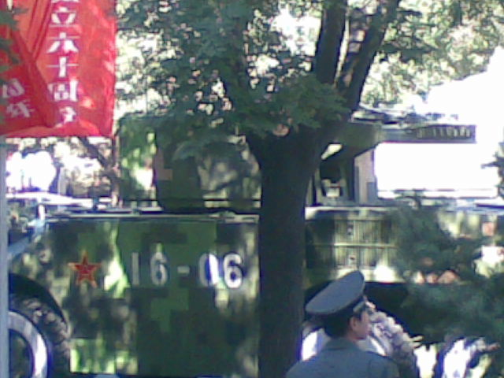
 

 

   
  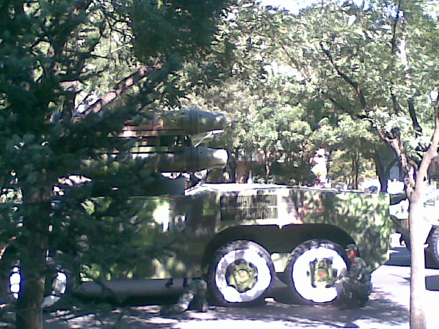
 

 

  下面是相机拍摄的：（日期设置有误，应为10月1日）
 

 

 

 

 

 

  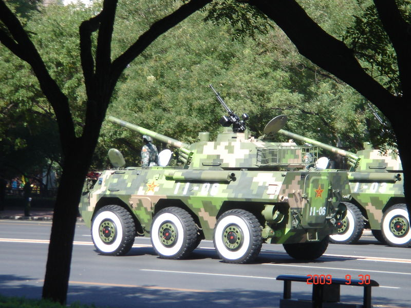
 

 

  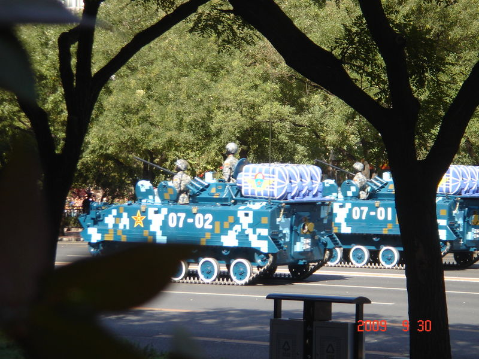
 

 

  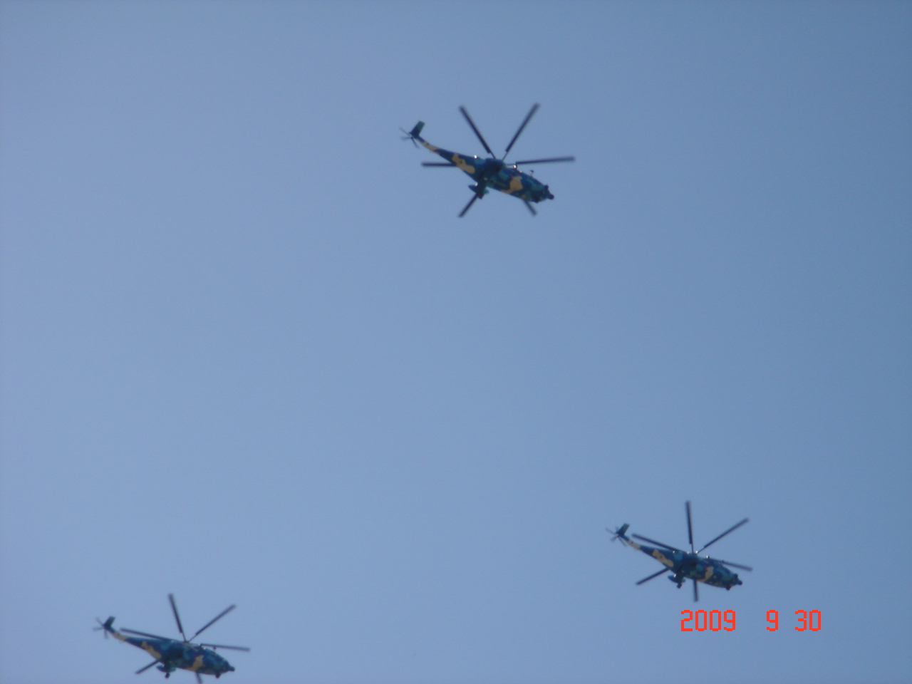
 

 

 

 

  PS:电信3G还能再快点吗？100KB/S我怎能受得了？
 

