# 评测Opera mini5 beta 

> 2009-10-02

 

  Opera mini5是一个手机浏览器，是java格式的，所以几乎通杀所有手机（部分山寨手机和黑白手机及大哥大除外）。
 

 

  好几天没上网了，没想到手机软件方面operamini5和qq2009都出来了。看来我落伍了。
 

 

  说实在的，opera mini5的UI确是变化挺大的，越来越像桌面版的OPERA了。
 

 

  据说opera mini5已经开发了1年多了，效果挺不错的，今天彻底放弃使用UCWeb7了。
 

 

  因为：1.速度提升了（感觉飞快，载入一个网页3-5秒）2.界面动画效果更好看了 3.增加了多标签 4.增加了复制粘贴功能。
 

 

  好了下面我就对OPERA MINI5 BETA版进行介绍：
 

 

  
 

 

  打开时，正在载入，进度条一闪而过
 

 

  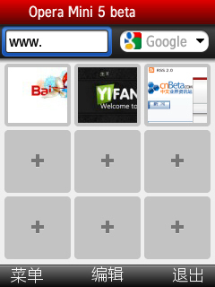
 

 

  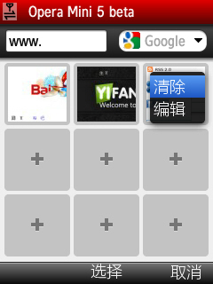
 

 

  进入首页，很明显，这就是OPERA10的排版，而且opm5下面也改成了op10的用图片显示快速启动的，这样感觉更加方便了。
 

 

  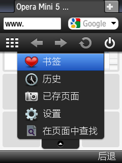
 

 

  主菜单
 

 

  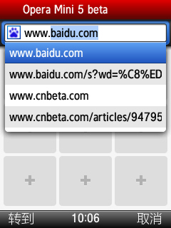
 

 

  输入网址
 

 

  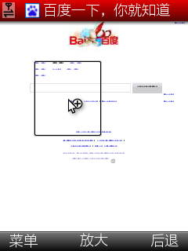
 

 

  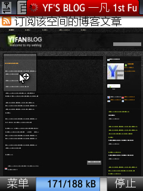
 

 

  
 

 

  浏览网页
 

 

  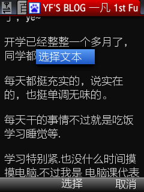
 

 

  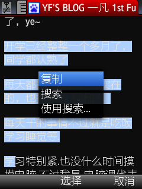
 

 

  复制功能
 

 

  
 

 

  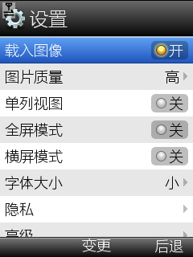
 

 

  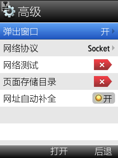
 

 

  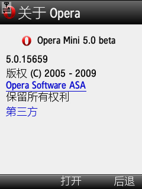
 

 

  优点：
 

 

  功能增多了，界面UI更加漂亮，速度明显提升，解决了无响应的问题
 

 

  缺点：
 

 

  1.目前只是java版本，没有for S60/WM的，对于智能手机来说，没有完全发挥出它的优势，比如标签功能，如果标签一旦增多，op会自动关闭几个标签，如果是for S60/WM则不会，因为智能手机的内存很大。而且字体也可以自由设置。
 

 

  2.下载功能倒退，下载功能又回到了转到自带浏览器然后再下载
 

 

  3.没有同步功能
 

 

  4.书签只能先打开再添加，无法直接添加
 

 

  5.不适合Q屏及更小屏的用户，目前手机市场大部分都是Q屏，既然不适合，为什么不出for s60/WM等高分辨率的版本。
 

