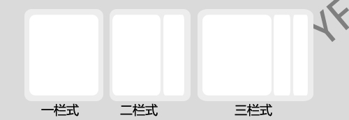
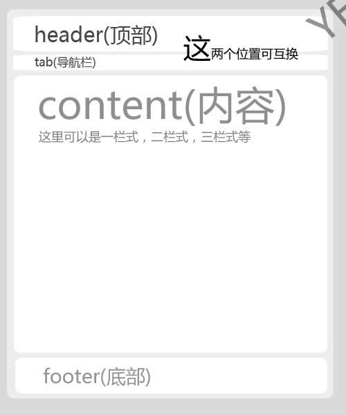
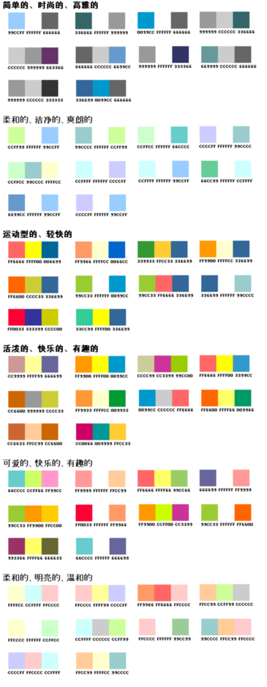

# 网页设计与制作建议 

> 2009-10-05

 

  你看看，我又来班门弄斧了，我只是跟大家探讨一下而已，部分不专业语句谢绝深究。
 

 

  对于我这种现代化文盲来说，面对各位砖家叫兽，我不敢班门弄斧，不过我写html代码已经很长时间了，积累了一些经验，各位砖家叫兽可以装作路过，请勿拍砖。
 

 

  先提一下！我的BLOG的模板做得比较失败。现在因为没时间做新模板。
 

 

  要讨论就讨论这个吧，我认为还比较不错（
  <a href="http://hi.baidu.com/commit">
   http://hi.baidu.com/commit
  </a>
  ）这个也是我做的一个模板，已分析，已经有800多人使用了。（模板地址：
  <a href="http://hi.baidu.com/yfboke/modify/preview/01f3ab62836b5adde7113af4.css">
   http://hi.baidu.com/yfboke/modify/preview/01f3ab62836b5adde7113af4.css
  </a>
  ）
 

 

  <strong>
   排版
  </strong>
 

 

  网页最重要的就是排版了，那么我们应该选择什么样的板式呢？
 

 

  1.一栏式？二栏式？三栏式？N栏式？
 

 

  我认为：如果到现在还是使用一栏式显然不切实际，为什么？现在宽屏电脑越来越多，如果使用一栏式不仅增加了浏览器的滚动条大小，使用户因文章过多而放弃浏览，而且还会使网页显得单一。
 

 

  至于二栏式，这个是属于适中型的，为什么这么说呢？宽屏并没有完全占据电脑市场，这是一个比较合适的选择，但选择这个也有缺点，那就是...目前来说大部分网页都是选择二栏式，如果你的网页没有一定的特色，是不会显得十分新颖的，只是普通普通...
 

 

  我最看好的就是三栏式了，目前来说，三栏式还不是很多，大部分都是存在于某些人的blog里面，继续看好中……
 

 

  
 

 

  2.整体布局
 

 

  现在最普通的恐怕就是这样的布局了：
 

 

  
 

 

  这样的布局有好处，1.可以突出中心 2.整齐美观 3.内容丰富。
 

 

  这样的布局大多数出现在cms，blog之间。但因为这样网页太多了，可能会显得不够个性化，不过我还看到过...
 

 

  
 

 

  这种设计方式我相当认同，同样的，可以突出中心（因为Content占据了大部分位置），而且还富有个性化，适合blog使用（大多数为三栏式），可惜的是，content的宽度减小了，也就是说，一旦在content内出现尺寸大点的图片可能会被“缩小”，影响美观。
 

 

  但是我还是推荐第二种方式布局，因为从整体上讲，这种布局方式最新颖，也很漂亮。（Wordpress的众多模板得到体现）
 

 

  <strong>
   整体颜色搭配
  </strong>
 

 

  建议：1.不宜过白和过黑（亮和暗）2.整体颜色要一致 不要有太大的反差 3.要突出中心
 

 

  方案：
 

 

  
 

 

  （图片来源于网络）
 

 

  作为blog，我推荐使用 “简单的，时尚的，高雅的”这种。因人而异，按照个人喜好选择吧。
 

 

  <strong>
   广告位的位置
  </strong>
 

 

  广告——一直是个很棘手的问题——放在哪都难看，至少我是这么认为的。
 

 

  但是很现实的问题，一个网站需要域名，需要空间，而这些都需要钱，也就是说，做广告可以把钱拿回来。
 

 

  建议：
 

 

  1.请勿把广告放到header，影响整体效果
 

 

  2.放到文章后面，作为相关文章最好（尤其是google广告，会自动搜索关键词和文章内容匹配）
 

 

  3.切勿放弹窗广告，这是最烦的了
 

 

  4.如果是二栏式以上结构，放到边栏最合适
 

 

  5.广告颜色要与整体相匹配，大小要适中
 

 

  <strong>
   写代码的习惯
  </strong>
  （使用dw的同志请跳过）
 

 

  很多时候，做网页都要写代码，我提出几点建议：
 

 

  1.如果页面有css，最好使用外部调用css的方式
 

 

  使用外部调用css就是在网页目录下建立个css.css之类的文件，使用一句代码来条用它
 

 

  好处：1.方便 2.在做CMS模板的时候，生成HTML网页可以节省空间 3.加快客户的浏览速度（为什么？因为如果使用调用的方式，浏览同样两个网页，一个使用调用的方式，一个是直接加载网页中，因为浏览器会产生缓存，直接读取CSS，更省时间，虽然效果不是很明显）
 

 

  2.经常写备注
 

 

  3.分段，格式化
 

 

  4.使用多种浏览器测试
 

