# 鸟巢 

> 2009-10-08

 

  本来是想去鸟巢看看《鸟巢版图兰朵》的。
 

 

  可是...到那才知道...图兰朵 1.看不到字幕 2.听不懂，意大利语 3. 无聊
 

 

  进入鸟巢要进行安检，液体不能带进去。鸟巢那——一杯矿泉水——3元。
 

 

  图兰朵 说实在的一点也不好看.......走的人很多。
 

 

  于是就拍了许多鸟巢的照片。
 

 

  拿出一部晒晒。可惜手机像素不高。。。200W
 

 

  来张PS过的，呵呵，这样清晰点，去除了很多噪点，可是仍然还有很多，想放弃了。。。。
 

 

  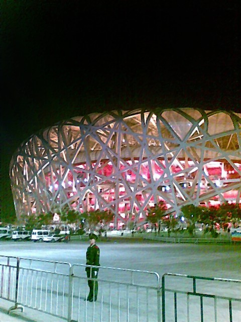
 

 

 

 

  ————————————以下均可能不够清晰——————————————
 

 

  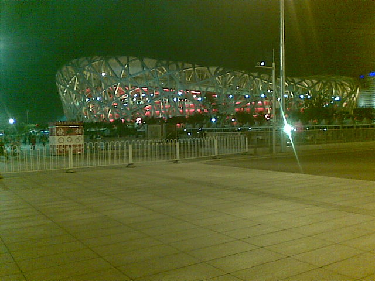
 

 

  鸟巢
   
  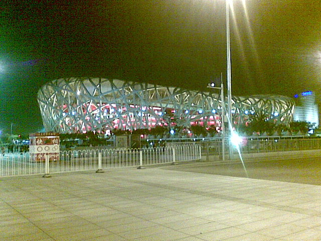
 

 

  又一张鸟巢
   
  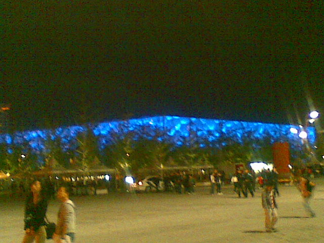
 

 

  模糊版水立方
   
  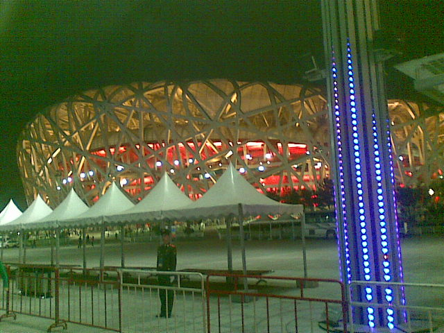
 

 

  近景鸟巢
   
  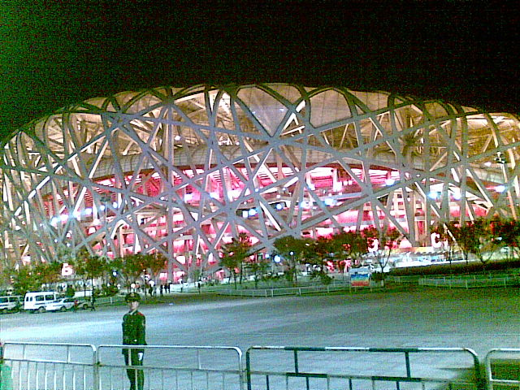
 

 

  还是鸟巢
   
  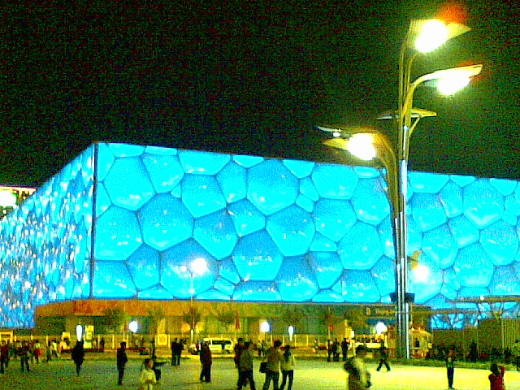
 

 

  水立方
   
  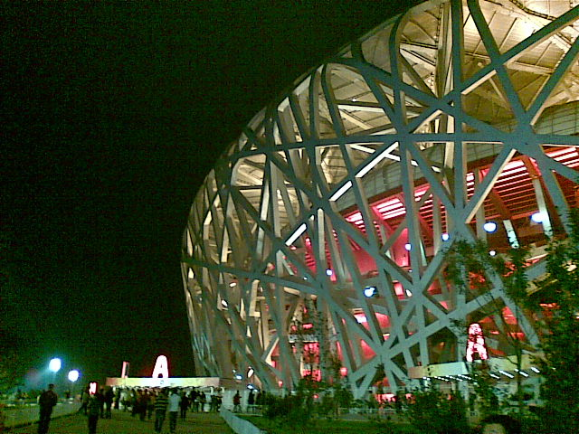
 

 

  鸟巢侧面
   
  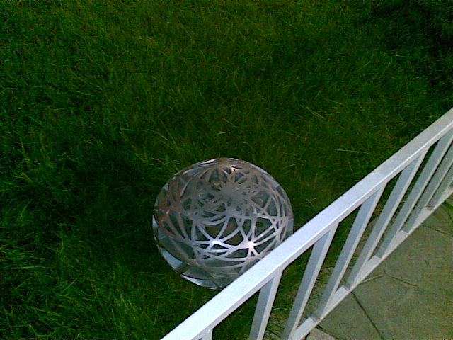
 

 

  这个不得不说很有特色，连奥林匹克公园的灯罩都是鸟巢版的
   
  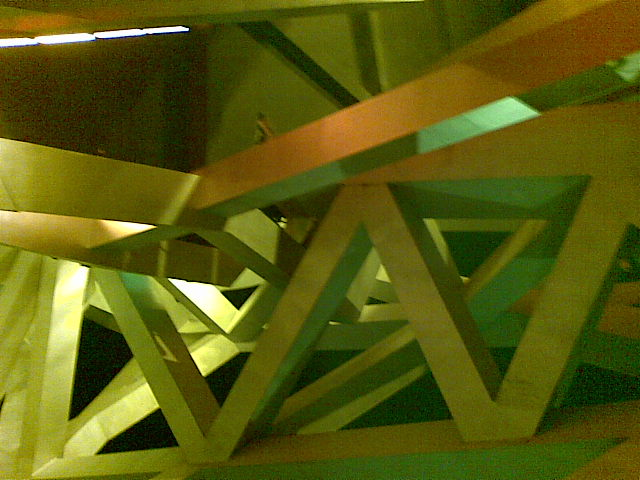
 

 

  真乃 钢筋鸟巢
   
  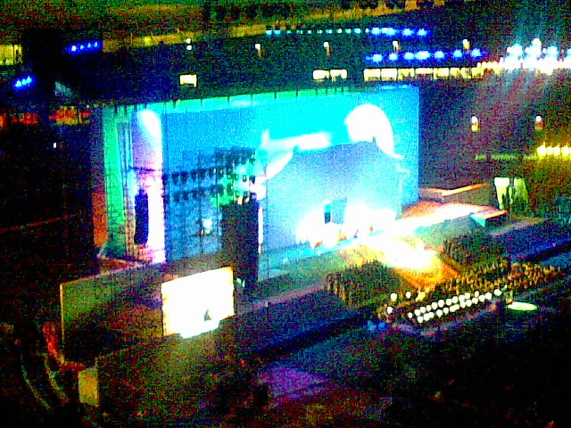
 

 

  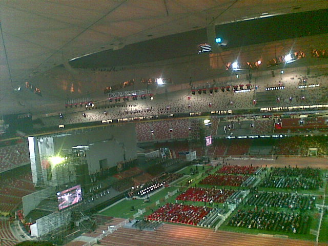
 

 

  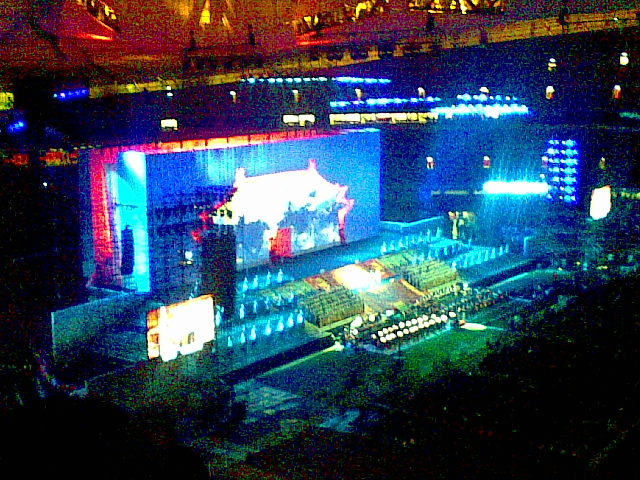
 

 

  图兰朵
   
  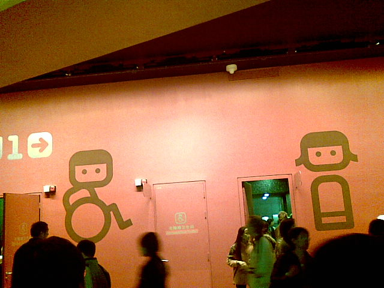
 

 

  有创意的厕所，可惜没有男的
   
  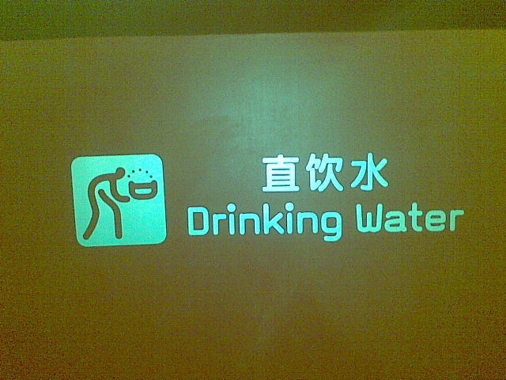
 

 

  这个可以直接喝水，很方便，很过瘾。
 

 

   
  图兰朵没看完就出来了，宁可放弃580元的门票也不消磨时光。
 

 

  鸟巢的座位之间很紧凑，但是...这么紧凑老外在观看比赛的时候，是不是很困难？难以想象。
 

 

  睡觉了，10月9日——10月10日 两天月考，呜呜~~~~~
 

