# 全面评测 WEB QQ MINI版 

> 2010-01-02

 

  
   
  听说过Webqq的人不少，但是最近TX出了一个mini版，专为移动设备定制的网页qq版本。
 

 

  不过还是封测版，只有唯一的功能——聊天。
 

 

  地址是：w.qq.com
 

 

  挺省流量的，流量消耗介于 WEBQQ与移动QQ之间吧。
 

 

  不过这个mini版，感觉还是没什么用的，因为它是为智能手机 上网本之类的设备开发的，但是TX有没有想过，智能手机用 QQ2009 for wm/symbian/iphone等等...已经接近于完美了，而非智能手机还是打不开mini版的（因为里面的一些js脚本，ajex普通手机浏览器是无法执行的。）
 

 

  上网本就不用多说了，使用webqq就行了，何必使用mini版呢？
 

 

  因为目前还处于封测阶段，昨天我申请的，今天竟然给我了一个封测资格。
 

 

  好了，不多说了，咱们先看看效果吧。
 

 

  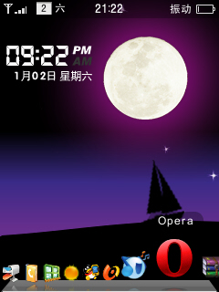
 

 

  打开OPERA 浏览器（版本：beta2）
 

 

  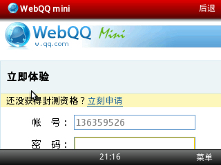
 

 

  打开webqqmimi的页面，速度不错，很快就进入了。
 

 

  
   
   
  竟然还需要输入验证码，知道手机登录的慢。。
 

 

  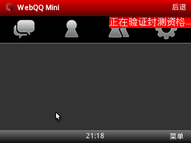
 

 

  我当然通过咯~
 

 

  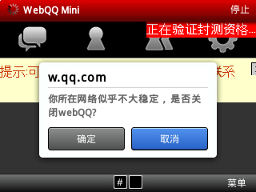
 

 

  然而！没办法重新再来吧~
 

 

  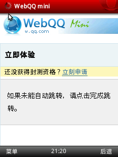
 

 

  让我改成竖屏的了，因为这样容易聊天。
 

 

  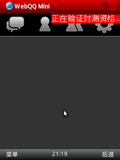
 

 

  一样的画面
 

 

  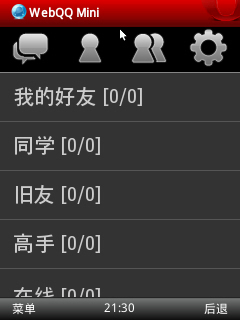
 

 

  登录成功啦~不过感觉字体怎么这么大，别着急~
 

 

  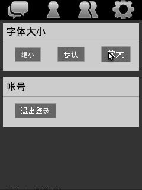
   
  改了改，挺不错的
 

 

  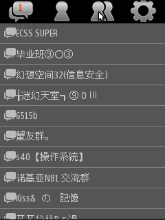
 

 

  能群聊
 

 

  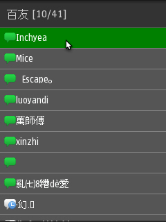
 

 

  找个人聊天吧
 

 

  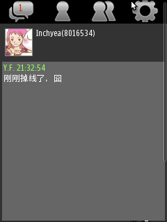
 

 

  消息盒子
 

 

  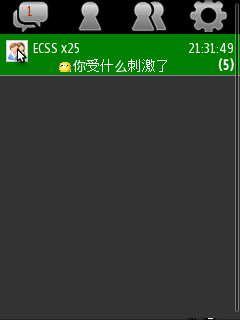
 

 

  群聊画面
 

 

  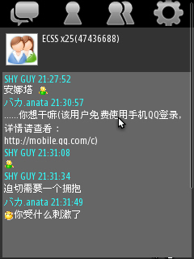
   
   
   
  评析：mini版似乎很省流量，除了打开页面需要消耗700KB左右的流量，每秒消耗的流量与手机QQ差不多。而且没广告！
   
  但是还是缺点比较多：动不动就网络不稳定需要重新登录。不过这个也不赖webqq MINI，因为网页版的都这样，我曾经用opera试过baidu hi网页版，也是这样。
 

 

  建议：增加皮肤功能（很容易实现的，通过js脚本）增加聊天文字大小颜色设置等等。。。
 

 

  非常之欠补充
 

