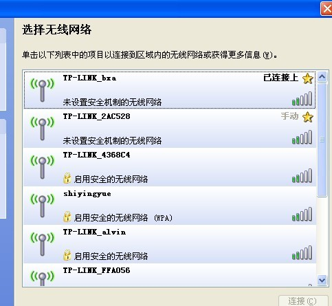
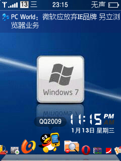

# Wifi?蹭网无线可能 

> 2010-01-15

 

  
   
   
 

 

  蹭网？无线可能！
 

 

  落户北京。搬进新家啦~~~~
 

 

  爽，更爽的是———我搜到WIFI了，而且还不是一个！
 

 

  一堆，囧~但是大多数都是加密的。
 

 

  不过找到了3个不是加密的都能连上，能蹭网了~~~目前考虑：3G+WIFI蹭网不需要 adsl了。。。
 

 

  连了一个速度不错~~~我喜欢，哈哈，开始蹭网。
 

 

  BT+迅雷 ，120KB/S“高速”（至少比3G快）下载。
 

 

  看看IP吧：123.114.105.**
 

 

  北京网通-&gt;&gt;&gt;adsl
 

 

  
   
 

 

  不知道明天还可以蹭网吗？
 

 

  ——————————————————日环食————————————
 

 

  今天看到日环食了，就一小点，就没了。
 

 

  
 

 

  ——————————————————手机————————————
 

 

  手机的界面摆弄了半天终于达到理想效果了
 

 

  
 

 

  
 

 

  买了个2GB的内存卡（45元），爽以前都是512MB的，现在终于不为没内存发愁了
   
   
  下电影咯，直接看RMVB的，省时又省力。
 

 

  持续看好andorid...
 

