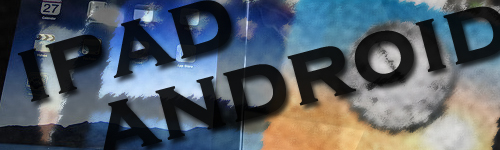

# ipad,android那点事儿 

> 2010-01-28

 

  
 

 

  <strong>
   Ipad？！
  </strong>
 

 

  1月27日，与会者在美国加利福尼亚州旧金山举行的苹果公司新产品发布会上体验iPad。当日，苹果公司在旧金山举行新产品发布会，发布最新产品iPad。
 

 

  早就有传言说苹果要推出一款平板电脑，昨日发布了，不足为奇。
 

 

  从照片上看，样子很像一个电子书，大小比 笔记本电脑小 比ipod touch大，装的系统是IPHONE OS 3.2
 

 

  其实个人认为就是一个放大版的ipod touch或是说是iphone
 

 

  因为可以选择是不是支持3G。
 

 

  其实个人并不是很看好ipad，如果装的系统是macosx，绝对看好，因为iphone 的系统，虽然软件多，游戏多，而且功能很强大，但毕竟不能称之为——平板电脑，它的最遗憾之处——没有多任务。而且。。。看起来并不像是一个操作系统。
 

 

  个人并不看好。
 

 

  <strong>
   android？！
  </strong>
 

 

  相反，个人很看好，android，在最近的几个月内，android的应用程序的更新速度，远远超过了iphone/windows mobile/symbian等流行系统的更新速度。
 

 

  而且android手机层出不穷。google也发布了一款叫做Nexus One的手机。其界面十分绚丽。
 

 

  相信不久android系统的应用程序将大量泛滥。
 

 

  其实android无论从其硬件支持，应用程序方面，都是不错的。
 

 

  OpenGL 提供了良好的游戏环境，另外蓝牙Bluetooth, EDGE, 3G, and WiFi 这些功能我还是挺喜欢的。
 

 

  还有其内核——linux，我很欣赏linux就是在于其系统的易用性，我感觉linux系统的易用性要比windows好的多。
 

 

 

 

  nokia已经抛弃了symbian，下一代移动应用程序的带头“人”将是谁呢？是android？还是iphone os呢？
 

