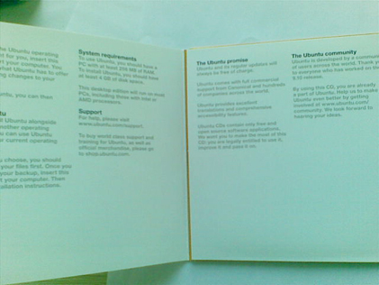
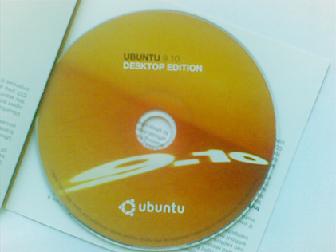

# 收到免费寄送的ubuntu9.10光盘 

> 2010-01-31

 

  
 

 

  在
  <a href="http://hi.baidu.com/yfboke/blog/item/b932ef8f3f02c6f3503d924e.html" target="_blank">
   Ubuntu9.04各方面指南
  </a>
  中我就说过，安装linux ubuntu的方法很多，可以申请免费的live cd。
 

 

  可我一直没有试过，两个礼拜前，我在官网上申请了无数次。
 

 

  终于有一次成功了。
 

 

  没想到，今天竟然收到了live cd。
 

 

  我打开我家的邮箱（就放在了邮箱里）。
 

 

  唔——里面很多东西诶。有很多的广告，优惠券，竟然还找到了这个，官网上说是4-6周后会寄送到，没想到，这么快，两个礼拜就到了。
 

 

  打开后，包装不是很精美吧，邮寄的包裹用纸做的，上面都是英文，旁边还有人工的用中文的批注我家的地址。
 

 

  包裹的后面是免税的文字：
 

 <code>
  

   敬启者：
  

  

  

  

   Canonical ltd. 致力于开放源代码的自由软件的开发、分发与推广。为了推广这些软件，我们以邮寄的方式向申请者免费寄送光盘。虽然因为邮寄的原因我们为将光盘设置了0.13欧元的定价，但是这些光盘是免费发放的推广材料，不是用于销售的进口商品，我们不从中获得经济利益，所以理应免税。
  

 </code>
 

  竟然是0.13欧元，对于欧洲人来说，这个数字是不吉利的吧？囧。
 

 

  打开包裹，里面都是塑料的防护膜，可能是怕光盘受损吧。
 

 

  哈哈最后露出了光盘的真相：
 

 

  
 

 

  
 

 

   
  
 

 

 

 

  目前还没测试光盘。因为没有光驱。呵呵，珍藏吧，免费的哦~
   
   
 

