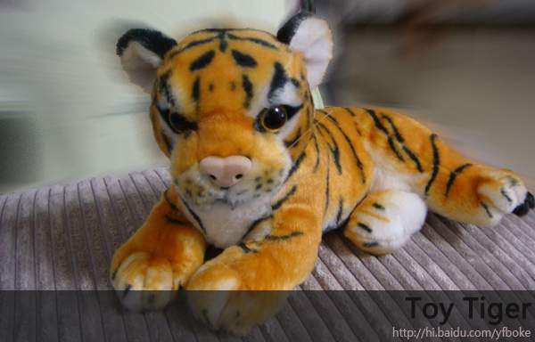
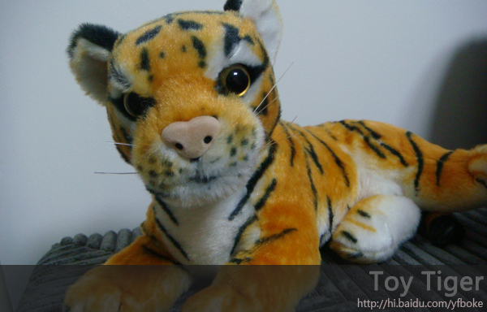
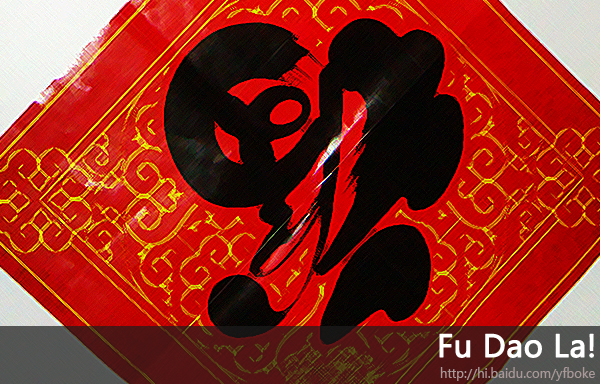

# 一年又一年 

> 2010-02-13

 

 

 

  
   
 

 

  一年又一年，Weblog已经写了将近3年了。
 

 

  3年来，结交了不少百度好友。
 

 

  十分感谢您对我的支持。
 

 

  牛年马上过去，虎年来啦~
 

 

  呃...今天晚上有春节联欢晚会 ，又是一个不眠之夜。
 

 

  其实，春节联欢晚会也没什么看的了，除了赵本山等人外，就没什么好看的了。
 

 

  年年等着看春晚，春晚的小品越来越...呃。
 

 

  以前的春晚演播大厅装饰的不好，但小品很搞笑，现在相反了。
 

 

  我家有个小虎 来个POSS吧~！
 

 

  
 

 

  HI？
 

 

  
 

 

  虎视眈眈
 

 

  
 

 

  最后来一张福到啦~祝大家 新年快乐！~
   
   
  N天后等待我的ideneb（苹果系统）安装成功的消息吧！
 

