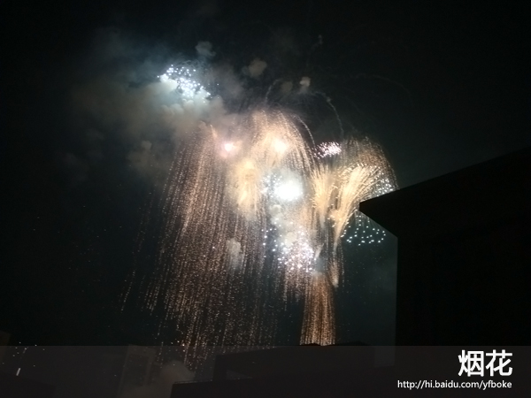
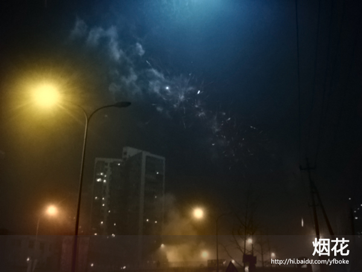
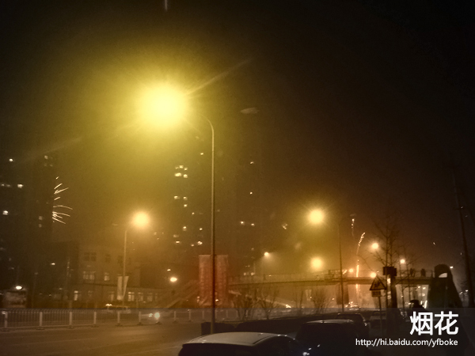

# 放鞭炮,烟花 

> 2010-02-14

 

  
 

 

  0点整，出去放鞭炮。
 

 

  北京石景山区这块挺热闹的，这感觉，就跟打雷似的，有的鞭炮震得感觉地在动。
 

 

  有点地震的感觉吧，带着相机去的（SONY T200），可是烟花瞬时太快，根本不能抓拍。
 

 

  如若拍到，也是虚的，拍了好多张。回去用PS整了整，去了噪点。
 

 

  景象相当壮观，相当阳光。
 

 

  我们是在街道旁边放的，小区不让放。
 

 

  说实在的，放鞭炮，烟花确实没什么意思，不过挺热闹的。
 

 

  
   
   
  
 

 

  这个感觉有点 极光的感觉
 

 

  
 

 

  注意 所有的亮点一般都是 烟花 鞭炮（相机照不出那种壮观）
 

 

   
   
 

