# 异国风情 北京洋庙会 [多图] 

> 2010-02-15

 

  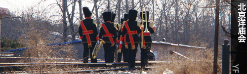
 

 

  大年初二，昨天在电视里看到北京的洋庙会，今天也去了下。
 

 

  春节逛庙会是北京的传统吧……庙会其实说白了就是——
 

 

  吃喝玩乐罢了。不过洋庙会里面添了点洋味儿罢了。
 

 

  既然是洋庙会，起初我还以为有外国人，事实证明了一切，一个也没有。
 

 

  门票是10元，外面有黄牛党（7-8元左右），我路过他们的时候正好有城管……黄牛们赶紧收拾东西走人。
 

 

  <strong>
   吃喝
  </strong>
  ——呃…虽说有几个是意大利，法国，欧洲等国的特色小吃，冰激凌，但大多数还都是 羊肉串啊，牛肉串啊，价格在10元4串左右。爆肚啊，鸡翅啊，之类的小吃，价格在10元左右
 

 

  <strong>
   玩乐
  </strong>
  ——有过山车等游乐场的经典游戏，还有 飞翔（看了，明显就是4D电影，50元一张票），还有什么游戏吧，套圈之类的，赢了能得灰太狼。
 

 

  还是带着相机去的。SONY T200。找到景观就照。
 

 

  不多说了，去庙会就是要多带钱，不过好像有很多情人...
 

 

  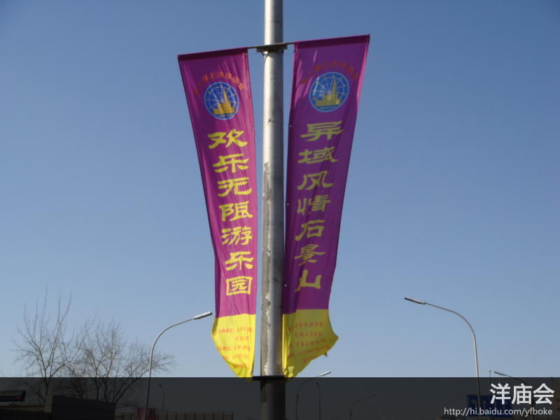
 

 

   
  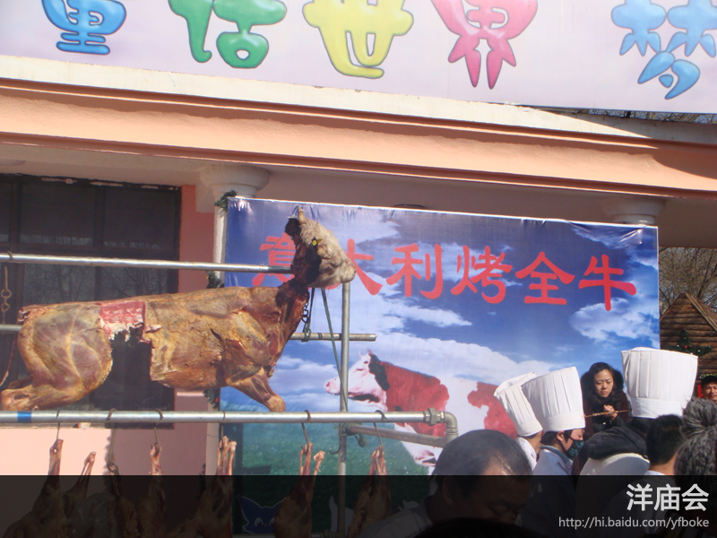
 

 

   
  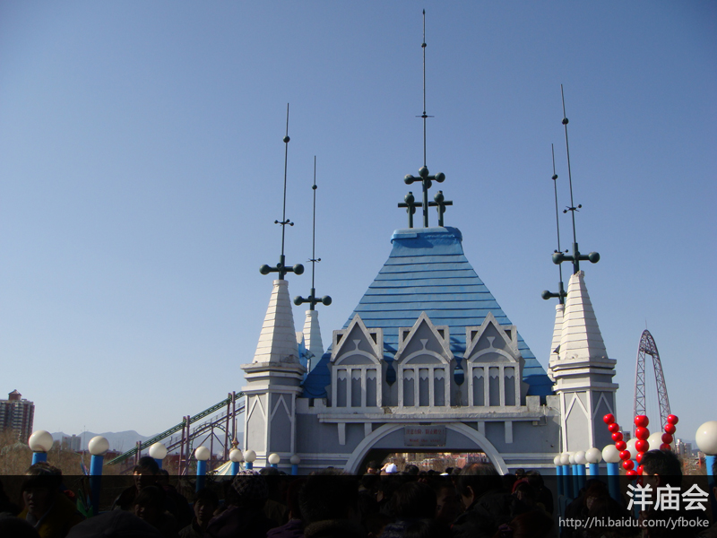
 

 

   
  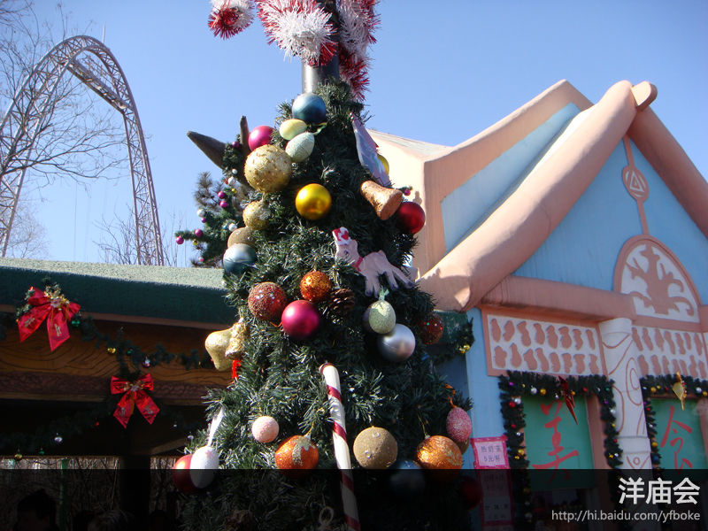
 

 

 

 

   
  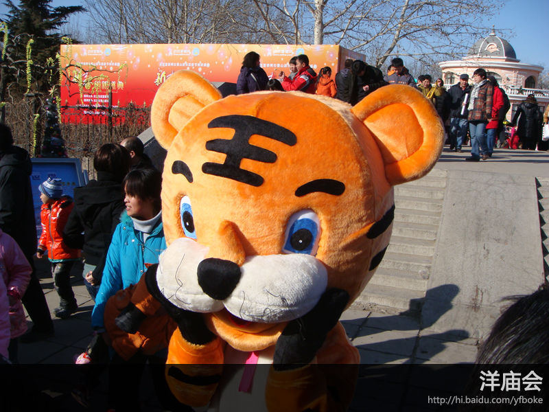
 

 

   
  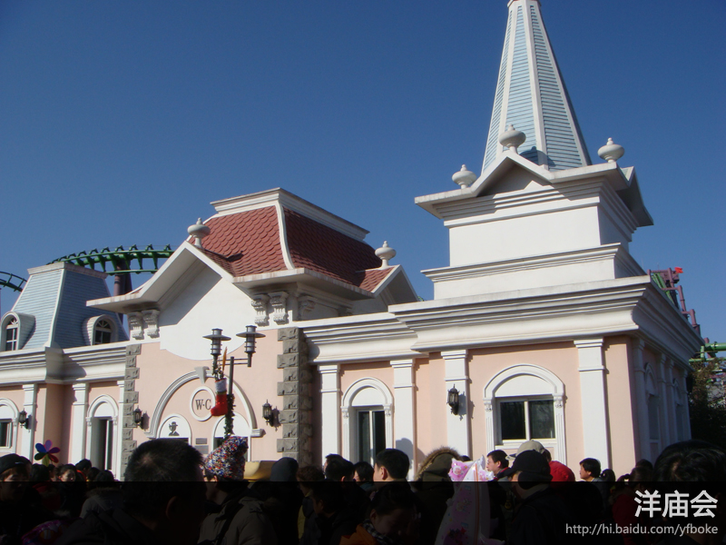
 

 

   
  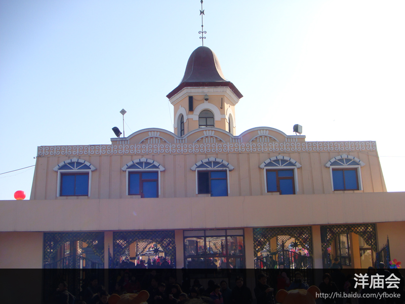
 

 

   
  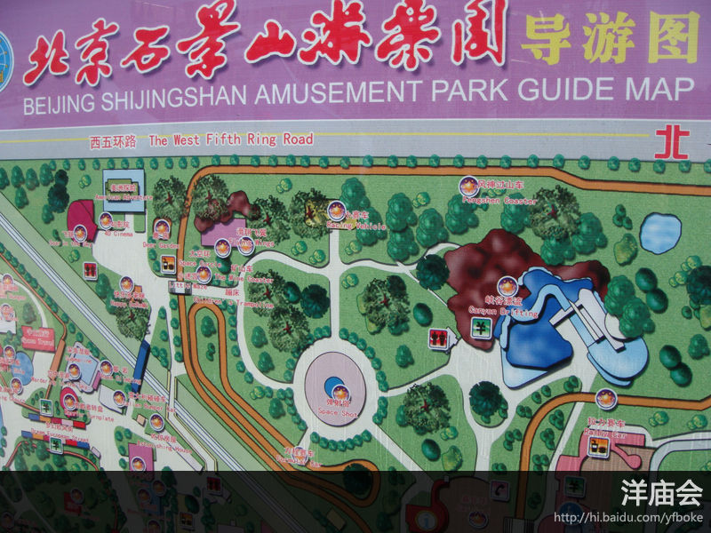
 

 

   
  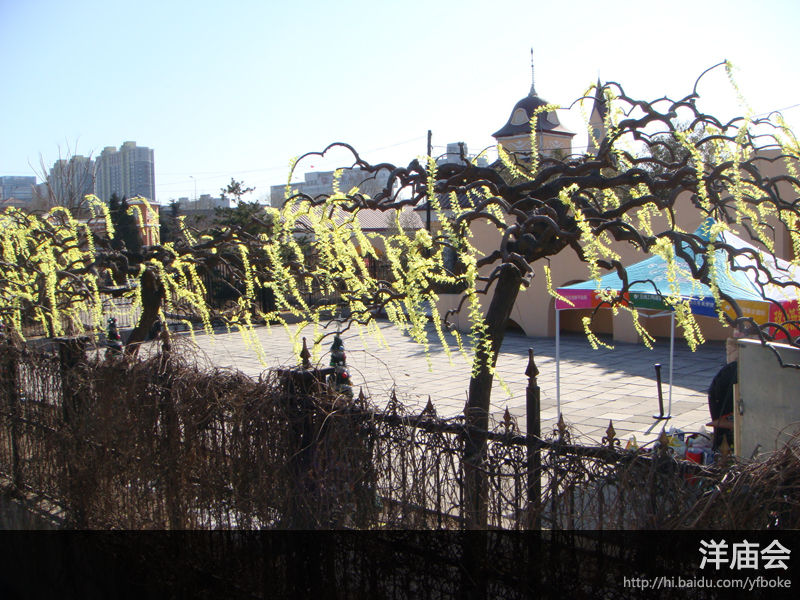
 

 

   
  
 

 

   
  
 

 

   
  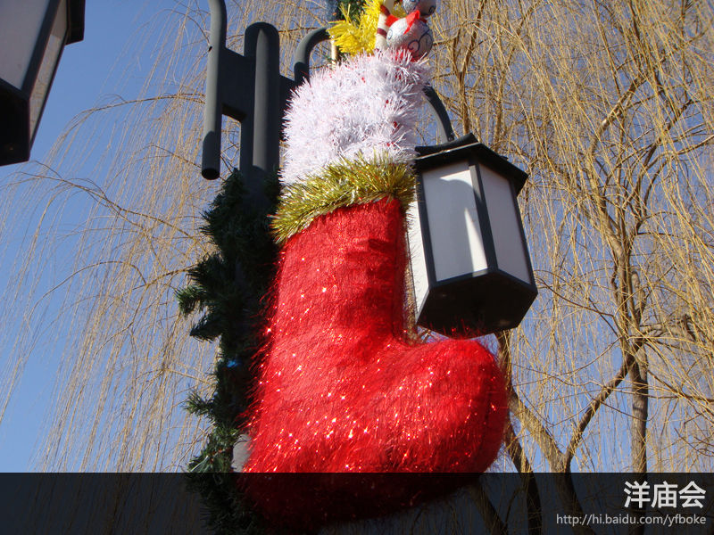
 

 

   
  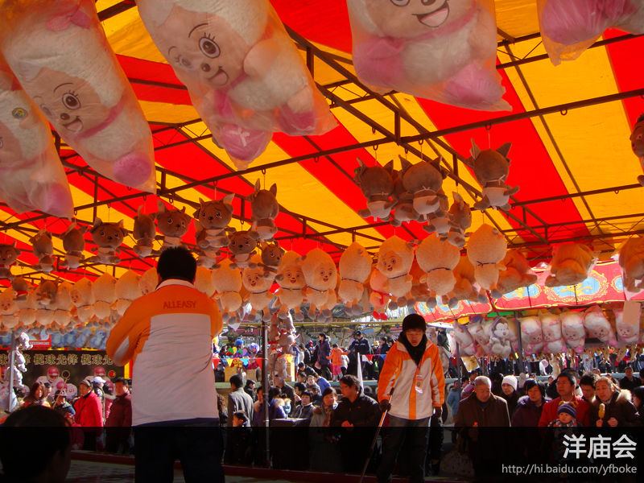
 

 

   
  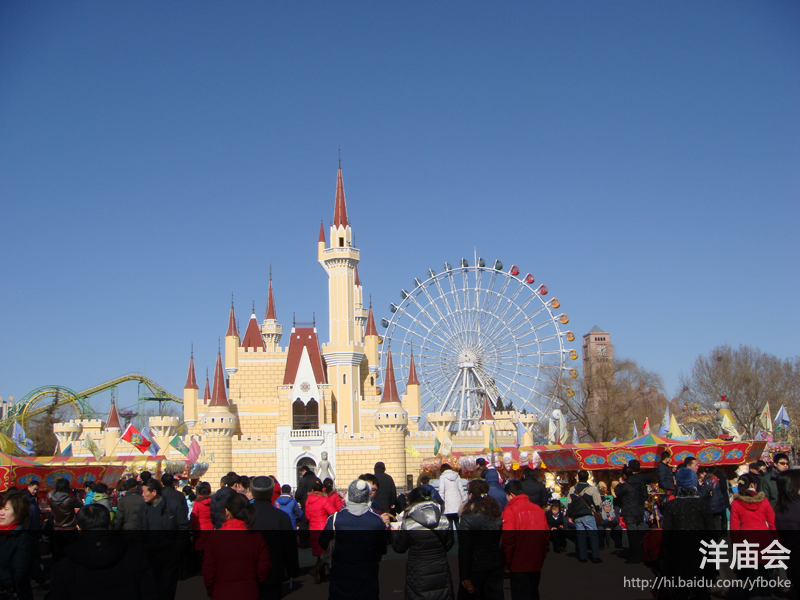
 

 

   
  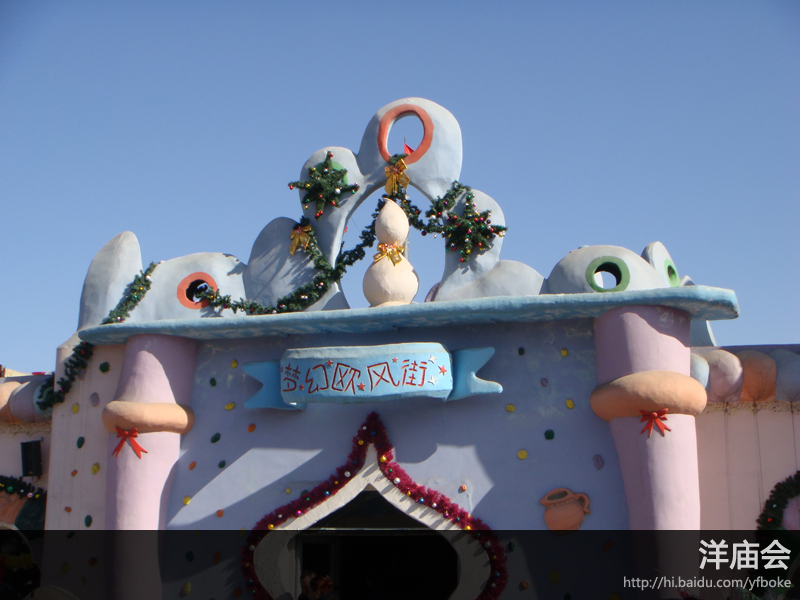
 

 

   
  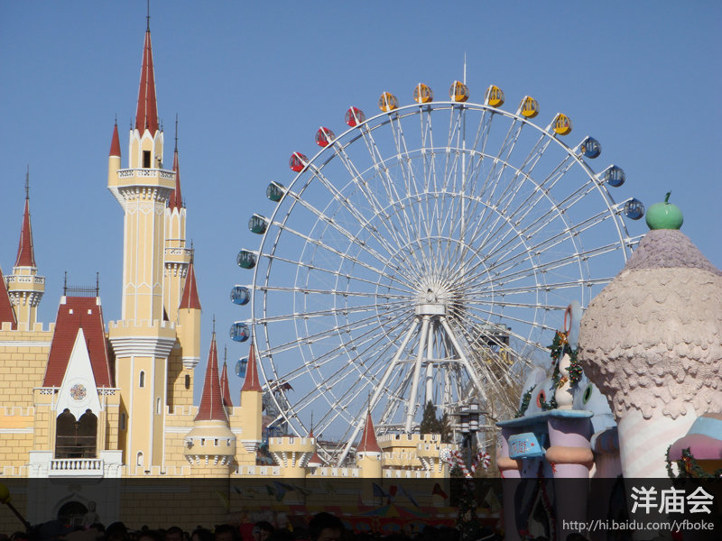
 

 

   
  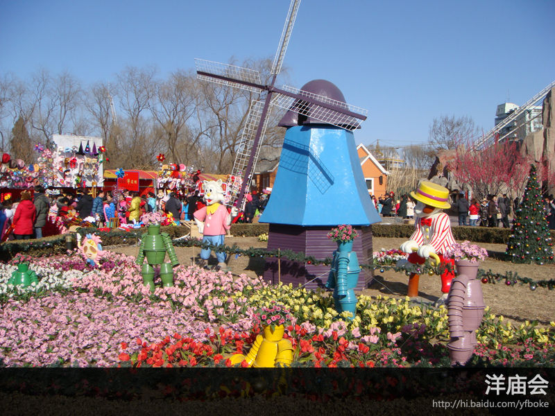
 

 

   
 

  
 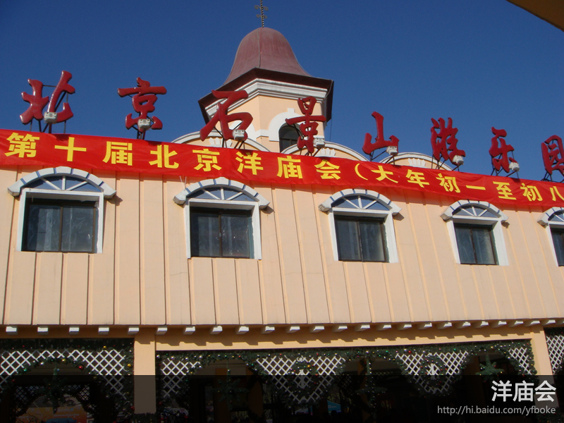

