# Mac OSX (ideneb v1.6 lite)安装过程 (未成功) 

> 2010-02-18

 

  
 

 

  我相信我一定能成功，我曾有过想法偷吃苹果，都没成功。
 

 

  虽然这次还是没成功，但是我已经跨出了一小步，相信下一步就会成功。
 

 

  ideneb是黑苹果，也就是Mac OSX for pc吧。
 

 

  这次没成功我把所有原因应该归结到 我在VMware下安装的。
 

 

  介绍一下我的机型：Lenovo Thinkpad X200
 

 

  下载了4天4夜的ideneb精简版 总归下载完毕了
 

 

  经过了N个小时的解压 ISO文件终于出来了——4G多
 

 

  接着下载精简版的VM。安装后。开机。
 

 

  出师不利，开机后 就无限的重启，还没进入开机界面
 

 

  好在有绝招：输入：busratio=20 cpus=1
 

 

  果然 进入了安装界面 欣喜若狂
 

 

  
 

 

   
 

 

  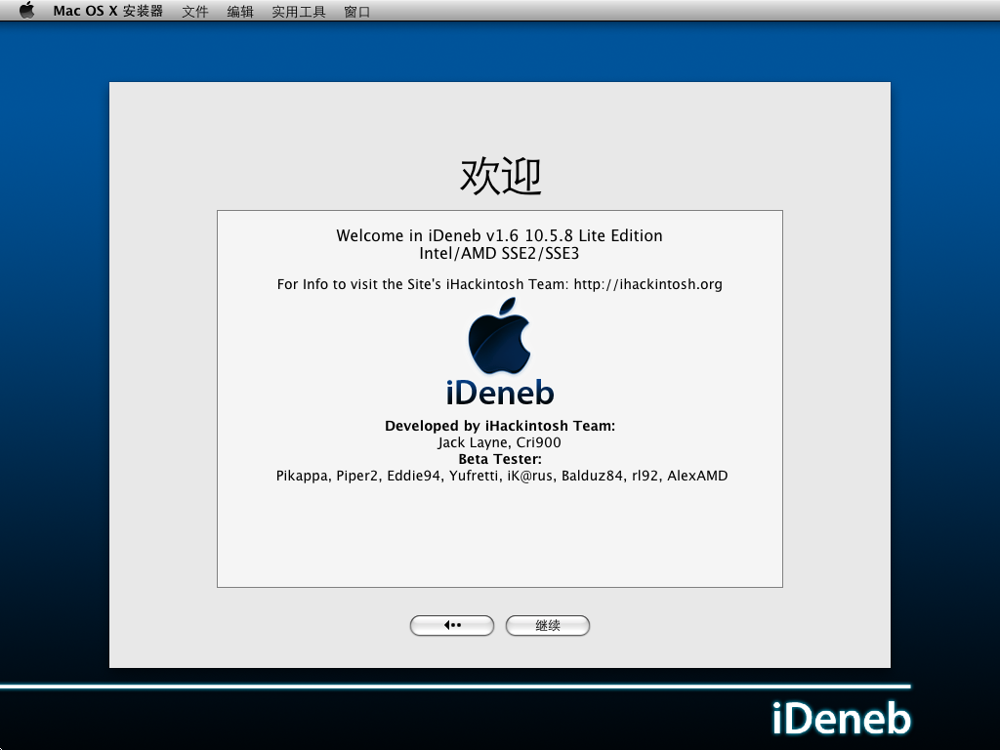
 

 

   
  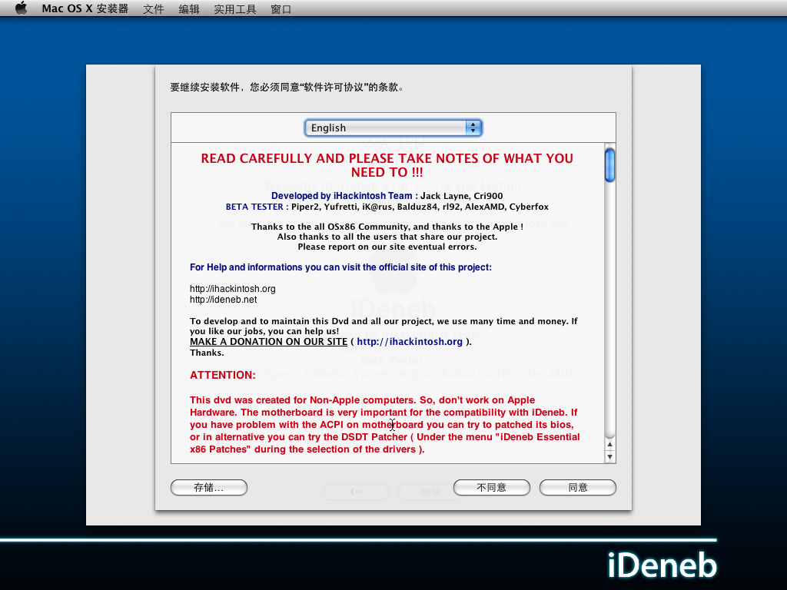
 

 

   
  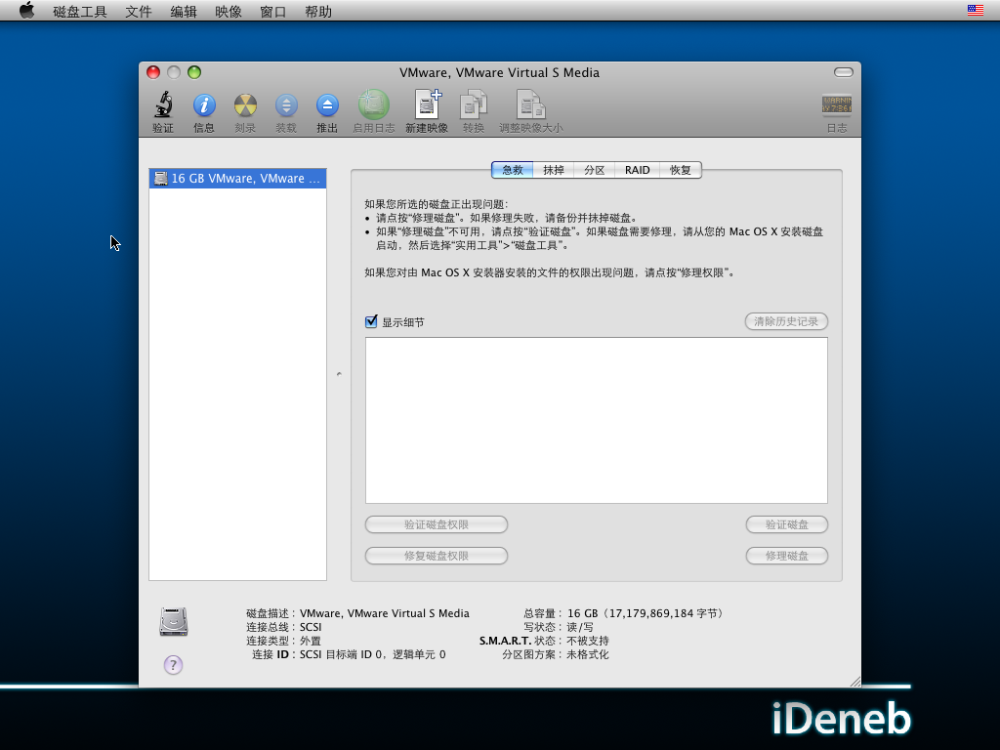
 

 

   
  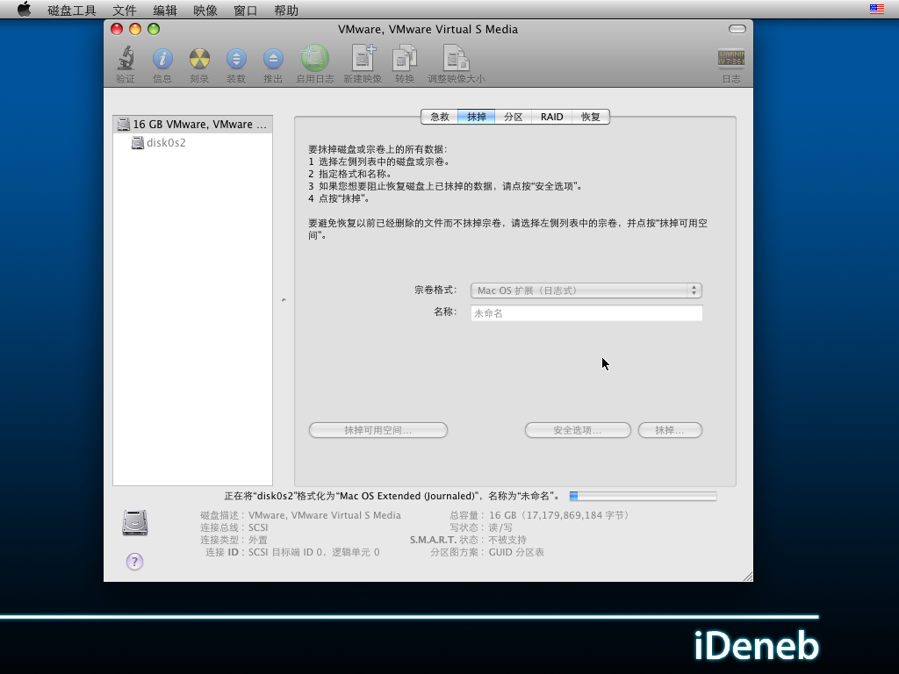
 

 

   
  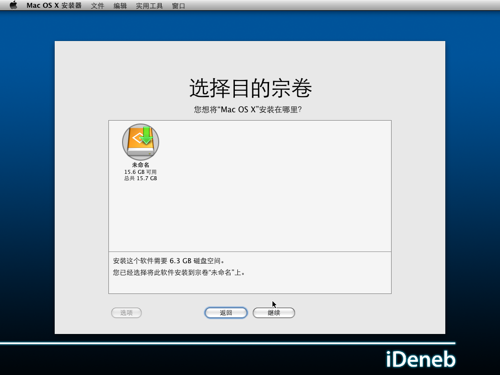
 

 

   
  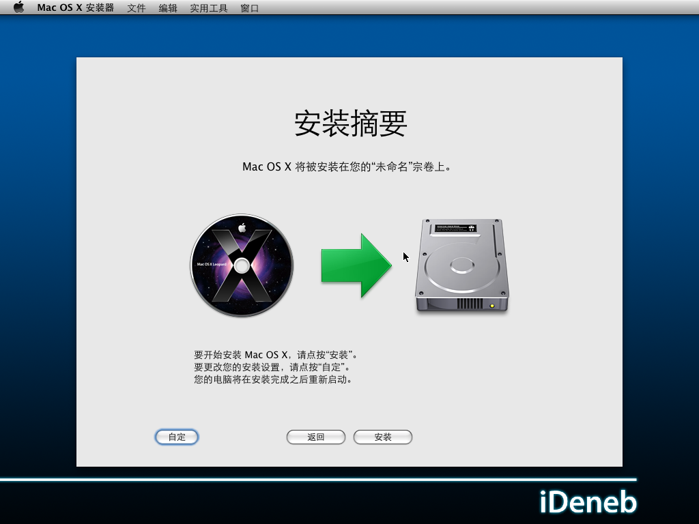
 

 

   
  
 

 

   
  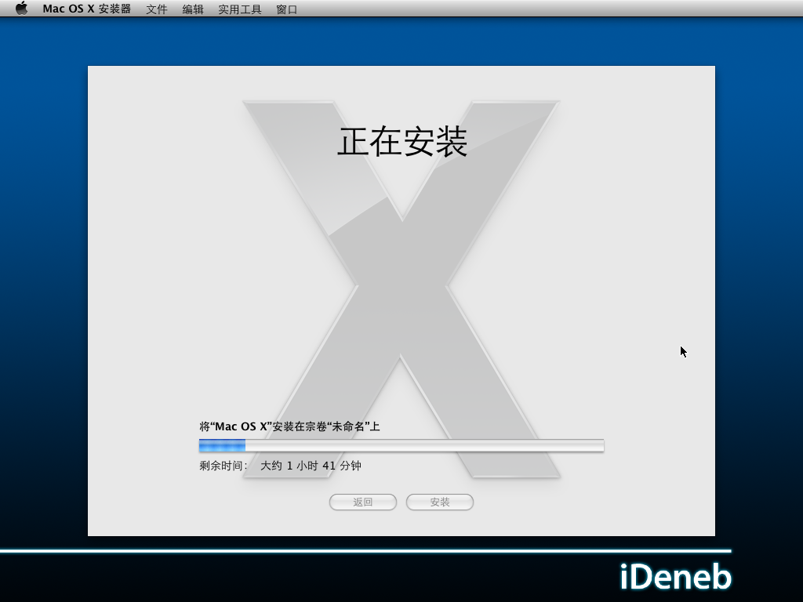
 

 

   
  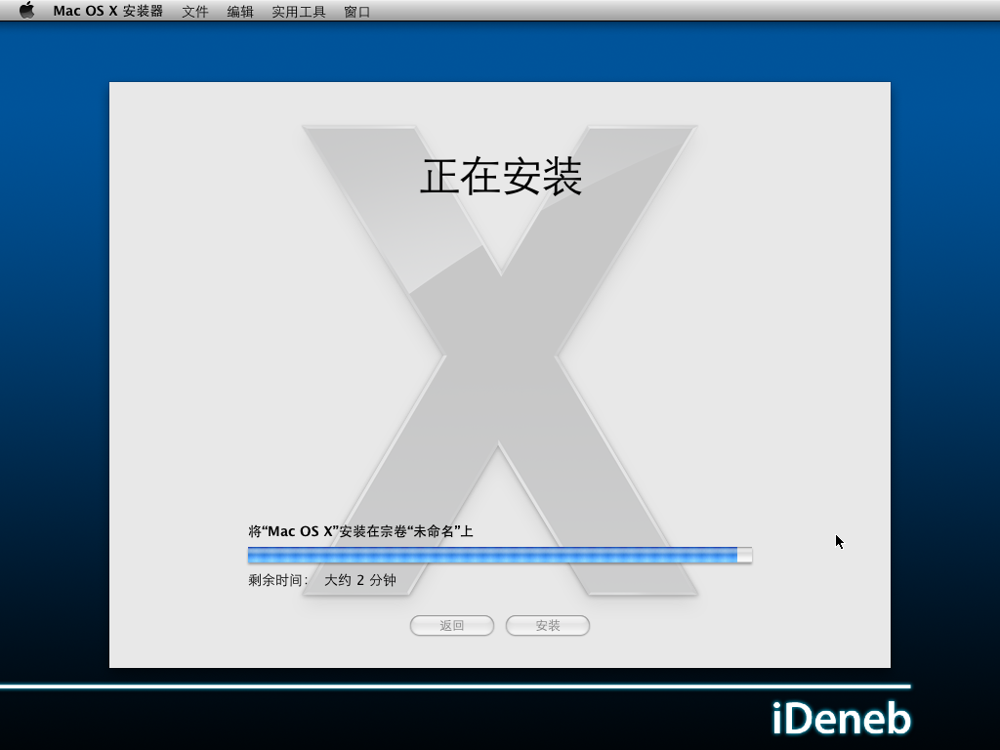
 

 

 

 

  安装完毕后自动重启了
 

 

  可是 重启之后
 

 

  就再也打不开了
 

 

  输入 busratio=20 cpus=1 -v -f命令查看
 

 

  原来还是驱动问题 继续重装
 

 

  可是..下一次的重装又是驱动选错了。
 

 

  
 

 

   
  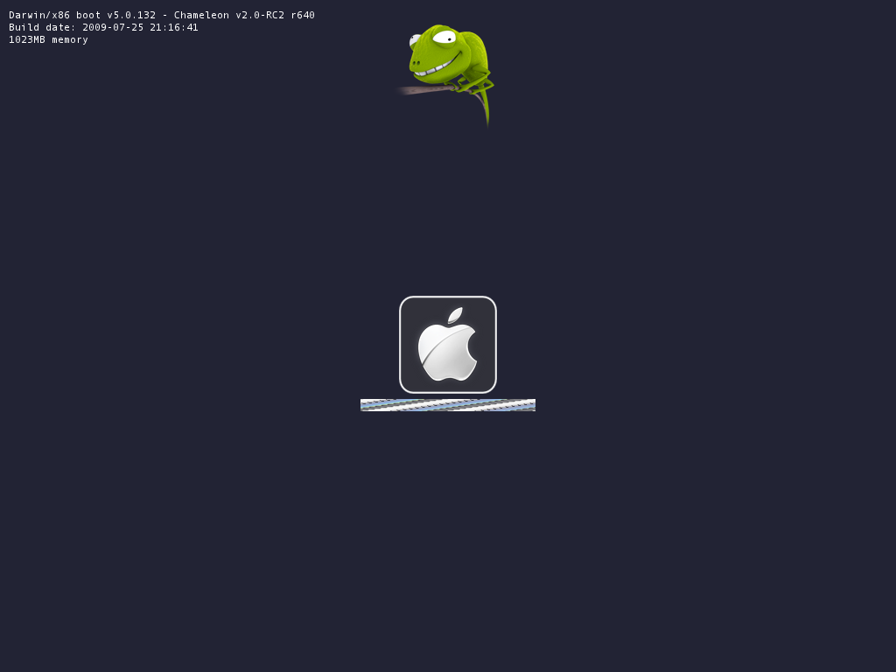
 

 

   
  
 

 

   
  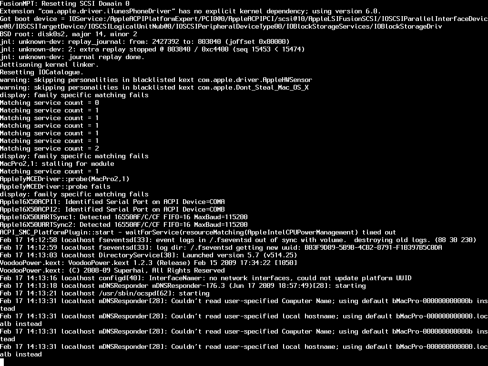
 

 

   
  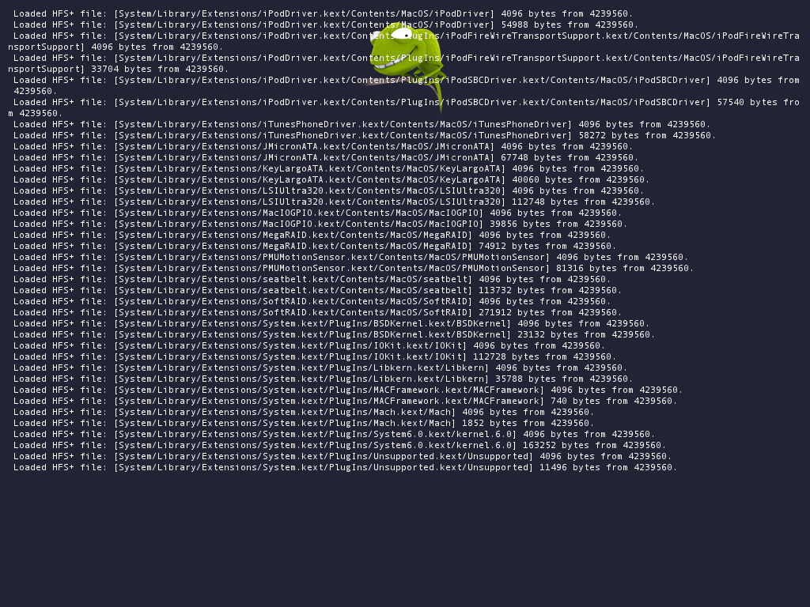
 

 

   
  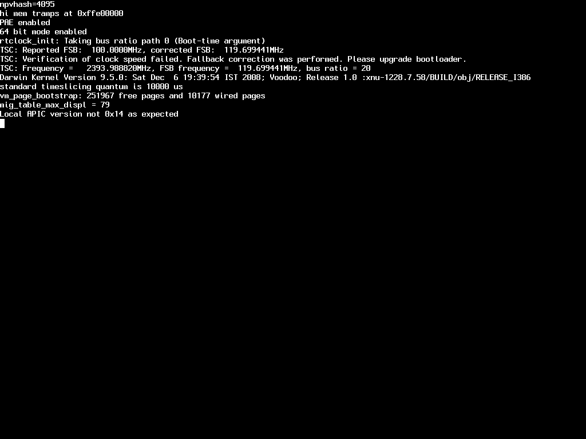
 

 

   
   
   
  未完待续
   
 

