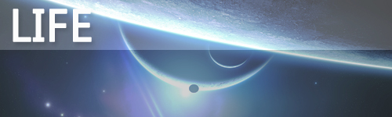

# 生命&人生 

> 2010-02-20

 

  
 

 

   
  2010年2月18日，记住这个日子。
 

 

  在我接手机充电器的时候，我犯了一个极其低级可恶的错误，左手触到了插头，被220V电压电到了，持续了2-4秒，左右手抽搐了两下，迅速本能的弹开了。检查了一下，没有受伤，心脏跳动正常，身体素质还是很强的。
 

 

  这一电，把我电得清醒了，如果我没有意志坚定地把手拿开，我可能就没命了。
 

 

  生命≠游戏，游戏可以模拟人生，但是…！游戏可以重置，人生不可以，而真正的人生后面的游戏我还没玩到呢。
 

 

  我也曾想过为什么虚拟人生（SIM3）这个游戏这么畅销，因为…只有人生是最好玩的，最有趣的。
 

 

  睡觉，看着窗外的烟花，看着想了很多，也许，这是GOD给我的教训吧，让我保持清醒，而非虚度光阴。
 

 

  记得今年春晚冯巩的小品中，冯巩唤醒抽过去的老爷子说过一句话：“老爷子，是时候该享受生活了”，我也曾想过，什么是享受生活，坐在电脑旁？错！大错特错！
 

 

  享受生活可能就是远离喧嚣，无忧无虑，没有任何的杂念，躺着…而非与形形色色的人之间相交往，互相争夺利益。
 

 

  不知为什么，好多初中同学都曾和我QQ联系，问我过得怎么样，而这种问候，在我刚上初中的时候，是没有过的。友情是最珍贵的。
 

 

  也曾想过，到大学后，或是工作后，我眼中的人与人交往的原则可能发生扭曲，从纯洁到利益的蜕变。
   
  从生命写到了人生，确实想了很多，清醒了许多。
 

 

  生活何其精彩，你我只是弹指一挥间。
 

 

  <strong>
   记一次触电后真实感想，现在才发上来
  </strong>
 

