# 1分钟体验Slitaz linux 

> 2010-02-22

 

  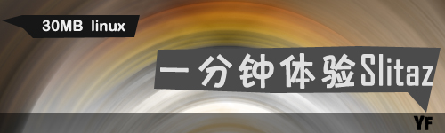
 

 

  早上在52abc的空间中看到了30MB的linux——slitaz，才30MB那就下载试试吧。
 

 

  用超快的3G龟速网络，不到1个小时就下载好啦30MB的iso文件。
 

 

  下载的是包含浏览器的开发版本。slitaz-cooking-firefox.iso
 

 

  实际大小为：29.0 MB (30,408,704 字节)
 

 

  马上运行虚拟机，运行之。
 

 

  显然，这也是个live-cd的版本，能运行。
 

 

  速度极快，运行桌面很简朴，简朴得很，载入的驱动也不全，连键盘驱动都不全。
 

 

  键盘y键和z键互换了，不过不影响正常使用。
 

 

  具体功能：能上网，能处理文件，能编辑文字，能看图片。
 

 

  更多扩展功能官网上说要下载不到1GB的扩展包。
 

 

  汗，那岂不是slitaz桌面环境的ubuntu了？
 

 

  就是运行速度极快估计连64MB的内存都能运行，不到100MB的使用空间，哈哈。
 

 

  推荐指数：★☆☆☆☆
 

 

  截图欣赏
 

 

  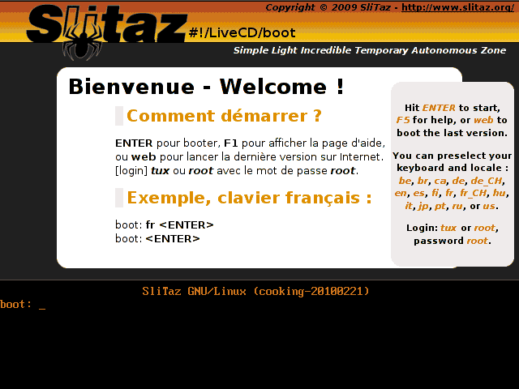
 

 

  看到下面的boot了吗？哈哈 可以输入命令
   
  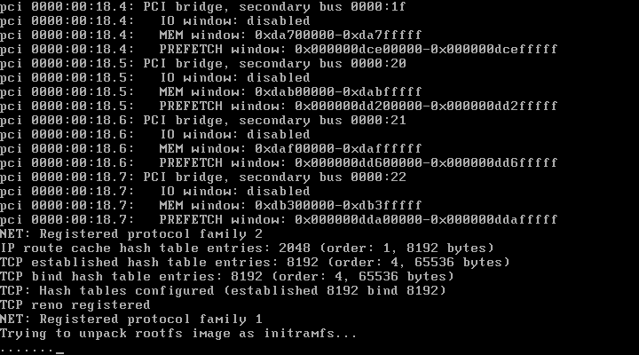
   
  
 

 

  自动启动桌面环境
   
  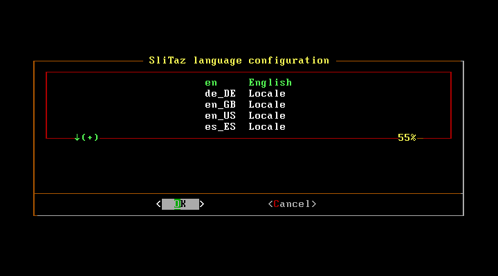
 

 

  选择语言好像
   
  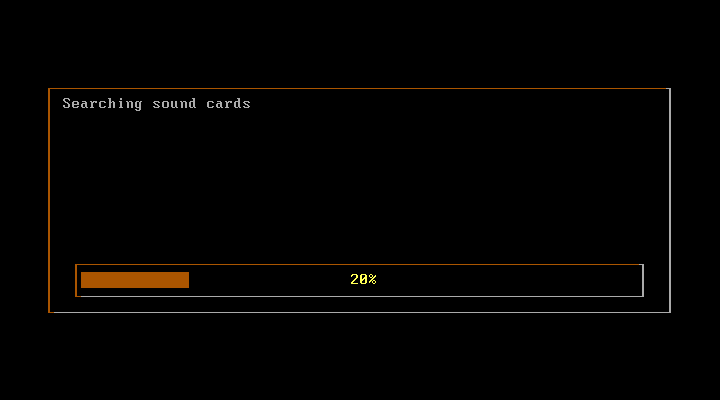
 

 

  载入中
   
  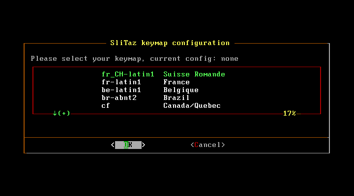
 

 

   
  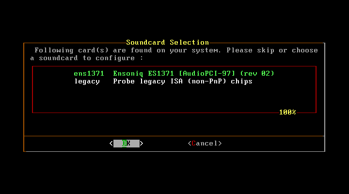
 

 

   
  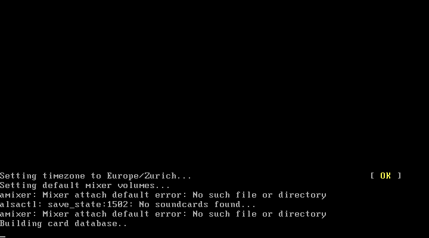
 

 

   
  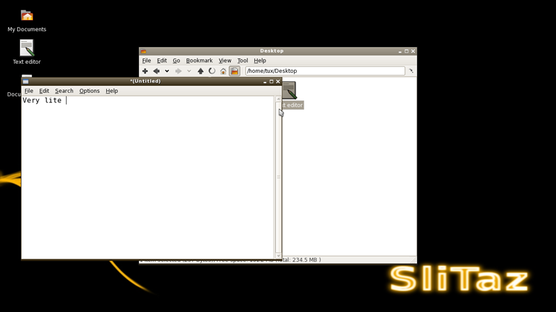
 

 

  终于进入桌面了（1280*800 被我压缩了）
   
  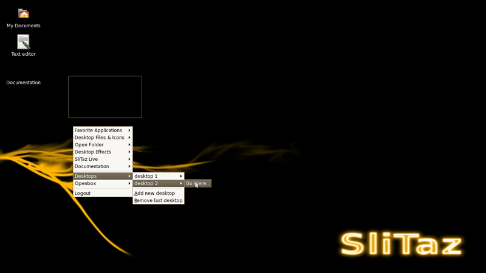
 

 

  很简陋吧？但是有两个虚拟桌面
   
  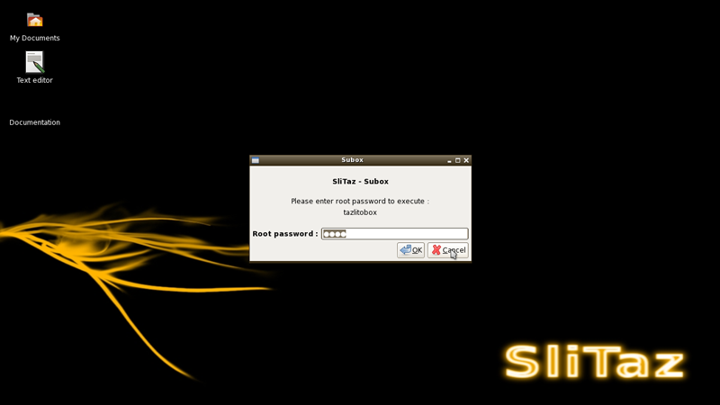
 

 

  linux的一贯作风 输入密码
   
  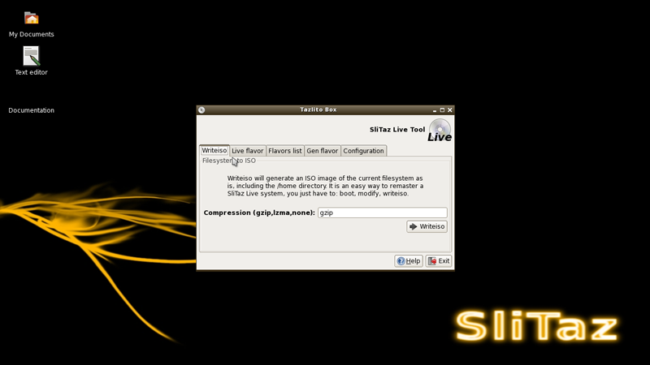
 

 

   
  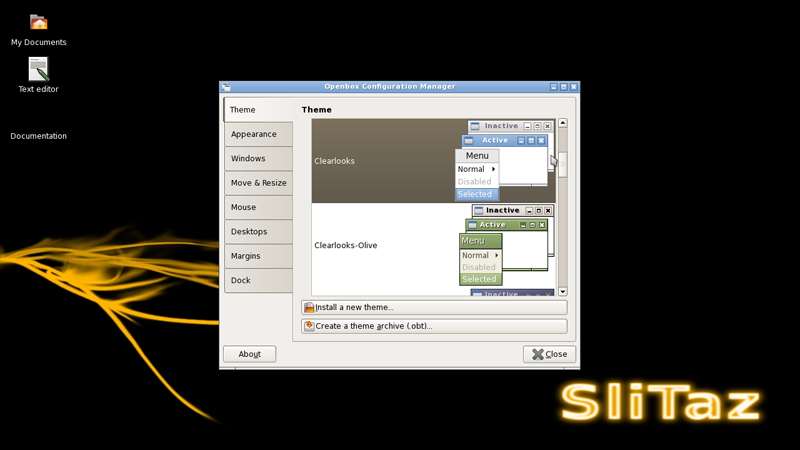
 

 

  更改主题
   
  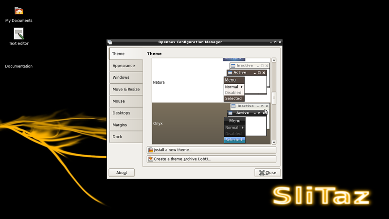
 

 

   
  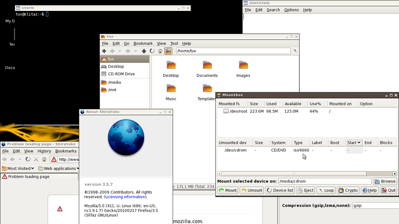
 

 

  最后来个poss吧，这张几乎涵盖了30MB的slitaz的所有应用程序。
   
 

 

  PS:投我一票吧，新春的活动
  <a href="http://act.hi.baidu.com/flashalbum/userpage/?portal=28cb7966626c6f674003" target="_blank">
   <strong>
    点击这里进入
   </strong>
  </a>
 

