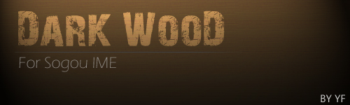
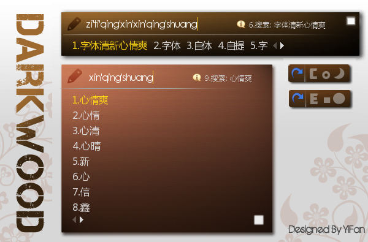

# DarkWooD 酷炫的搜狗皮肤 [YiFan亲手制作,效果不错] 

> 2010-02-24

 

  
 

 

  想想还有几天就开学了，寒假也没干什么事情 就这样过去了。难道说？要留下杯具吗？
 

 

  总要留下点什么，想来想去，做个狗皮吧，以前做得都不成功，现在做出来的这个比较满意。
 

 

  为什么呢？三天内下载量达到330，你呢？
 

 

  唯一的缺点就是需要安装两个字体：
  <strong>
   微软雅黑，华文细黑
  </strong>
  。（百度上一搜就能找到字体下载地址）。
 

 

  这个皮肤是我用photoshop一点一点的做出来的，个人感觉很精致，开始做出来的是圆角的，后来听取luoyandi（HI友）的建议，该做成方角的了，因为圆角显得很大。
 

 

  得了，啥也别说了，看浏览的效果吧。
 

 

  
   
 

 

 

 

  另外说明下：旁边的那个小方块是半透明的，会随着背景颜色的变化而变化。
 

 

 

 

  话说这个东西我也是做了很长时间的，因为做这个需要很长的经历，需要做14个PNG，汗。
 

 

  这算是我给大家的礼物吧~！哈哈，欢迎提出建议。
 

 

  
   
   
  <strong>
   (下载方法1:右键上面的图片，图片另存为，文件名为：Darkwood.rar，然后保存到某一个位置即可，解压，安装~Enjoy it！
    
  </strong>
  <strong>
   2:点击上面的图片；进入下载页面)
  </strong>
   
 

 

  PS:投我一票吧，新春的活动
  <a href="http://act.hi.baidu.com/flashalbum/userpage/?portal=28cb7966626c6f674003" target="_blank">
   <strong>
    点击这里进入
   </strong>
  </a>
 

