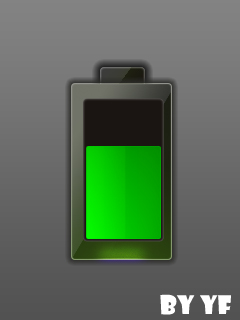

# 寒假已经结束,总结寒假 

> 2010-02-27

 

  
 

 

  寒假真的过得很快很快很快
 

 

  明天就开学了，学校好可恶，在万家团圆的元宵节让我们回学校度过。
 

 

  记得寒假前曾经有过很多的计划，看看吧？
 

 

  所有2010年度寒假计划
 

 

  //生活
   
  1.高中课程学习计划，复习与预习 -&gt;失败！
   
  2.到有特色的地方玩一玩    -&gt;完成!
   
  3.睡一个星期的懒觉 -&gt;完成!
   
  4.多锻炼，再瘦下去 -&gt;失败！
   
  5.淘宝上买书，体验网上购物 -&gt;完成!
 

 

  //计算机
   
  6.下载ideneb，等待时机刻录光盘 -&gt;完成!
   
  7.安装ideneb，体验MAC OSX -&gt;失败！
   
  8.学习ASP读取、调用、添加ACCESS记录 -&gt;完成!
   
  9.改进BLOG模板或做个新的模板    -&gt;完成!
   
  10.PS技术大长进 -&gt;失败！
   
  11.恢复BLOG暑假时候的人气 -&gt;失败！
   
  12.制作新的头像    -&gt;完成!
   
  13.学会线性链表的使用，学会一些算法 -&gt;失败！
   
  14.学习PY语言，编写一个实用简单的PY平台手机程序 -&gt;失败！
 

 

  <strong>
   学会了ASP+ACCESS
  </strong>
 

 

  说道学习ASP读取、调用、添加ACCESS记录，在边学边练习的过程中做了个网站(
  <a href="http://www.oplan.tk" target="_blank">
   我是传送门
  </a>
  )
 

 

  已经分享了，代码完全是我自己编写的，CSS+HTML的，CSS美工不是很好，因为注重的是框架（内在结构）。
 

 

  漏洞很多，我知道 比如注册页面的 可以重复注册漏洞 数据库方面的漏洞（不说了） 利用session欺骗技术来提权 随意写入数据库等等~。我也很想解决这些问题 可惜没有时间了。
 

 

  当下 已经解决了很多漏洞 但光凭我自己发现的漏洞还有很多，但毕竟不是像zblog之类的优秀作品，这么一个学习练习的作品，出现很多漏洞，自认为很正常，何况是自学。其实也很好解决，就是没时间了。
 

 

  
   
 

 

  <strong>
   留下许多杯具
  </strong>
 

 

  杯具很多，如 学习方面，感觉又没有在执行学习计划，效率下降了，不提了~
 

 

  如 时间利用方面，生活无规律 早上起得晚，晚上睡得晚
 

 

  如 计算机的ideneb 体验苹果 ，安装了近15次，都是失败，最后彻底失望，不弄了
 

 

  如 Blog方面 本来打算恢复下人气 但是无法扭转局面
 

 

  杯具了...
 

 

  <strong>
   其他
  </strong>
 

 

  其他方面也做了些，如搜狗的皮肤一个，皮肤一经发出，3天内下载量达到330个，4天内下载量达到610多个，应该是比较成功的吧。
 

 

  PS了不少东西，可惜都被我删了。
 

 

  下面亮出一个今天刚刚做的仿M8充电效果
 

 

  
   
 

